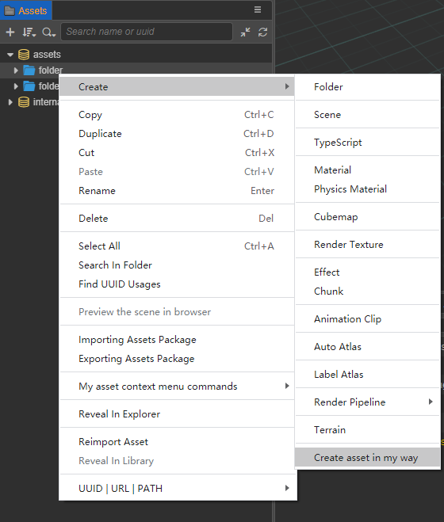

# 扩展资源管理器面板

Cocos Creator 3.0 支持对 **资源管理器** 菜单栏进行自定义扩展。自定义数据需要定义在 `contributions.assets` 字段内。

assets 支持的字段分为如下两种：

- `menu`：资源右键菜单
- `drop`：识别自定义资源

## assets.menu 资源右键菜单

### 字段参数

| 字段名 | 类型  | 是否选填 | 描述 |
| :--- | :---  | :--- | :--- |
| methods | string  | 否 | 菜单按钮点击执行脚本。 |
| （where） | string  | 是 | 按钮显示条件。</br> 由于 **资源管理器** 能够弹出菜单栏的地方有多处，因此，可以根据需求指定显示条件。</br> 目前支持弹出的位置参数有：</br> <ul> <li> `createMenu` -- 创建资源的两个菜单入口：</br> <ul> <li>面板左上角的 **+** 按钮 </li> <li>右击菜单中的 **新建** 选项 `Create` 菜单下。</li> </ul> </li> <li> `dbMenu` -- 资源数据库根节点（Assets）。 </li> <li> `assetMenu` -- 资源普通节点。 </li> <li> `panelMenu` -- 面板空白区域 </li> <ul> </br> 例如：菜单按钮是在面板空白区域下点击显示的，并且点击后执行的是 `methods` 定义的脚本里定义的 `onPanelMenu` 方法，可以这么写 `"panelMenu": "onPanelMenu"` |

案例如下：

```json
{
    "contributions": {
        "assets": {
            "menu": {
                "methods": "./assets-menu.js",
                "createMenu": "onCreateMenu",
                "assetMenu": "onAssetMenu",
                "dbMenu": "onDBMenu",
                "panelMenu": "onPanelMenu",
            },
        },
    },
}
```

```javascript
// assets-menu.js
exports.onCreateMenu = function (assetInfo) {
    return [
        {
            label: 'inCreateAsset',
            click() {
                if (!assetInfo) {
                    console.log('get create command from header menu');
                } else {
                    console.log('get create command, the detail of directory asset is:');
                    console.log(assetInfo);
                }
            },
        },
    ];
};

exports.onAssetMenu = function (assetInfo) {
    return [
        {
            label: 'inAssetMenu',
            submenu: [
                {
                    label: 'menu.assetCommand1',
                    enabled: assetInfo.isDirectory,
                    click() {
                        console.log('asset menu command 1');
                        console.log(assetInfo);
                    },
                },
                {
                    label: 'menu.assetCommand2',
                    enabled: !assetInfo.isDirectory,
                    click() {
                        console.log('asset menu command 2');
                        console.log(assetInfo);
                    },
                },
            ],
        },
    ];
};

exports.onPanelMenu = function (assetInfo) {
    return [
        {
            label: 'i18n:hello-world.menu.inPanelMenu',
            click() {
                console.log('panel menu command');
            },
        },
    ];
}
```

> **注意**：此处的 label 也可以通过多语言定义，规则是 `i18n:扩展名.属性名`。

其中，资源传入参数 `assetInfo` 各参数说明如下：

| 参数名 | 类型  | 是否选填 | 描述 |
| :--- | :---  | :--- | :--- |
| displayName | string  | 否 | 资源用于显示的名字。  |
| extends | string[]  | 是 | 继承类。  |
| importer | string  | 否 | 导入器名字。  |
| isDirectory | boolean  | 否 | 是否是文件夹。  |
| instantiation | string  | 是 | 虚拟资源可以实例化成实体的话，会带上这个扩展名。  |
| imported | boolean  | 否 | 是否导入完成。  |
| invalid | boolean  | 否 | 是否导入失败。  |
| name | string  | 否 | 资源名字。  |
| file | string  | 否 | 资源文件所在的磁盘绝对路径。  |
| redirect | object  | 是 | 跳转指向资源。</br>  <ul> <li> type { string } - 资源类型 </li> <li> uuid { string } - 资源 ID </li> </ul>  |
| readonly | boolean  | 否 | 是否只读。  |
| type | string  | 否 | 资源类型。  |
| url | string  | 否 | db:// 开头的资源地址。  |
| uuid | string  | 否 | 资源 ID。  |

返回值 `MenuItem[]` 各参数说明如下：

| 参数名 | 类型  | 是否选填 | 描述 |
| :--- | :---  | :--- | :--- |
| type | string  | 是 | normal、separator、submenu、checkbox 或 radio。  |
| label | string[]  | 是 | 显示的文本。  |
| sublabel | string  | 是 | 显示的二级文本  |
| submenu | MenuItem[]  | 是 | 子项菜单  |
| click | Function  | 是 | 点击事件  |
| enable | boolean  | 是 | 是否可用，不可用会有置灰样式。  |
| visible | boolean  | 是 | 是否显示。  |
| accelerator | string  | 是 | 显示快捷键。  |
| checked | boolean  | 是 | 当 type 为 `checkbox` / `radio` 时是否选中。  |

更多返回值属性可参考 [electron menu-item](https://www.electronjs.org/docs/api/menu-item) 的数据格式。

实现扩展的效果图如下：



如果只是为了加载脚本，而不需要定义任何的菜单按钮，甚至也可以这么写：

```json
{
    "contributions": {
        "assets": {
            "menu": "./assets-menu.js"
        }
    }
}
```

## assets.drop 识别自定义资源

### 字段参数

| 字段名 | 类型  | 是否选填 | 描述 |
| :--- | :---  | :--- | :--- |
| type | string  | 否 | 与编辑器 UI 组件 `<ui-drag-item type="xxx">` 里的 `type` 对应的类型。 |
| message | string  | 否 | 资源拖入 **资源管理器** 后需要触发的消息。 |

**资源管理器** 支持用户自定义资源类型，通过编辑器 UI 组件 `<ui-drag-item>` 标签定义。标签的参数中较为重要的属性是 `type`（`<ui-drag-item type="xxx">`），通过 `type` 定义的可拖入类型会注入到 **资源管理器** 面板的识别列表里。拖入 **资源管理器** 后的自自定义资源会触发注册方（扩展）注册的消息，注册方便能开始资源导入后的处理。

案例如下：

首先我们定义一份 package.json：

```json5
{
    "contributions": {
        "assets": {
            "drop": [
                {
                    "type": "custom-asset-type", // 对应 Demo 示例中 panel.html 的用法
                    "message": "drop-asset",
                },
            ],
            "menu": {
                "methods": "./assets-menu.js"
            },
        },
        "messages": {
            "drop-asset": {
                "methods": ["default.dropAsset"], // 'default' 是指当前插件的默认面板
            }
        },
    },
}
```

然后定义扩展面板文件 `panel.js`，接收消息回调：

```javascript
exports.methods = {
    dropAsset(assetInfo, dragInfo) {
        console.log(Editor.I18n.t('extend-assets-demo.drop.callback'));
        console.log(assetInfo);
        console.log(dragInfo);
    },
};
```

`assetInfo` 参数说明：

| 参数名 | 类型 | 描述 |
| :--- | :--- | :--- |
| uuid | string | 拖拽资源时，鼠标释放位置的资源 uuid。 |
| type| string  | 该资源的类型。 |
| isDirectory| boolean  | 该资源是否是文件夹。 |

最后定义面板文件 `panel.html`：

```html
<ui-drag-item
type="custom-asset-type"
additional='{"value":"this additional is dragInfo data."}'
>
<ui-label>Drag me to assets panel, and look console log.</ui-label>
</ui-drag-item>
```

此处 `additional` 里定义的内容就是上方 `dropAsset` 回调里 `dragInfo` 的内容。

## Demo 示例

可以通过链接 <a href="img/extend-assets-demo.zip" target="_blank">范例</a> 获取 **扩展资源管理器** 案例。
