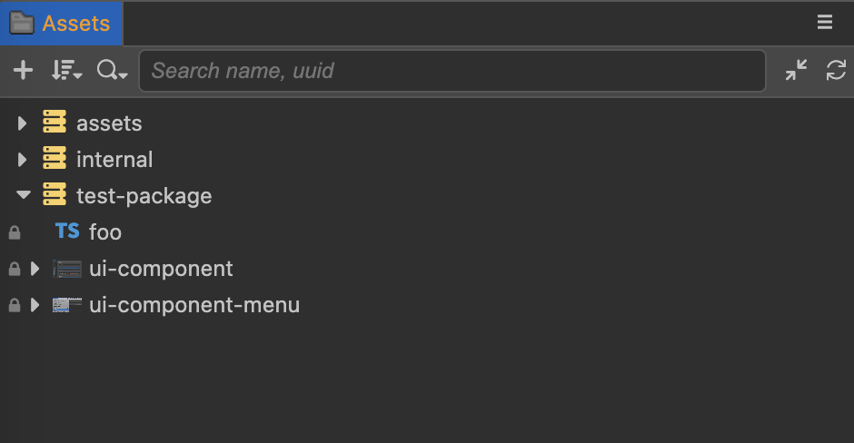

# 自定义资源数据库

所有项目内的资源文件都是通过资源数据库进行管理，其中项目内的 `assets` 目录存放的是当前项目的资源，引擎仓库里 `editor/assets` 里存放的是引擎内置的资源（如：常见的图片、脚本等）。

当我们在扩展内使用了资源时，需要将扩展内的资源文件夹注册到资源数据库里，并在扩展发布时将资源随着扩展一起发布。

通过本文我们将学会如何注册一个资源文件夹，并在脚本里使用资源。

## 注册配置

资源注册需要在 `contributions` 中使用 `asset-db` 字段进行配置，如下所示：

```json5
{
    "name": "test-package",
    "contributions": {
        "asset-db": {
            "mount": {
                "path": "./assets",
                "readonly": true
            }
        }
    }
}
```

上面的示例中，我们把扩展 `test-package` 根目录下的 `assets` 文件夹注册到了资源数据库中。

## 脚本资源

在 `test-package/assets/` 目录下创建一个脚本 `foo.ts`，内容如下：

```typescript
/// foo.ts
import { _decorator, Component, Node } from 'cc';
const { ccclass, property } = _decorator;
 
@ccclass('Foo')
export class Foo extends Component {
    start () {
        console.log('foo');
    }
}
```

为了使用 cc 的定义，我们需要拷贝 `{项目目录}\temp\declarations` 的定义文件到扩展根目录下。

由于 `foo.ts` 只是作资源使用，不属于扩展源码，所以我们需要在 `tsconfig.json` 中加入 `exclude` 配置进行排除，否则会出现编译错误。

```json5
{
    "compilerOptions": { 
        ... 
    },
    "exclude": ["./assets"]
}
```

> **注意**：扩展中的脚本资源可以在 Cocos Creator 工程中编写并测试完成后，再复制到扩展的 `assets` 目录。

## 其他资源

图片、文本、字体等资源直接放入 `assets` 目录下即可。

## 使用扩展中的资源

刷新扩展，可以在 Cocos Creator 编辑器的 **资源管理器** 窗口中看到新增了一个 `test-package` 资源包，如下图所示：



## 拖拽引用

若要以拖拽到组件方式引用包内的资源，使用方式与 `assets` 和 `internal` 中的资源一致。

## import 脚本

若要在项目中引用脚本，只需要从资源目录库引用即可，如下所示：

```typescript
/// bar.ts
import { Foo } from 'db://test-package/foo';
```

可以不用刻意关注某个类是否来自某个扩展包，TypeScript 开发环境的自动补齐功能会提示 **import** 目录的，无需担心。

> **注意**：扩展资源包中的类名应当保持全局唯一，否则会造成冲突，实际开发中尽量添加一个适合的前缀（如 `test-pacakge` 可简称为 `TP`，资源包中所有类统一加上 `TP` 前缀，变成 `TPFoo` ）。
