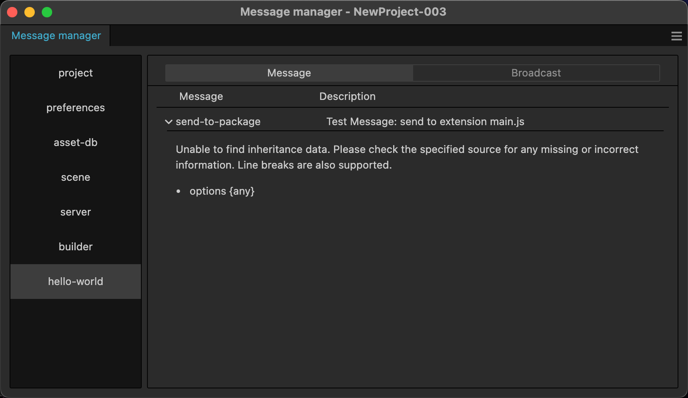
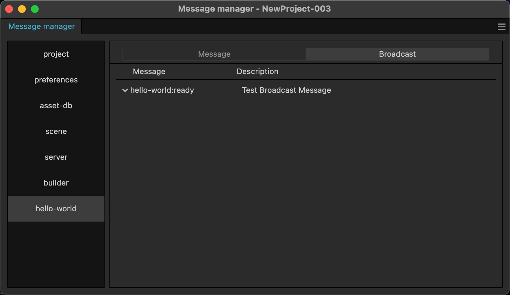

# 自定义消息

在 Cocos Creator 编辑器架构中，所有的交互都是通过消息通信实现的，本文将讲解如何自定义一条消息，并调用这条消息。

## 定义一条消息（监听消息）

只有在 `package.json` 文件的 `contributions.messages` 字段里定义过的消息才能被使用。消息的定义如下所示：

```json
{
    "name": "hello-world",
    "contributions": {
        "messages": {
            "test-messasge": {
                "public": false,
                "description": "",
                "doc": "",
                "methods": []
            }
        }
    }
}
```

`test-messasge` 为消息名称，下面我们逐一讲解每个属性的含义。

### public

类型 {string} 可选

是否对外显示这条消息，如果为 true，则会在 **开发者->消息列表** 面板显示这条消息的基本信息。

### description

类型 {string} 可选

消息摘要信息，如果 public 为 true，则会在消息管理面板显示，支持 i18n:key 语法。

### doc

类型 {string} 可选

消息文档说明，如果 public 为 true，则会在消息管理面板显示，支持 i18n:key 语法。

这个文档使用 markdown 格式撰写并渲染。

### methods

类型 {string[]} 可选

消息触发的方法队列。

这是一个字符串数组，字符串为扩展或者面板上的方法（methods）。
如果是触发扩展主程序的方法，则直接定义 `methodName`，如果要触发扩展里定义的面板上的方法，则要填写 `panelName.methodName`。

下面的示例中，`package-message` 将触发扩展主程序中的 `sendMessage` 方法，`panel-message` 将触发 `test-panel` 面板中的 `sendMessage` 方法。

```json5
{
    "name": "hello-world",
    "panels": {
        "test-panel": {
            "title": "HelloWorld",
            "main": "./dist/panel/index.js"
        }
    },
    "contributions": {
        "messages": {
            "package-message": {
                "public": true,
                "description": "Test Message: send to extension main.js",
                "doc": "Unable to find inheritance data. Please check the specified source for any missing or incorrect information.\nLine breaks are also supported.\n- options {any}",
                "methods": [
                    "receiveMessage"
                ]
            },
            "panel-message": {
                "methods": [
                    "test-panel.receiveMessage"
                ]
            },
            "hello-world:ready": {
                "public": true,
                "description": "Test Broadcast Message"
            }
        }
    }
}
```





定义完消息后，我们需要在扩展主入口和面板入口里，增加一个 `sendMessage` 方法:

```typescript
export const methods: { [key: string]: (...any: any) => any } = {
    receiveMessage() {
        console.log('Received a message');
    },
};

export function load() { }

export function unload() { }
```

## 通过消息触发函数（执行消息）

刚刚我们定义了两个消息，`package-message` 和 `panel-message`。

我们可以通过消息系统的 API 触发这个消息监听器：

```typescript
// 不需要返回值
Editor.Message.send('hello-world', 'panel-message');
// Or 需要等待数据返回
const result = await Editor.Message.request('hello-world', 'panel-message');
```

关于更多消息机制，请参考文档 [消息系统](./messages.md)。
