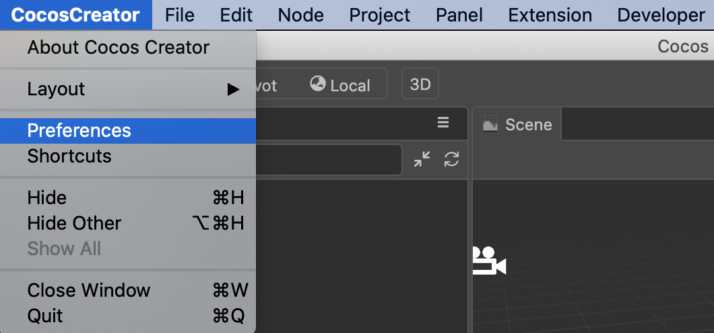
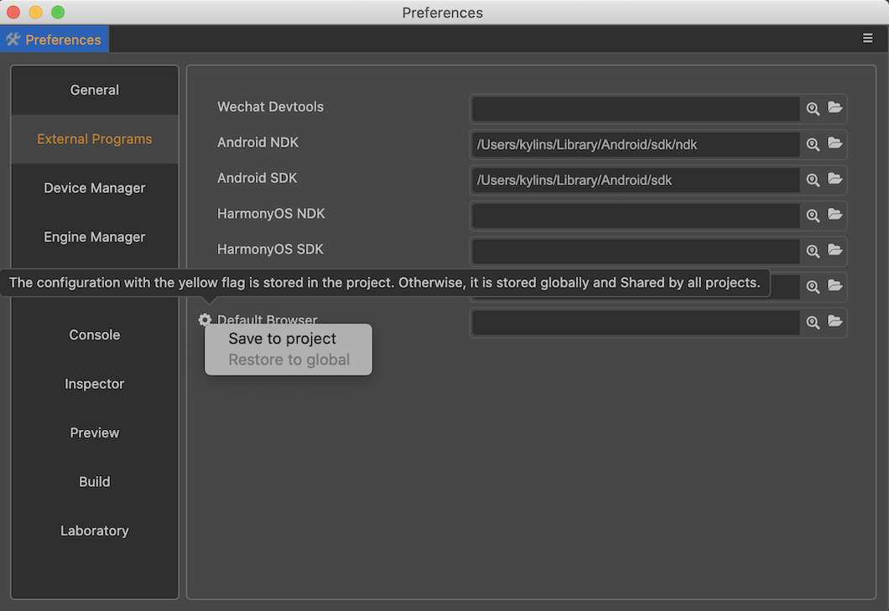
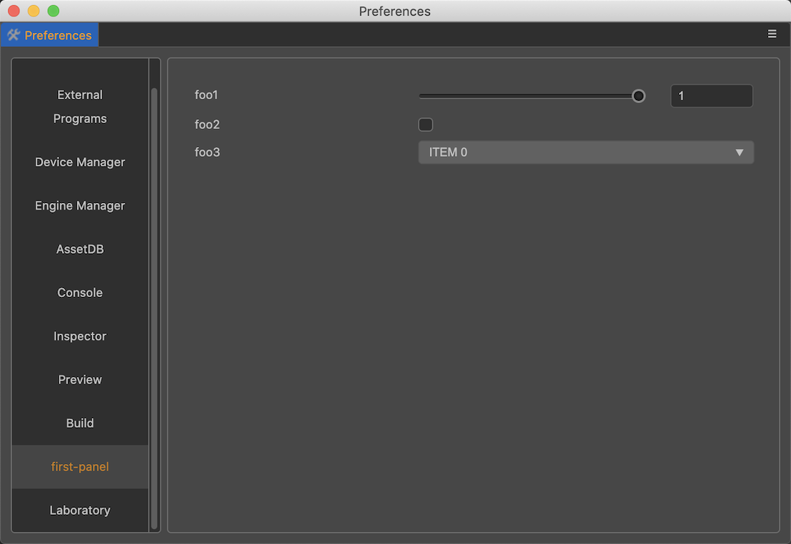
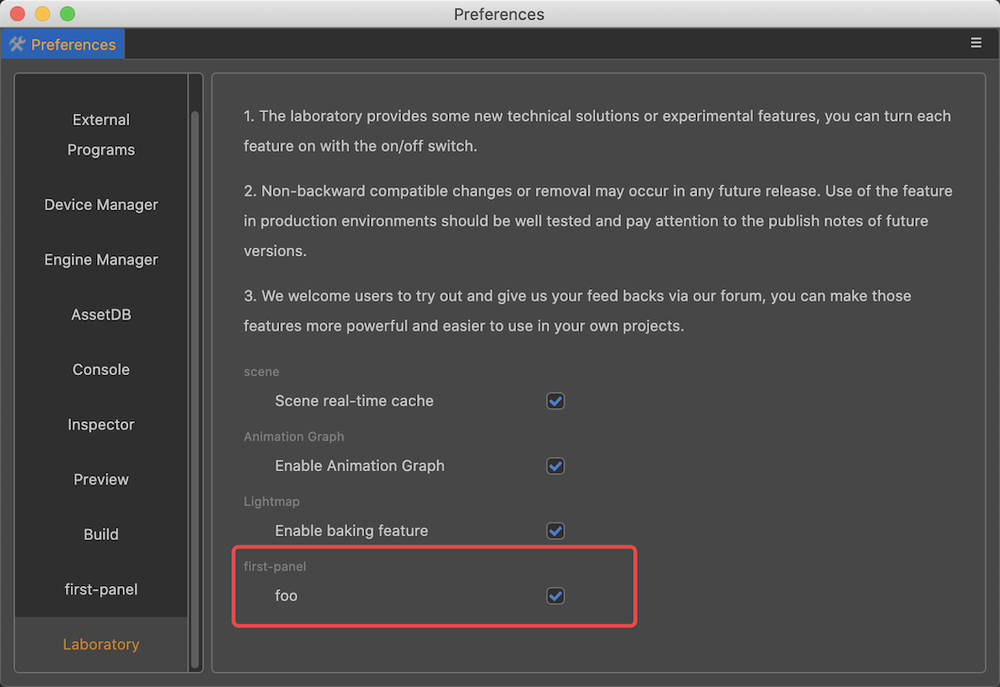

# 自定义偏好设置面板

偏好设置存放的一般是不需要通过 git 同步给该项目其他开发者的配置。例如一些开发工具的绝对路径。

并且在偏好设置面板里，还能选择存放在项目还是存放在全局。存放在项目的配置只对当前项目生效，如果存放在全局，则会影响所有编辑器。

## 偏好设置面板简介

在顶部菜单栏可找到 **Cocos Creator -> 偏好设置** 菜单，如下图所示：



点击可打开偏好设置面板，如下图示：



偏好设置面板分成左右两侧：

- 左侧显示的是提供配置项目的功能扩展的名字。
- 右侧是根据配置渲染出来的操作面板。

面板上的修改，会立即修改到对应的配置项目上，更多关于 **偏好设置** 面板的介绍，请参考文档 [偏好设置](../../editor/preferences/index.md)。

## 自定义面板

Cocos Creator 允许每个扩展注册自己的编辑器配置，然后在偏好设置面板内显示。

偏好设置控制的是编辑器相关的配置，会作用到所有项目上，如果只想增加特定项目的配置，请参考文档 [自定义项目设置面板](./contributions-project.md)。

### 偏好设置的两种方式

偏好设置允许以两种方式显示配置：

1. 通用配置
2. 实验室配置

通用设置直接以选项卡的形式展示，而实验室开关则单独一个选项卡集中展示。

- 当扩展提供的功能比较稳定时建议将配置数据放在通用功能内。
- 当扩展提供的功能处于开发阶段时建议将功能的开关配置数据放在实验室配置中。

### 偏好设置定义

我们在偏好设置里新增扩展的配置，也需要通过在扩展定义文件 `package.json` 里添加 `contributions` 配置来实现。

注册自定义偏好设置需要在 `contributions.profile.editor` 里定义好相关数据字段。更多相信信息可以参看 [配置系统](./profile.md)

这里我们举例新建一个叫做 `first-panel` 的扩展：

```JSON5
{
    //`package.json`
    "name": "first-panel",
    "contributions": {
        "profile": {
            "editor": {
                "foo": {
                    "default": 1,
                    "label":"foo"
                },
                "foo1": {
                    "default": 1,
                    "label":"foo1"
                },
                "foo2": {
                    "default": false,
                    "label":"foo2"
                },
                "foo3": {
                    "default": 0,
                    "label":"foo3"
                }
            }
        },   
    }
}
```

> **注意**：偏好设置里的配置数据，都应该存放在 `profile.editor` 字段中。

当定义好数据字段后，还需要在 `contributions.preferences` 字段里定义需要显示的数据以及用什么 UI 组件来显示。如下所示：

```JSON5
{
    //`package.json`
    "name": "first-panel",
    "contributions": {
        "profile": {
            // ...
        },
        "preferences": {
            "properties": {
                "foo1": {
                    "ui": "ui-slider",
                    "attributes": {
                        "min": 0,
                        "max": 1,
                        "step": 0.1
                    }
                },
                "foo2": {
                    "ui": "ui-checkbox"
                },
                "foo3": {
                    "ui": "ui-select",
                    "items": [
                        {
                            "value": 0,
                            "label": "ITEM 0"
                        },
                        {
                            "value": 1,
                            "label": "ITEM 1"
                        },
                        {
                            "value": 2,
                            "label": "ITEM 2"
                        }
                    ]
                }
            },
            "laboratory": ["foo"]
        }    
    }
}
```

上面的示例中，在 `contributions.profile.editor` 字段定义了 4 个数据项： `foo`、`foo1`、`foo2`、`foo3`。

在 `contributions.preferences` 字段中，我们定义了 `properties` 和 `laboratory`。

### 通用配置（properties）

`properties` 中定义的字段，将在偏好设置面板中新建一个与扩展同名的标签页独立显示，如下图所示：



### 实验室配置（laboratory）

`laboratory` 中定义的字段，将在偏好设置面板中的 **实验室（Laboratory）** 标签页中显示，如下图所示：



## UI 组件配置

本示例展示了 4 种常见 UI 组件在自定义偏好设置面板时的用法，理论上所有带 `value` 属性的 UI 组件都可以用于偏好设置面板，具体用法请参考文档 [UI 组件](./ui.md)。
