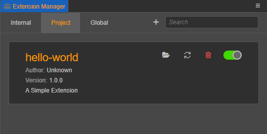

# 扩展改名

## 修改显示名称

如果想对扩展改名，只需修改 `package.json` 文件中的 `name` 字段即可。代码示例如下：

```JSON5
// "name": "simple-1649426645745"
"name": "hello-world"
```

像上面一样将 `name` 字段改为 "hello-world" 并在扩展管理器面板刷新扩展，就可以看到扩展的名称改成了 **hello-world**。



## 修改扩展文件夹名称

如果想连同文件夹名称一并修改，需要在文件夹修改后重启 Cocos Creator，才能让修改过文件夹名称的扩展重新生效。

如果修改了文件夹名称，**i18n** 多语言相关的字符串路径也需要一并修改，如下所示：

```json
// "description": "i18n:simple-1649426645745.description",
"description": "i18n:hello-world.description",
```
