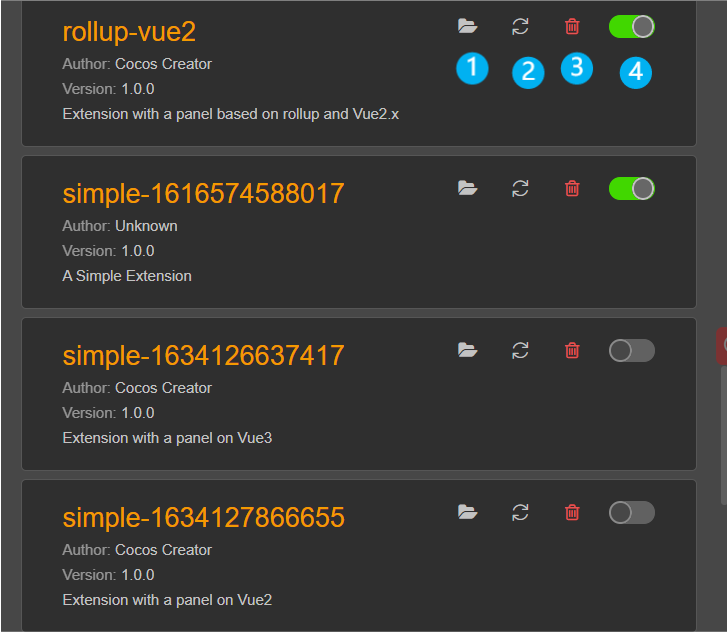

# 扩展管理器

扩展管理器用于管理编辑器内的扩展。

在管理器顶部存在多个标签，选中标签后下方将显示对应的扩展列表。
面板顶部的详情如下：

**(1)** 选中对应的标签以切换扩展列表的内容。

**(2)** 扫描按钮，扫描扩展目录下的扩展，卸载不存在的扩展，安装未被导入的扩展。

**(3)** 导入按钮，点击后根据当前的标签导入扩展。

**(4)** 搜索栏，此处可以输入扩展的名称以筛选扩展列表的内容。

## 扩展列表

扩展管理器面板根据当前选择的标签以及搜索栏筛选等操作来显示扩展的列表。

扩展列表的每一项左侧显示扩展的信息，右侧的详情如下:

**(1)** 查看扩展所在的目录。

**(2)** 刷新按钮，重新加载这个扩展。

**(3)** 卸载按钮，点击后将卸载这个扩展并将扩展的内容从硬盘上删除。

**(4)** 扩展的开关，点击后将开启\关闭扩展。

## 标签

顶部右方有交互的按钮，根据当前的标签交互按钮的内容会变更。

接下来逐个介绍每个标签以及每个标签对应的面板内容。

### Internal

| 内容     | 描述                                                 |
| -------- | ---------------------------------------------------- |
| 扩展列表 | 展示编辑器内置的扩展，内置扩展无法被关闭、卸载、刷新 |
| 扫描按钮 | 无法扫描内置扩展，所以该按钮处于禁用状态             |
| 导入按钮 | 无法导入扩展为内置扩展，所以该按钮处于禁用状态       |

### Project

项目扩展的功能仅在项目中生效。

| 内容             | 描述                                           |
| ---------------- | ---------------------------------------------- |
| 项目扩展所在目录 | 项目扩展目录为 `${项目目录}/extensions`        |
| 扩展列表         | 展示安装在项目扩展目录的扩展                   |
| 导入按钮         | 导入扩展的 zip 包，解压 zip 到项目扩展的目录下 |

### Global

全局扩展将影响所有启用该扩展的项目。

| 内容             | 描述                                                         |
| ---------------- | ------------------------------------------------------------ |
| 全局扩展所在目录 | **Windows**：`%USERPROFILE%\.CocosCreator\extensions`  **MacOS**：`$HOME/.CocosCreator/extensions` |
| 扩展列表         | 展示安装在全局扩展目录下的扩展                               |
| 导入按钮         | 导入扩展的 zip 包，解压 zip 到项目扩展的目录下               |

### Develop

为了方便开发扩展，在 Develop 标签下允许临时导入除了当前项目扩展以及全局扩展以外的扩展，该标签下的扩展导入后并不会被记录，关闭项目后此标签下的扩展将会丢失。
注意，在此标签的扩展列表中，点击扩展的卸载按钮仅移除和卸载扩展，并不会删除硬盘中的内容。

| 内容     | 描述                                           |
| -------- | ---------------------------------------------- |
| 扩展列表 | 展示临时安装的扩展                             |
| 扫描按钮 | 该按钮处于禁用状态                             |
| 导入按钮 | 临时导入除了当前项目扩展以及全局扩展以外的扩展 |
