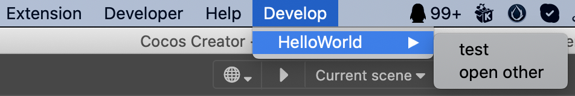

# 入门示例-扩展间通信

在前面两篇文档 [入门示例-菜单](./first.md) 和 [入门示例-面板](./first-panel.md) 中，我们介绍了：
- 怎么创建扩展
- 怎么在扩展中定义菜单
- 怎么在扩展中定义消息
- 怎么在扩展中定义面板

本文主要演示两个扩展之间如何通信，将涉及到三个话题：
- 如何打开另一个扩展的面板
- 如何向另一个扩展发送消息
- 如何发送和监听广播消息

## 打开另一个扩展的面板

有时候我们需要在自己写的扩展中打开另一个扩展，接下来我们就试着对 **入门示例-菜单** 中的扩展示例进行改造 ，使它可以打开 **入门示例-面板**。

修改后的 `package.json` 如下：
```json5
{
    "package_version": 2,
    "version": "1.0.0",
    "name": "hello-world",
    ...
    "contributions": {
        "menu": [
            {
                "path": "Develop/HelloWorld",
                "label": "test",
                "message": "log"
            },
            {
                "path": "Develop/HelloWorld",
                "label": "open other",
                "message": "open-other"
            }
        ],
        "messages": {
            "log": {
                "methods": [
                    "log"
                ]
            },
            "open-other": {
                "methods": [
                    "openOther"
                ]
            }
        }
    }
}
```

我们修改了 `contributions.menu`，新增了 `open other` 菜单项，并且把此扩展的菜单都放到了 Develop/HelloWorld 下。 刷新扩展后，可以在顶部菜单栏找到如下图所示的菜单内容：



在 `contributions.messages` 中，我们新增了一个 `open-other` 消息，并让 `main.ts` 里的 `openOther` 函数处理此消息。

**入门示例-面板** 中的扩展名为 `first-panel`，因此我们使用 `Editor.Panel.open('扩展名')` 来打开它的默认面板，如下所示：

```typescript
openOther(){
    Editor.Panel.open('first-panel');
}
```

在 `hello-world` 根目录执行 `npm run build` 命令后，前往 **扩展管理列表** 刷新 `hello-world` 扩展。

点击 **Develop** -> **HelloWorld** -> **open other** 菜单项，即可以看到示例面板被打开。

## 与其他扩展通信

### 定向通信

在上面的示例中， 我们在 `hello-world` 中通过 `Editor.Panel.open('扩展名')` 来打开 `first-panel` 的面板。 但如果我们是想做其他操作，这种方案就不行了。

当一个扩展想要调用另一个扩展的功能时，可以通过以下函数向某个扩展发送消息来实现：
```typescript
Editor.Message.send(extensionName:string,messasge:string,...args:any[])
```

每一个扩展的 `contributions.messages` 中定义的消息，默认都是可以对外的。在 `first-panel` 中我们找到了 `open-panel` 消息，它用于打开自己的默认面板。为了简单起见，我们将 `hello-world` 中 `main.ts` 的 `openOther` 函数改为如下内容：

```typescript
openOther(){
    Editor.Message.send('first-panel','open-panel');
}
```

重新编译 `hello-world` 扩展并刷新后，再次点击 **Develop** -> **HelloWorld** -> **open other** 菜单项，可以看到 `first-panel` 的默认面板被打开了。

### 广播通信

当一个扩展想要向整个系统所有扩展通知某个事件完成的时候，可以通过以下函数广播一条消息来实现：
```typescript
Editor.Message.broadcast(message:string, ...args:any[])` 
```

接下来我们定义一个叫 `first-panel:open` 的广播消息，由 `first-panel` 扩展来广播，由 `hello-world` 扩展来监听。

在 `hello-world` 中，我们新增一个消息监听，并指定处理函数，修改后的 `contributions.messages` 如下：
```json5
{
    "messages": {
        "log": {
            "methods": [
                "log"
            ]
        },
        "open-other": {
            "methods": [
                "openOther"
            ]
        },
        "first-panel:open":{
            "methods": [
                "onFirstPanelOpen"
            ]
        }
    }
}
```

然后在 `hello-world` 的 `main.ts` 增加如下处理函数：
```typescript
onFirstPanelOpen(){
    console.log("hello-world knows first-panel is open");
}
```

作为监听方的改造就完成了，接下来我们修改一下广播方 `first-panel`。

在 `first-panel` 项目的 `src/panels/default/index.ts :ready` 函数中加入如下广播消息代码：
```typescript
Editor.Message.broadcast("first-panel:open");
```

`ready` 函数会在 `first-panel` 的默认面板打开时调用，此时会对 `first-panel:open` 消息进行广播。

> 广播方也可以在 messages 中监听自己的广播消息，但通常没必要。

分别编译并刷新两个扩展，再次点击 **Develop** -> **HelloWorld** -> **open other** 菜单项，除了可以看到示例面板被打开，还能在 Cocos Creator 的控制台窗口中看到如下打印：

```bash
hello-world knows first-panel is open
```
这就表示 `hello-world` 扩展收到了 `first-panel` 扩展的广播消息。

更多消息相关的详细内容请参考文档 [消息系统](./messages.md)。