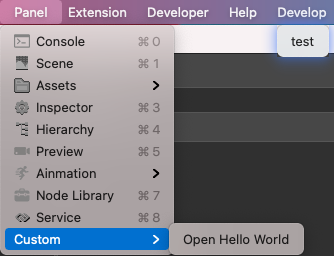

# 扩展面板

通常，制作一款扩展插件时都会考虑其易用性，可视化编辑成为了一种刚需，因此，了解如何制作界面成为必不可少的环节。

下方罗列出了一个基础面板的结构，更多细节请参考：[面板结构](./panel.md)。

## 面板结构

利用菜单按钮 `test` 打开一个只显示 `Hello World` 内容的面板。

扩展 `hello-world` 文件结构如下：

```
hello-world
  |--browser.js
  |--package.json
  |--panels
    |--default.js
```

### 面板配置

`package.json` 定义如下：

```json
{
    "name": "hello-world",
    "version": "1.0.0",
    "main": "./browser.js",
    "description": "一份简单的扩展",
    "panels": {
        "default": {
            "title": "simple panel",
            "main": "./panels/default.js"
        }
    },
    "contributions": {
        "menu": [
            {
                "path": "Develop",
                "label": "test",
                "message": "log"
            },
            {
                "path": "i18n:menu.panel/Custom",
                "label": "Open Hello World",
                "message": "open-panel"
            }
        ],
        "messages": {
            "log": {
                "methods": ["log"]
            },
            "open-panel": {
                "methods": ["openPanel"]
            }
        }
    }
}
```

### 面板入口文件 browser.js

主进程入口文件 `browser.js` 定义如下：

```js
'use strict';

// 扩展内定义的方法
exports.methods = {
    log() {
        console.log('Hello World');
    },
    openPanel() {
        Editor.Panel.open('hello-world');
    },
};
```

面板入口文件 `default.js` 定义如下：

```js
'use strict';

// 面板的内容
exports.template = '<div>Hello World</div>';

// 面板上的样式
exports.style = 'div { color: yellow; }';

// 快捷选择器
exports.$ = {
    elem: 'div',
};

// 面板启动后触发的钩子函数
exports.ready = function() {
    this.$.elem.innerHTML = 'Hello World';
};

// 面板关闭后的钩子函数
exports.close = function() {};
```

效果如下：


