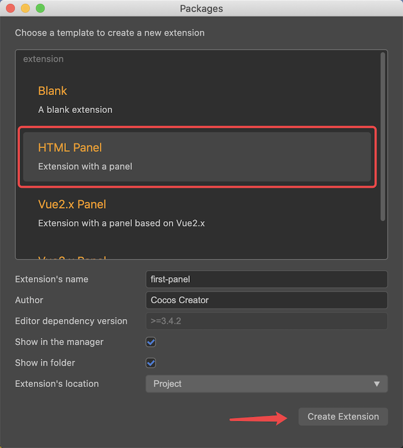
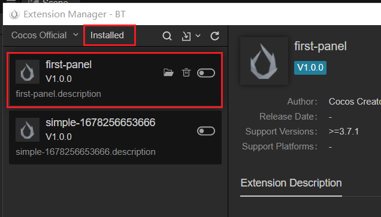
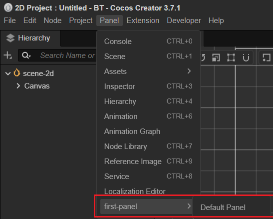
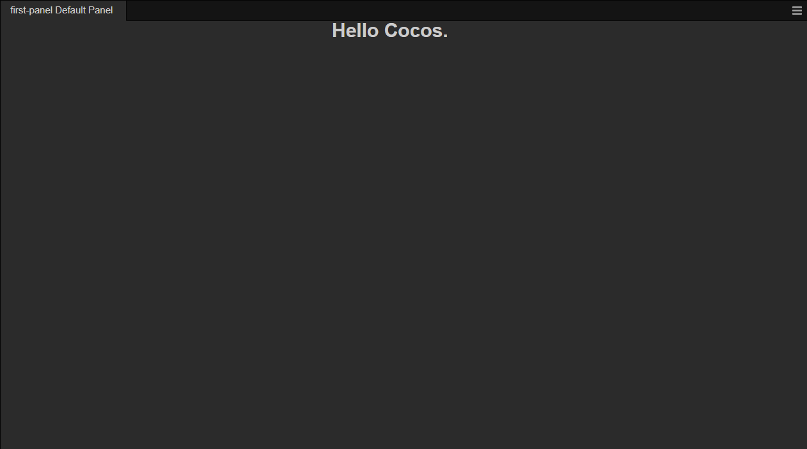
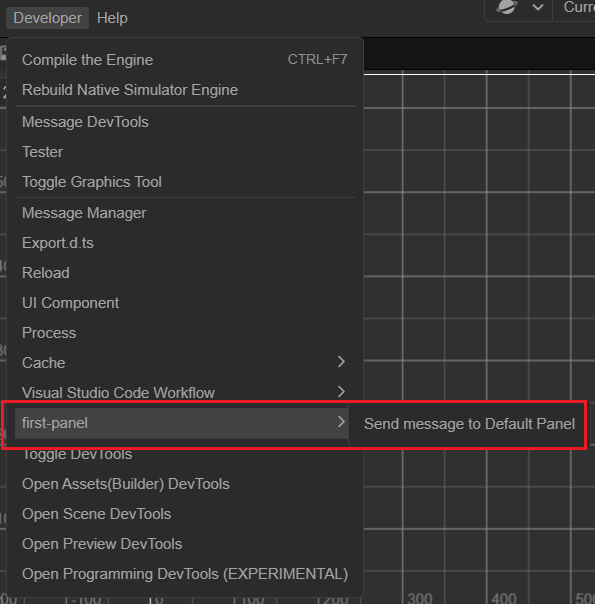
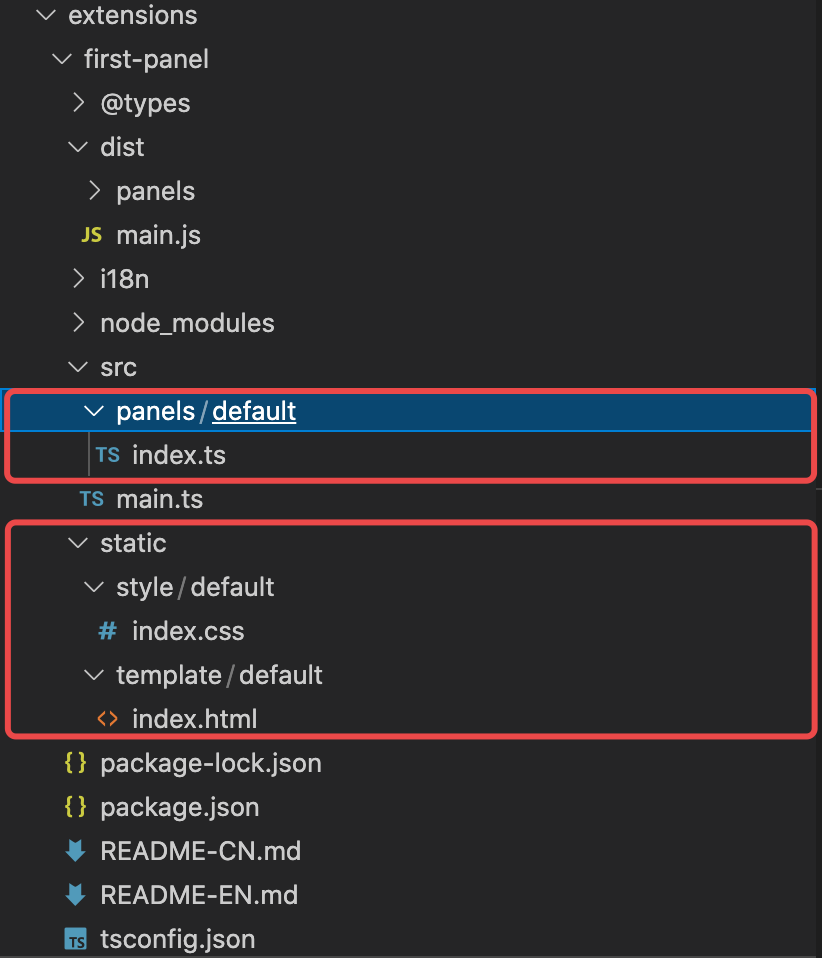

# 入门示例-面板

在文档 [入门示例-菜单](./first.md) 中讲解了怎么创建一个最简单的扩展，接下来我们看看如何创建一个面板并与之通信。

## 通过模板创建

在 Cocos Creator 中创建面板最快捷的方式是通过 **包含面板的扩展模板** 创建，如下图所示：



点击 **创建扩展** 按钮后，可以在项目根目录下找到 extensions/first-panel 扩展。

### 编译、安装
在命令行工具中，定位到 extensions/first-panel 目录，并执行以下语句：

```
npm install
npm run build
```

命令执行完成后，回到 **扩展管理器** 中，找到 first-panel 扩展，启用并刷新，如下图所示：



### 查看面板

启用并刷新插件后，可以在 面板（Panel） 菜单中找到如下图所示的菜单项：



点击 **默认面板（Default panel）** 菜单项，即可弹出如下所示面板：



本示例还在 **开发者（Developer）** 菜单中定义了另一个用于通信的菜单项，如下图所示：



点击上图中红色方框所示的 **发送消息给面板（Send message to Default Panel）** 按钮后，可以看到面板上显示的内容会发生改变。

## 面板讲解

接下来，我们逐一讲解面板目录结构、定义与通信机制。

### 面板目录结构



如上图所示，比 hello-world 多出了 `static` 和 `panels`目录。

`static` - 用于存放面板布局文件，如 css\html 等。

`panels` - 用于存放面板相关的源代码，每一个面板有一个 `index.ts` 入口源文件。

`index.ts` 、 `style` 、 `template` 请参考文档 [编写面板](./panel-boot.md) 

### 描述文件 package.json

在理解面板之前，我们先看看 `package.json` 中，面板相关的定义，如下所示：

```json
{
    "package_version": 2,
    "version": "1.0.0",
    "name": "first-panel",
    "description": "i18n:first-panel.description",
    "main": "./dist/main.js",
    "dependencies": {
        "fs-extra": "^10.0.0"
    },
    "devDependencies": {
        "@types/node": "^16.0.1",
        "@types/fs-extra": "^9.0.5",
        "typescript": "^4.3.4"
    },
    "panels": {
        "default": {
            "title": "first-panel Default Panel",
            "type": "dockable",
            "main": "dist/panels/default",
            "size": {
                "min-width": 400,
                "min-height": 300,
                "width": 1024,
                "height": 600
            }
        }
    },
    "contributions": {
        "menu": [
            {
                "path": "i18n:menu.panel/first-panel",
                "label": "i18n:first-panel.open_panel",
                "message": "open-panel"
            },
            {
                "path": "i18n:menu.develop/first-panel",
                "label": "i18n:first-panel.send_to_panel",
                "message": "send-to-panel"
            }
        ],
        "messages": {
            "open-panel": {
                "methods": [
                    "openPanel"
                ]
            },
            "send-to-panel": {
                "methods": [
                    "default.hello"
                ]
            }
        }
    },
    "author": "Cocos Creator",
    "editor": ">=3.4.2",
    "scripts": {
        "build": "tsc -b",
        "watch": "tsc -w"
    }
}
```

`panels`：{} - 本扩展中定义的面板
- default：String - 定义了一个名为 default 的面板
    - title：String - 面板标题
    - type：String - 面板类型
    - main：String - 面板源码目录
    - size：{} - 大小信息
        - min-width：Number - 最小宽度
        - min-height：Number - 最小高度
        - width：Number - 面板默认宽度
        - height：Number - 面板默认高度


## 更多阅读
`panel` 详细的面板讲解，请参考文档 [面板系统](./panel.md)。

`i18n` 为多语言配置，请参考文档 [多语言系统(i18n)](./i18n.md)。

`messages` 完整的消息定义机制，请参考文档 [自定义消息](./contributions-messages.md)。