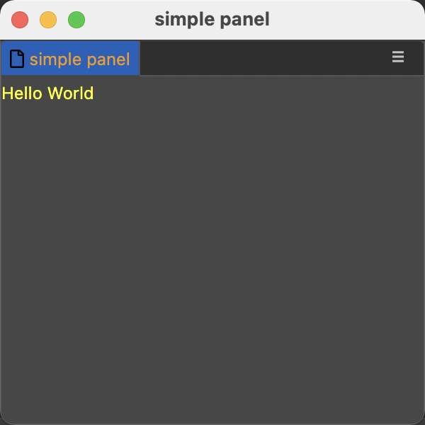
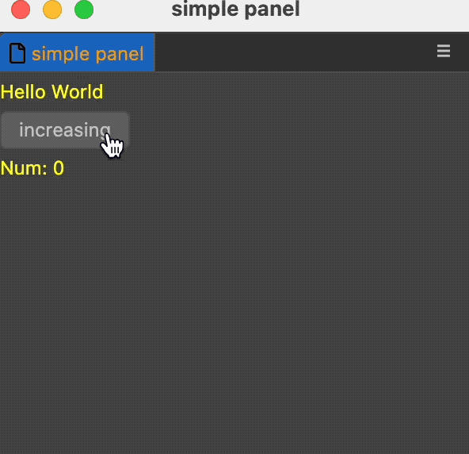
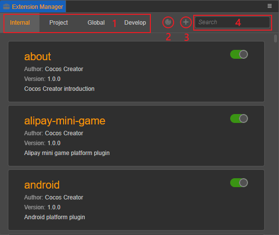

# 制作第一个插件

我们将通过本文，学会创建一个可以开启面板并存储数据的 Creator 扩展 `hello-world`，并通过该扩展了解扩展间交互的整个流程。

流程结构如下：
- [创建并安装扩展](#创建并安装扩展)
- [定义描述文件 package.json](#定义描述文件-package.json)
- [入口文件 browser.js](#入口文件-browser.js)
- [扩展面板](#扩展面板)
- [数据交互](#数据交互)
- [运行/刷新扩展](#运行/刷新扩展)

## 创建并安装扩展

有关扩展插件的创建请查看：[创建并安装扩展](./first#创建并安装扩展)。

创建好的扩展 `hello-world` 结构如下：

```json
hello-world
  |--browser.js
  |--package.json
```

## 定义描述文件 package.json

每个扩展都需要有一份 package.json 文件，用于描述改扩展的用途。只有完整定义了描述文件 package.json 后，Cocos Creator 编辑器才能知道这个扩展里定义的具体的功能，加载入口等信息。

虽然 package.json 在很多字段上的定义和 node.js 的 npm package 相似，但它们显然是为不同的产品服务而特殊定制。所以 **从 npm 社区中下载的 npm 模块，并不能直接放入到 Cocos Creator 中变成扩展**，但是可以在 Creator 扩展中使用 npm 社区里的模块。

接着，看看 package.json 的基础结构：

```json
{
    "name": "hello-world",
    "version": "1.0.0",
    "main": "./browser.js",
    "description": "一份简单的扩展",
    "contributions": {
        "menu": [{
            "path": "Tools",
            "label": "config",
            "message": "log"
        }],
        "messages": {
            "log": {
                "methods": ["log"]
            }
        }
    }
}
```

其中：
- name { String } - 定义了包的名字，包的名字是全局唯一的，关系到今后在官网服务器上登录时的名字。
    > 注意：插件若要上传到 Cocos Store，对包名有一定的限制，只允许使用 **小写字母、数字，连字符（-）、下划线（_） 和 点（.）**，并以 **小写字母** 或 **数字** 开头。
- version { String } - 版本号，我们推荐使用 `semver` 格式管理你的包版本。
- main { String } (可选) - 程序入口文件。
- description { String }（可选） - 一句话描述你的包是做什么的。
- contributions { Object } (可选) - 对编辑器已有功能进行扩展的配置对象。

扩展内使用的消息需要在 `contributions` 里的 `messages` 对象上注册，一个消息可以绑定一个或多个的扩展内定义的方法。编辑器内的大多数功能是通过扩展实现，因此，也可以采用消息传递进行交互。更多消息定义请参考：[消息通信](./messages.md)。

菜单按钮需要在 `contributions` 里的 `menu` 数组对象上定义，此处提供一个菜单的基础信息，最后将这个菜单绑定到一条的消息。具体内容请参考 [扩展主菜单](./contributions-menu.md)。

更多描述参数请参考：[定义描述文件 package.json](./first#定义描述文件-package.json)

## 入口文件 browser.js

定义好描述文件以后，接下来就要书写入口程序 `browser.js`：

```js
'use strict';

// 扩展内定义的方法
exports.methods = {
    log() {
        console.log('Hello World');
    },
};

// 当扩展被启动的时候执行
exports.load = function() {};

// 当扩展被关闭的时候执行
exports.unload = function() {};
```

这份入口程序会在 Cocos Creator 的启动过程中被加载。`methods` 内定义的方法与 `package.json` 里 `contributions.messages.消息` 内定义的 `methods` 对应，将会作为操作的接口通过 [消息通信](./messages.md) 跨扩展调用，也可与面板通信。

接着，[运行扩展](#运行/刷新扩展)。并检查扩展是否处于启用状态。

此时，菜单栏上就会出现 Tools，Tools 下有一个 config 按钮，按下后会通过菜单按钮注册的消息在编辑器内的消息机制下进行通信，在控制台面板就能看到我们定义的输出

```
Hello World
```

恭喜，到此处就编写了一个最简单的扩展。

## 扩展面板

上述内容告诉我们如何制作一个最简单的插件，但是，通常在做插件的时候，我们更想提供给使用者一个可视化的编辑面板，帮助使用者减少工作时间，在接下来的教学里，就会教会大家如何制作一个扩展面板。

### 面板信息在 package.json 里的定义

在上述的 package.json 里继续增加后续的内容：

```json
{
    "contributions": {
        "messages": {
            "open-panel": {
                "methods": ["openPanel"]
            }
        }
    },
    "panels": {
        "default": {
            "title": "simple panel",
            "main": "./panels/default.js"
        }
    },
}
```

其中：
- panels { Object } 可选 - 定义面板的基础信息。

面板需要在 `panels` 里添加，面板分为默认面板和自定义名面板。每一个面板都需要定义面板的配置信息，通过面板入口文件。更多面板定义请参考：[扩展面板](./first-panel.md)。

### 定义面板入口文件 default.js

```js
'use strict';

// 面板的内容
exports.template = '<div>Hello</div>';

// 面板上的样式
exports.style = 'div { color: yellow; }';

// 快捷选择器
exports.$ = {
    elem: 'div',
};

// 面板启动后触发的钩子函数
exports.ready = function() {
    this.$.elem.innerHTML = 'Hello World';
};

// 面板关闭后的钩子函数
exports.close = function() {};
```

通过此文件，清晰的定义了面板的结构和布局。细心的朋友看到此处，可能有疑问，在消息定义处定义的消息回调方法 `openPanel` 为什么没有地方用到。因为该方法是是为了开启面板而注册的消息，所以，不应该在面板入口文件里定义，正确的方式是在程序入口文件 `browser.js` 里定义才对。

### 程序入口文件 browser.js

在 `methods` 里继续新增 `openPanel` 方法：

```js
exports.methods = {
    openPanel() {
        // 此处定义的是默认面板（default）
        Editor.Panel.open('hello-world');
        // 如果定义的是自定义名面板 list（default 改成 list）
        // 则需要使用 “扩展名 + . + 面板名” 的方式，例如：Editor.Panel.open('hello-world.list');
    },
};
```

接着，[刷新扩展](#运行/刷新扩展)。运行后效果如下：



## 数据交互

了解了上述扩展和面板定义后，再来了解一下它们之间的相互通讯。

### package.json

在 `contributions.messages` 中增加一条消息 `increasing`，交给 `browser.js` 处理。再增加一条 `hello-world:increasing` 消息，交给 `default` 面板处理：

```json
{
    "contributions": {
        "messages": {
            "increasing": {
                "methods": ["increasing"]
            },
            "query-num": {
                "methods": ["queryNum"]
            },
            "hello-world:increasing": {
                "methods": ["default.increasing"]
            }
        }
    },
    "panels": {
        "default": {
            "title": "simple panel",
            "main": "./panels/default.js"
        }
    },
}
```

此处，`hello-world:increasing` 是指我们监听了一个 `hello-world` 上的 `increasing` 消息。`default.increasing` 指的是交给 `default` 面板的 `increasing` 方法处理。

### browser.js

在 `browser.js` 的 `methods` 中新增一个 `increasing` 方法，负责记录一个 `num`，并在每次触发的时候递增并广播出去：

```js
let num = 0;
// 扩展内定义的方法
exports.methods = {
    queryNum() {
        return num;
    },
    increasing() {
        num++;
        Editor.Message.broadcast('hello-world:increasing', num);
    },
};
```

### default.js

在面板上新增一个按钮以及一个数值显示区域，按钮点下时数值 + 1。

```js
'use strict';

// 面板的内容
exports.template = `
<div>Hello</div>
<div><ui-button>increasing</ui-button></div>
<div><span>Num: </span><span class="num">-</span></div>
`;

// 面板上的样式
exports.style = 'div { color: yellow; }';

// 快捷选择器
exports.$ = {
    elem: 'div',
    button: 'ui-button',
    num: '.num',
};

exports.methods = {
    increasing(num) {
        this.$.num.innerHTML = num;
    },
};

// 面板启动后触发的钩子函数
exports.ready = async function() {
    this.$.elem.innerHTML = 'Hello World';

    this.$.button.addEventListener('confirm', () => {
        Editor.Message.send('hello-world', 'increasing');
    });

    this.$.num.innerHTML = await Editor.Message.request('hello-world', 'query-num');
};

// 面板关闭后的钩子函数
exports.close = function() {};
```

上述内容整个流程为：点击面板按钮，触发 `increasing` 消息，随后执行 `browser.js` 的 `increasing` 方法，方法让 `num` 的数值递增，并广播了消息 `hello-world:increasing`，将 `num` 的值传递出去。`default.js` 的 `increasing` 接收到了广播，将最新的数值信息呈现出来。



## 运行/刷新扩展

打开 Cocos Creator，在菜单栏上找到 **扩展 -> 扩展管理器**，在面板上选择扩展位置（全局或者项目）。然后在顶部找到 **刷新** 按钮，更新该位置的扩展列表信息。而后扩展列表会显示出已经找到的扩展，列表里的每一个扩展右边的按钮可以控制扩展启动/关闭、刷新等。


