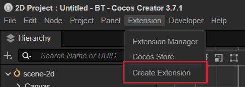
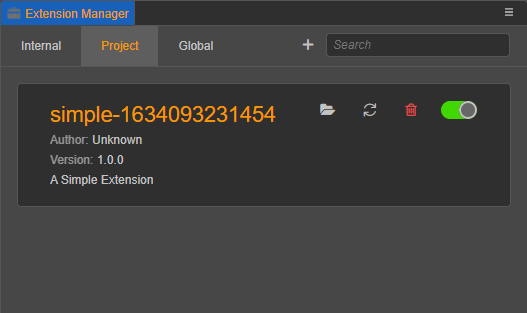
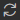

# 入门示例-菜单

本文将演示如何创建一个 Cocos Creator 扩展，本文将包含以下知识点：
- 创建扩展
- 新增菜单
- 菜单消息

## 创建并安装扩展

在编辑器的菜单栏中找到 **扩展 -> 创建扩展** 菜单，如下图所示：



点击 **创建扩展** 后，会弹出如下图所示的创建面板：


Cocos Creator 提供了如上图所示 4 种扩展模板，用于快速创建一个新的扩展项目。

为了更简单的演示模板创建流程，我们选择 **Blank** 模板，点击面板右下方的 **创建扩展** 按钮建一个扩展包。

更多模板创建相关内容，请参考文档 [扩展模板与编译构建-模板类型](./create-extension.md)。

## 扩展管理

扩展创建成功后，点击顶部菜单栏中的 **扩展 -> 扩展管理器 -> 项目/全局**，即可看到刚才创建的扩展。新创建的扩展默认是未启用状态，点击启用按钮即可启用此扩展：



更多扩展管理内容请参考文档 [扩展管理器-扩展列表](./extension-manager.md)。

## 扩展目录

点击  按钮可打开扩展包所在目录。以 **Blank** 模板为例，目录结构如下：


各子文件（夹）功能如下：
- `@types` - TypeScript 定义文件。
- `dist` - TypeScript 生成的 javascript 代码。
- `i18n` - 多语言配置。
- `src` - TypeScript 源代码。
- `package.json` - 扩展描述文件。
- `README-CN/EN.md` - 中文/英文说明文件。
- `tsconfig.json` - TypeScript 配置文件。

## 扩展定义文件 `package.json`

每个扩展都需要有一份 `package.json` 文件，用于描述改扩展的用途。

只有完整定义了描述文件 `package.json` 后，编辑器才能知道这个扩展里定义的具体功能、加载入口等信息。

> **注意**：虽然 `package.json` 很多字段的定义和 `node.js` npm 模块的 `package.json` 相似，但从 npm 社区中下载的 npm 模块并不能直接作为 Cocos Creator 扩展使用。可以在 Cocos Creator 扩展中调用 npm 模块，使扩展具备相应的能力。

打开 `package.json` 文件，可以看到以下内容：

```json
{
    "package_version": 2,
    "version": "1.0.0",
    "name": "simple-1649426645745",
    "description": "i18n:simple-1649426645745.description",
    "main": "./dist/main.js",
    "devDependencies": {
        "@types/node": "^16.0.1",
        "typescript": "^4.3.4"
    },
    "author": "Cocos Creator",
    "editor": ">=3.4.2",
    "scripts": {
        "build": "tsc -b",
        "watch": "tsc -w"
    }
}

```

各字段含义如下：
- `package_version`：Number - 版本号数值。
- `version`：String - 版本号字符串，推荐使用 [semver](http://semver.org/) 格式管理你的包版本。
- `name`：String - 定义了包的名字，包的名字是全局唯一的。命名规则请参考 [选项说明](./create-extension.md)。
- `description`：Stirng - 扩展描述，用于简要介绍扩展关键特性、用途等信息，支持 **i18n** 多语言设置。
- `main`：String - 入口程序文件。
- `devDependencies`：{} - 扩展依赖。如本示例中，扩展依赖的 NodeJS 版本为 16.0.1，依赖的 TypeScript 版本为 4.3.4。
- `author`：String - 作者信息。
- `editor`：String - 支持的 Cocos Creator 编辑器版本。
- `scripts`：{} - 脚本编译相关命令。

## 定义菜单和消息

将 `package.json` 改为如下内容：

```json
{
    "package_version": 2,
    "version": "1.0.0",
    "name": "simple-1649426645745",
    "description": "i18n:simple-1649426645745.description",
    "main": "./dist/main.js",
    "devDependencies": {
        "@types/node": "^16.0.1",
        "typescript": "^4.3.4"
    },
    "author": "Cocos Creator",
    "editor": ">=3.4.2",
    "scripts": {
        "build": "tsc -b",
        "watch": "tsc -w"
    },
    //------------------------------
    "contributions": {
        "menu": [{
            "path": "Develop",
            "label": "test",
            "message": "log"
        }],
        "messages": {
            "log": {
                "methods": ["log"]
            }
        }
    }
}
```

新增字段含义如下：
- `contributions`：Object（可选）- 对编辑器已有功能进行扩展的相关配置
    - `menu`：[]，注册菜单，并绑定消息。具体内容请参考 [自定义主菜单](./contributions-menu.md)。
    - `messages`：[] - 注册编辑器消息，可以绑定一个或多个的扩展内定义的方法。更多定义数据请参考 [自定义消息](./contributions-messages.md)。

更多关于 `package.json` 格式的定义，请参考 [扩展包的定义](./define.md)。

## 安装依赖和编译构建

扩展创建完成后打开扩展包所在目录，执行以下命令：

```bash
# install dependencies
npm install
# build
npm run build
```

更多扩展编译构建相关信息参考文档 [扩展模板与编译构建](./create-extension.md)。

## 运行扩展

返回编辑器，点击顶部菜单栏中的 **扩展 -> 扩展管理器 -> 项目/全局**，找到之前创建的扩展。点击扩展右侧的  按钮，使上面的修改内容生效。

若扩展已生效，在 Cocos Creator 顶部菜单栏区域会出现一个 **Develop** 菜单，并带有一个 **test** 菜单项，如下图所示：


此时点击 **test** 菜单项会发现没有任何反应，这是因为我们还没有为菜单信息编写对应的代码。

接下来我们便看看如何让菜单与扩展通信。

## 入口程序 `main.ts`

每一个扩展都有一个唯一的入口程序 `main.ts`，默认生成的内容如下：

```typescript
/**
 * @en Registration method for the main process of Extension
 * @zh 为扩展的主进程的注册方法
 */
export const methods: { [key: string]: (...any: any) => any } = { };

/**
 * @en Hooks triggered after extension loading is complete
 * @zh 扩展加载完成后触发的钩子
 */
export const load = function() { };

/**
 * @en Hooks triggered after extension uninstallation is complete
 * @zh 扩展卸载完成后触发的钩子
 */
export const unload = function() { };
```

`export const methods` 中定义的方法，将会作为操作的接口，通过 [消息系统](./messages.md) 跨扩展调用，或者是和面板通信。

入口程序是扩展的主进程，会在 Cocos Creator 的启动过程中被加载。

## 菜单消息处理

我们对入口程序稍作修改，添加一个接收 `log` 消息的处理函数，如下所示：

```typescript
export const methods: { [key: string]: (...any: any) => any } = { 
    log(){console.log('Hello World')},
};
```

执行 `npm run build` 命令，编译扩展。

点击扩展右侧的  按钮，使上面的修改内容生效。

再次点击 `Develop/test`菜单项，会发现在 Cocos Creator **控制台** 打印出了 “Hello World”。
