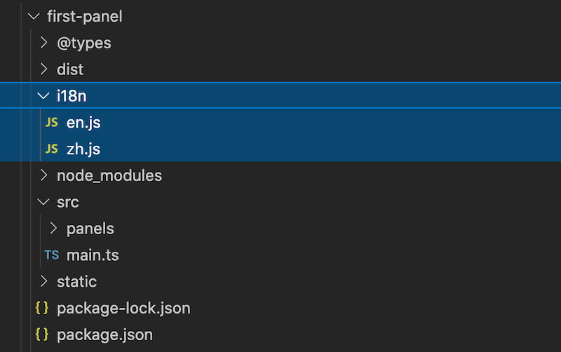

# 多语言系统（i18n）

## 什么是 i18n

**i18n**（其来源是英文单词 internationalization 的首末字符 i 和 n ，18 为中间的字符数）是“国际化”的简称。

在资讯领域，i18n 指让产品（出版物，软件，硬件等）无需做太多改变就能够适应不同的语言和地区的需要。

在程序开发领域，i18n 则是指在不修改内部代码的情况下，能根据不同语言及地区显示相应的本地化内容。

Cocos Creator 扩展系统中内置的多语言方案（i18n）允许扩展配置多份语言的 **键值映射**，并根据编辑器当前的语言设置在扩展里使用不同语言的字符串。

> **注意**：本文将介绍如何赋予 **扩展** 多语言的能力，如需在工程内添加运行时的多言能力，请参考：
> 1. [多语言本地化（L10N）](../l10n/overview.md)
> 2. [i18n 游戏多语言支持](../../advanced-topics/i18n.md)

## i18n 文件夹

要启用多语言功能（以下简称 i18n），需要在扩展的目录下新建一个名叫 i18n 的文件夹，并为每种语言添加一个相应的 `JavaScript` 文件，作为键值映射数据。

数据文件名应该和语言的代号一致，如 `en.js` 对应英语映射数据，`zh.js`对应中文映射数据。如下图所示：



映射以 `JavaScript` 对象的 key 作为键值，并以模块信息导出，如下所示：

- `en.js`

  ```javascript
  "use strict";
  module.exports = {
      open_panel:"Default Panel",
      send_to_panel:"Send message to Default Panel",
      description:"Extension with a panel"
  };
  ```

- `zh.js`

  ```javascript
  module.exports = {
      open_panel:"默认面板",
      send_to_panel:"发送消息给面板",
      description:"含有一个面板的扩展"
  };
  ```

以 `open_panel` 为例，假设注册的扩展名字叫做 `first-panel`，则对应的文本翻译 key 为 `first-panel.open_panel`。

## 在脚本中使用

在 TypeScript 或者 JavaScript 脚本中，可通过 `Editor.I18n.t` 接口获取当前语言对应的翻译后的文本：

```typescript
let str = Editor.I18n.t('first-panel.open_panel');
```

## 在 HTML 模板中使用

在 HTML 模版里需要翻译的话可以使用 ui-label 元素进行翻译：

```html
<ui-label value="i18n:first-panel.open_panel"></ui-label>
```

> **注意**：`ui-label` 是一个普通的行内元素，类似 span。

### 在 json 文件中使用

例如在扩展包的 `package.json` 中注册菜单路径时，只要这个字段支持 i18n 格式的路径，该路径就可以用 `i18n:${key}` 的形式实现多语言翻译功能。

示例1：扩展描述

```json5
// "package_version": 2,
// "version": "1.0.0",
// "name": "first-panel",
"description": "i18n:first-panel.description",
// "main": "./dist/main.js",
```

示例2：面板标题

```json5
"panels": {
    "default": {
        "title": "first-panel Default Panel",
        // "type": "dockable",
        // "main": "dist/panels/default",
        // "size": {...}
    }
},
```

示例3：菜单路径与显示内容

```json
"menu":[
  {
    "path": "i18n:menu.panel/first-panel",
    "label": "i18n:first-panel.open_panel",
    "message": "open-panel"
  },
  {
    "path": "i18n:menu.develop/first-panel",
    "label": "i18n:first-panel.send_to_panel",
    "message": "send-to-panel"
  }
]
```
