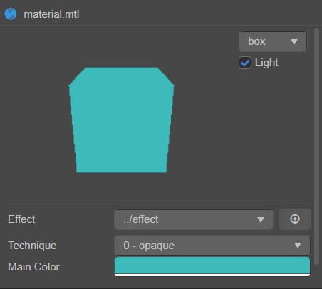

# 自定义在 material 中 effect 的 inspector 的内容

inspector 针对 material 有一套自动渲染的机制，能够根据使用的 effect 自动渲染出操作界面。
但有些特殊情况下，自动渲染并不能满足操作需求，所以 inspector 允许针对每一种 effect 定制 material 渲染界面。
假设我们需要自定义一个 effect 的 inspector ，在 material 中要能修改它的 `mainColor` 属性。

## 设置 effect 的代码

我们新建一个名为 `my-effect` 的 effect 文件，然后在 effect 代码中进行如此设置：

```yaml
// Effect Syntax Guide: https://github.com/cocos-creator/docs-3d/blob/master/zh/material-system/effect-syntax.md

CCEffect %{
  editor:
    inspector: 'packages://my-effect-extension/my-effect.js'
  techniques:
  - name: opaque
    passes:
    - vert: general-vs:vert # builtin header
      frag: unlit-fs:frag
      properties: &props
        mainTexture:    { value: white }
        mainColor:      { value: [1, 1, 1, 1], editor: { type: color } }
}%

CCProgram unlit-fs %{
  precision highp float;
  #include <output>
  #include <cc-fog-fs>

  in vec2 v_uv;
  uniform sampler2D mainTexture;

  uniform Constant {
    vec4 mainColor;
  };

  vec4 frag () {
    vec4 col = mainColor * texture(mainTexture, v_uv);
    CC_APPLY_FOG(col);
    return CCFragOutput(col);
  }
}%

```

更多关于 effect 的定义方式请参考 [Effect Syntax Guide](https://github.com/cocos-creator/docs-3d/blob/master/zh/material-system/effect-syntax.md)

## 定义一个插件

首先我们需要一个扩展，关于创建扩展的方法请参考 [创建扩展](./create-extension.md)

## 定义 inspector

假设我们开启了一个名为 `my-effect-extension` 的扩展。
然后在 `my-effect-extension` 目录下定义一个js脚本 `my-effect`，脚本的内容如下：

```js
"use strict";

module.exports = {
    template: `
    <ui-prop>
        <ui-label slot="label" value="Main Color"></ui-label>
        <ui-color id="color" slot="content"></ui-color>
    </ui-prop>
    `,
    $: {
        color: '#color',
    },
    methods: {
        /**
         * 
         * @param {{r:number,g:number,b:number,a:number}} color 
         * @returns 
         */
        colorToUIColor(color) {
            return [color.r, color.g, color.b, color.a];
        },
        /**
         * 
         * @param {number[]} UIColor 
         * @returns 
         */
        UIColorToColor(UIColor) {
            return { r: UIColor[0], g: UIColor[1], b: UIColor[2], a: UIColor[3] };
        }
    },
    update(material, assetList, metaList) {
        this.material = material;
        // 找到材质中的颜色
        this.mainColor = this.material.data[0].passes[0].props.find(prop => { return prop.name === 'mainColor'; });
        // 同步面板与材质的颜色
        this.$.color.value = this.colorToUIColor(this.mainColor.value);
    },
    ready() {
        if (this.$.color) {
            // 监听颜色变换
            this.$.color.addEventListener('confirm', (event) => {
                // 设置材质的颜色
                this.mainColor.value = this.UIColorToColor(event.target.value);
                // 发送修改事件，通知面板材质被修改了
                this.dispatch('change');
            })
        }
    },
}

```

update 的参数详情如下表

| 参数名    | 参数含义                       |
| --------- | ------------------------------ |
| material  | 当前材质的数据                 |
| assetList | 当前选中的资源的资源信息列表   |
| metaList  | 当前选中的资源的 meta 信息列表 |

关于 assetList 和 metaList 的定义请参考 [inspector](./inspector.md)。

## 最终效果

新建一个 material ，然后在 material 设置 effect 为 `my-effect`，修改面板的 Main Color 的值并且在面板点击确认后，可以看到如下画面。



## Demo

点击下载完整的 [demo](./zip/effect-inspector-project.zip)