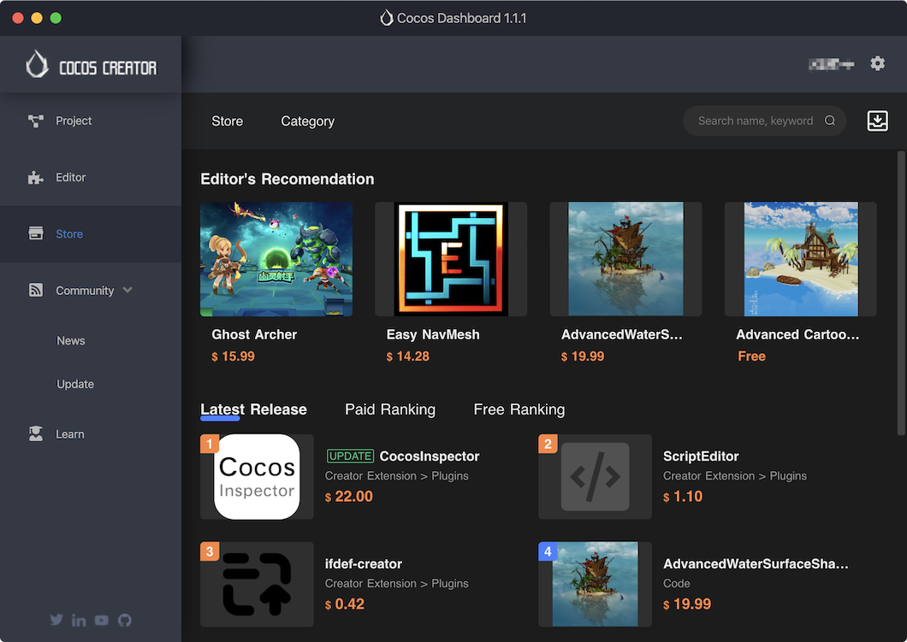
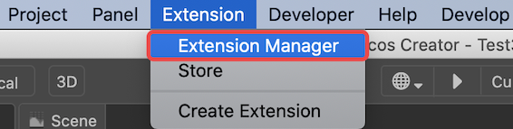
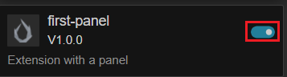
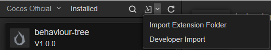
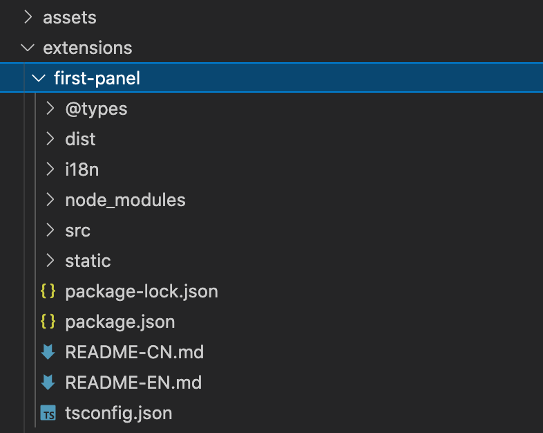

# 安装与分享

## 安装位置

Cocos Creator 在启动项目的过程中会搜索并加载 **项目** 路径下的扩展。

### 项目

扩展存放的地址为：

- `${你的项目地址}/extensions`

## 安装扩展

可以通过三种方式获得扩展：
- 其他开发者打包分享，请参考下文 [打包扩展](#%E6%89%93%E5%8C%85%E6%89%A9%E5%B1%95)。

- 从 **Dashboard->商城** 下载。

  

- 从 [Cocos Store·资源商城](http://store.cocos.com) 页面下载。

获得扩展压缩包（zip 文件）后，在编辑器顶部菜单栏中点击 **扩展 -> 扩展管理器**：

点击后可打开如下图所示的 **扩展管理器** 面板。

在 **扩展管理器** 中选择 **项目**（上图所示 1） 选项卡，点击  (上图所示 3) 按钮。

在弹出的文件选择框中选择要导入的扩展压缩包，点击 **打开** 按钮即可导入。

导入的扩展压缩包会被解压并放到指定的 [安装位置](#%E5%AE%89%E8%A3%85%E4%BD%8D%E7%BD%AE)。

最后在 **扩展管理器** 对应的 **项目** 选项卡中找到扩展，点击右边的 **启用** 按钮，刚刚导入的扩展就可以正常运行了。如下图所示：

对于解压后的扩展，也可以通过点击  右侧的下拉按钮导入。

## 卸载已安装的扩展

在 **扩展管理器** 中找到需要删除的扩展，点击 **删除按钮**  即可，同时扩展所在的文件夹也会删除。如果只需要禁用，可以只选择 "关闭"。

## 重载扩展

若扩展的内容有修改，是不会自动更新的，这时候就需要在编辑器内手动重新载入一次扩展。

在 **扩展管理器** 中找到对应的扩展，然后点击 **重新载入按钮** ，这时候编辑器中的扩展将使用最新的代码和文件重新运行。

## 打包扩展

当编写好一个扩展后，如果要将扩展分享给其使用者，则需要将该扩展打包为 zip 格式的压缩包。

我们以 `first-panel` 扩展为例，其目录结构如下：

进入扩展根目录，选择相应文件并将所有文件压缩成 zip 包，如下图所示（截图为 macOS 系统，其余平台同理）：

上图中所选文件（夹）为必选，缺一不可，它们作用如下：
- `dist` - 生成的 javascript 代码。
- `i18n` - 多语言配置。
- `node_modules` - 依赖的 Node.js 模块。
- `package.json` - 扩展描述文件。
- `static` - 静态资源文件。

将压缩包命名为 `first-panel.zip`（建议与扩展文件夹同名），分享给其他人或者上传 Cocos Store 即可完成分享。

> **注意**：要在扩展的目录下进行文件选择操作，否则可能导致目录结构不对。

若想上架扩展到 [资源商店（Cocos Store）](https://store.cocos.com)，请参考文档 [上架扩展到资源商店](./store/upload-store.md)。
