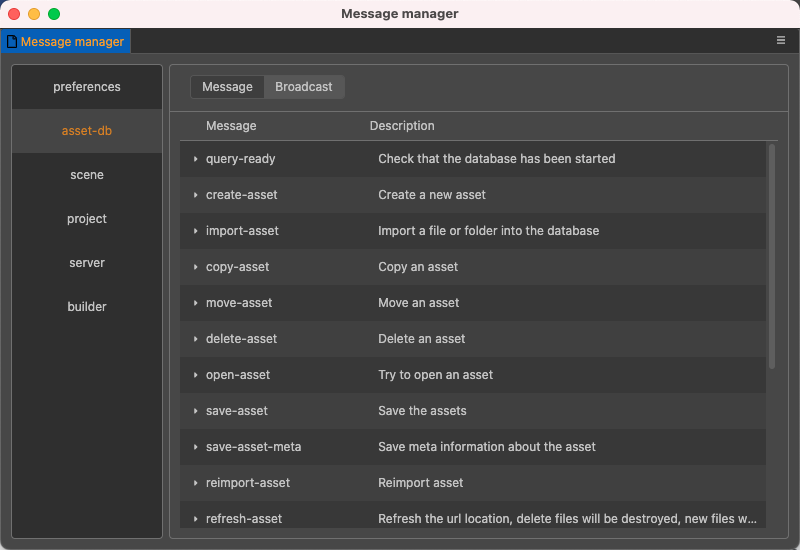
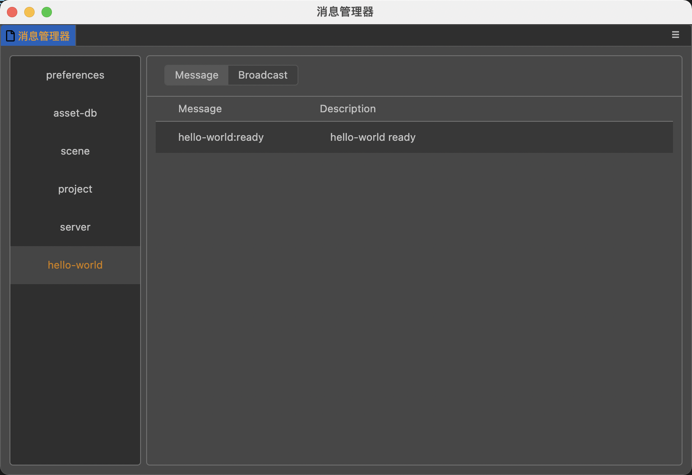

# 消息系统

Cocos Creator 3.0 中有许多独立运行的进程，进程间相互隔离，一个进程不能随便访问另一个进程，这是系统安全性的保证和需要。但实际上进程之间通常需要一起协作才能去完成一项任务，此时就需要在进程间进行通知和数据传递。为保证进程之间相互独立，在与其他功能进行交互的时候，需要通过"消息"进行。

编辑器里的 **消息系统** 是根据 IPC（进程间通信）扩展封装，**这个系统承担起了整个编辑器内通讯交互的重担**。

在 Cocos Creator 3.0 中，所有的消息都需要在 `contributions` 里的 `messages` 字段内注册、监听方可使用。

## 消息类型

消息系统的交互消息分为两种：

1. 普通消息：主动发送某条消息到某个功能（扩展）。
2. 广播消息：某个功能（扩展）完成了一个操作后向所有人发送通知，告知操作已经完成。

### 普通消息

普通消息可以理解成一种对外的 API。例如：自定义扩展 `hello-world` 提供了 `get-data` “消息”，可以根据数据 id 给自身面板提供缓存数据，注册方式如下：

```json
{
    "contributions": {
        "messages": {
            "get-data": {
                "methods": ["getData"]
            }
        }
    }
}
```

这样，在编辑 `hello-world` 面板的时候，如果有需要获取缓存信息，就可以在自身的扩展脚本里使用这个 API 发送消息。这种消息类似一种远程调用 API。

```js
const info = await Editor.Message.request('hello-world', 'get-data', 'mat');
```

### 广播消息

广播消息是某一个功能内的操作完成后，对外进行的一种通知。还是以 **场景编辑器** 为例。

**场景编辑器** 在启动一个 scene 后，会通知所有消息监听对象"场景"已经启动完毕。在自定义 `hello-world` 扩展定义如下：

```json
{
    "contributions": {
        "messages": {
            "scene:ready": {
                "methods": ["initData"]
            }
        }
    }
}
```

“场景”扩展内广播如下：

```js
Editor.Message.broadcast('scene:ready', sceneUUID);
```

之后，每当场景准备就绪后广播 `scene:ready`，就会触发 `hello-world` 扩展里的 `initData` 方法。

## 消息的命名规范

### 普通消息

请使用 **小写** 单词，并且不能包含特殊字符，单词间以 **-** 连接。

### 广播消息

不能包含除了 **:** 以外的特殊字符。格式为 `packageName:actionName`。

加上 packageName 是为了防止命名出现冲突。在自己的扩展里，监听的时候需要直接标明监听的是哪一个扩展的哪个广播（动作），这样在 `package.json` 中能够更加直观的了解扩展对消息的处理流程。

## 查看消息列表

内置扩展以及用户自定义扩展对外“开放”的所有消息，可以通过 **开发者 -> 消息列表** 面板查看。



## 发送消息

消息发送采用以下三种方法：

- `Editor.Message.send(pkgName, message, ...args);`

  `send` 方法只发送消息，并不会等待返回。如果不需要返回数据，且不关心是否执行完成，请使用这个方法。

- `await Editor.Message.request(pkgName, message, ...args);`

  `request` 方法返回一个 promise 对象，这个 promise 会接收消息处理后返回的数据。

- `Editor.Message.broadcast(`${pkgName}:${actionName}`, ...args);`

  `broadcast` 方法只发送，并且发送给所有监听对应消息的功能扩展。

例如：

```js
// 请求场景节点数据，可以通过选中节点，右键选择复制和打印 UUID 获取到节点 uuid。
const info = await Editor.Message.request('scene', 'query-node', uuid);

Editor.Message.send('hello-world', 'save-data', info);
```

## 参数字段

| 字段名 | 类型  | 是否选填 | 描述 |
| :--- | :---  | :--- | :--- |
| public | string  | 是 | 是否对外显示这条消息，如果为 true，则会在消息列表界面显示这条消息的基本信息。 |
| description | string  | 是 | 如果 public 为 true，则会在消息列表显示一些简单的描述，支持 i18n:key 语法。 |
| doc | string  | 是 | 如果 public 为 true，则会显示这条消息的一些文档，支持 i18n:key 语法。这个文档使用 markdown 格式撰写并渲染。 |
| methods | string[]  | 是 | 消息触发的方法队列。</br>这是一个字符串数组，字符串为扩展或者面板上的方法（methods）。</br>
如果是扩展上的方法，则直接定义 "methodName"，如果要触发扩展里定义的面板上的方法，则要填写 "panelName.methodName"。例如场景管理器的 ready 方法，就是 `scene:ready`。 |

### 定义普通消息

定义一个菜单栏按钮 `Tools/open`，当点击该按钮，会派发 `open-panel` 消息，书写方法如下：

```json
{
    "name": "hello-world",
    "contributions": {
        "menu": [
            {
                "path": "Tools",
                "label": "open",
                "message": "open-panel"
            }
        ],
        "messages": {
            "open-panel": {
                "public": false,
                "description": "",
                "doc": "",
                "methods": ["openPanel"]
            }
        }
    }
}
```

> 注意：由于 `open-panel` 消息的 `public` 为 false，所以在消息管理面板上不会出现。

### 定义广播消息

开发一个扩展的时候，完成一个动作后需要向其他功能发送一些通知，这些通知也需要显示在 "消息列表" 面板上的话，可以这样定义消息：

```json
{
    "name": "hello-world",
    "contributions": {
        "messages": {
            "hello-world:ready": {
                "public": true,
                "description": "hello-world ready"
            }
        }
    }
}
```


