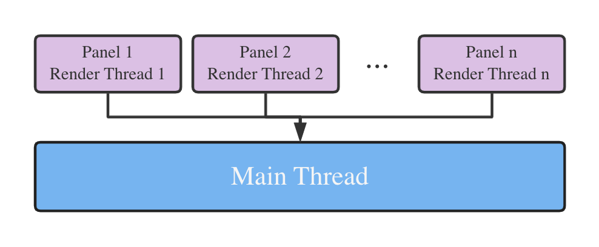
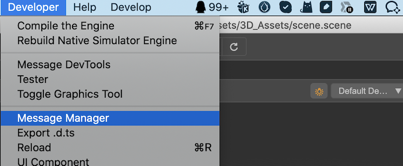
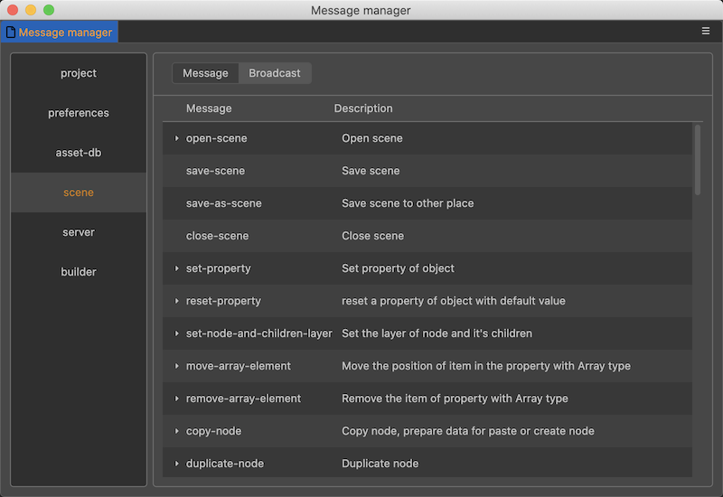

# 基础结构

在编写扩展之前，我们首先需要了解一下 Cocos Creator 内，扩展的基础结构。

## Electron
Cocos Creator 编辑器是基于 GitHub 的 [Electron](https://github.com/atom/electron) 内核开发。

Electron 是一个集成了 [Node.js](https://nodejs.org/) 和 [Google Chromium](https://github.com/chromium/chromium) 的跨平台开发框架。

## 多进程机制

在 Electron 的架构中，一份应用程序由主进程和渲染进程组成，其主进程负责管理平台相关的调度，如窗口的开启关闭、菜单选项、基础对话框等等。而每一个新开启的窗口就是一个独立的渲染进程。每个进程独立享有自己的 `JavaScript` 内容，且彼此之间无法直接访问。当需要在进程之间传递数据时，需要使用进程间通信（`IPC`）机制。

相关功能可以通过阅读 [Electron's introduction document](https://github.com/atom/electron/blob/master/docs/tutorial/quick-start.md) 更深入的理解 Electron 中的主进程和渲染进程的关系。

简单点说，Electron 的主进程相当于一个 Node.js 服务端程序，而每一个窗口（渲染进程）则相当于一份客户端网页程序。

Cocos Creator 编辑器沿用了 Electron 的主进程和渲染进程的结构设计。所以扩展在编辑器内启动并运行的时候，扩展定义的 main 其实是在主进程启动，而 panels 定义的面板，则在渲染进程启动。进程结构简要概括如下：

## 进程间通信

进程间通信实际上就是在一个进程中发消息，然后在另外一个进程中监听消息的过程。

Electron 提供了进程间通信对应的模块 `ipcMain` 和 `ipcRenderer` 来帮助我们完成这个任务。

由于这两个模块仅完成了非常基本的通信功能，并不能满足编辑器，扩展面板与主进程之间的通信需求，所以 Cocos Creator 在这之上又进行了封装，扩展了进程间消息收发的方法，方便扩展开发者和编辑器开发者制作更多复杂情景。更多说明请查看文档 [消息系统](./messages.md)。

## 扩展的能力

扩展内拥有完整的 Node.js 环境，可以很方便的使用 npm 市场上大量的工具，用于完成自己想要的功能。

如果需要和其他功能交互，则需要对应功能开放对应的操作消息，我们在自己的扩展内，通过 [消息系统](./messages.md) 触发、查询、处理编辑器内的功能或者数据。

已经开放的消息列表可以在顶部菜单 **开发者 -> 消息列表** 面板里查看，如下图所示：

