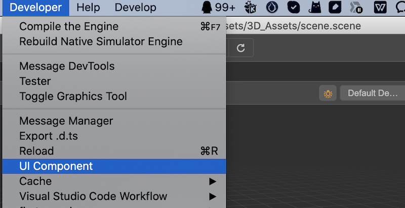

# UI 组件

## UI 组件面板

为了方便布局，编辑器内提供了许多预设的 UI 组件。

1、找到编辑器顶部主菜单中的 **开发者 -> UI 组件** 查看。

2、点击后可打开如下的面板：

该面板由两部分组成，左边栏列出了目前引擎支持的 UI 种类，右侧栏提供了部分示例，开发者可按需使用。

## 在 HTML 中使用

在 HTML 使用 UI 组件非常简单，只需要将对应代码复制到你的 HTML 文件中，即可使用。

## 在扩展面板时使用

在扩展编辑器面板时，可以使用 json 方式进行配置。理论上所有带 `value` 属性的 UI 组件都可以用于扩展编辑器面板，下面列出常见的几种：

### 输入框

- 组件：`ui-num-input`
- 无额外属性

### 滑动条

- 组件：`ui-slider`
- `attributes` 组件属性
    - `min` 最小值
    - `max` 最大值
    - `step` 步长

### 复选框

- 组件：`ui-checkbox`
- 无额外属性

### 选择列表

- 组件 `ui-select`
- `items` 列表元素
    - `value` 值
    - `label` 显示标签

具体使用示例请参考文档 [自定义偏好设置面板](./contributions-preferences.md) 和 [自定义项目设置面板](./contributions-project.md)。
