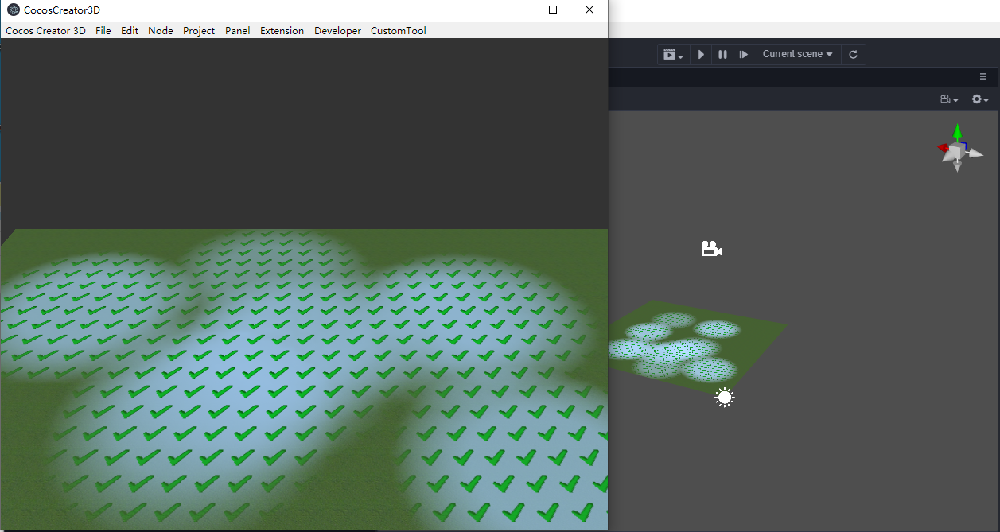
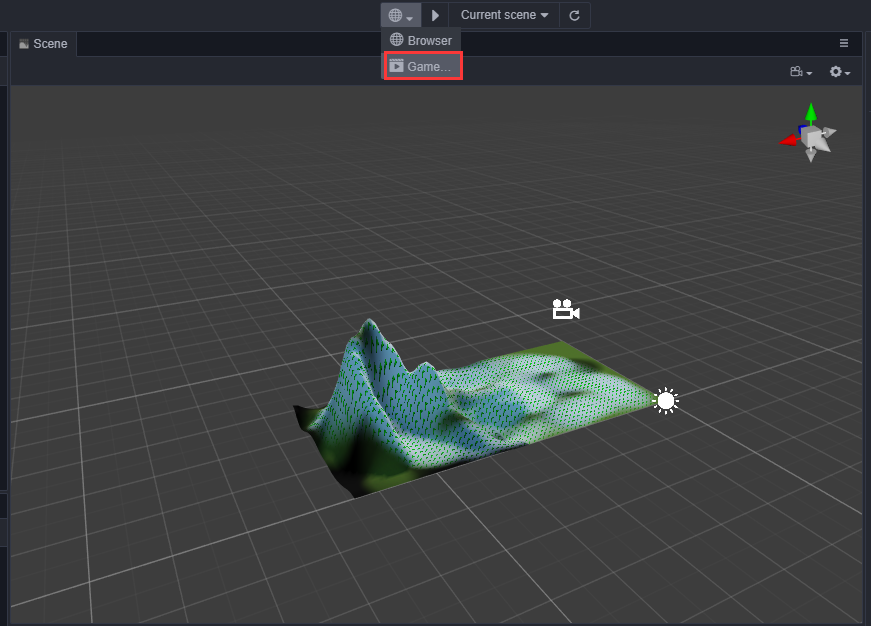
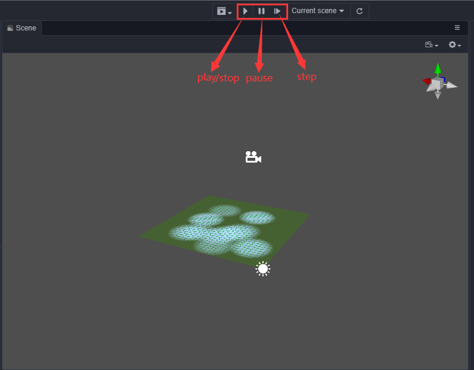
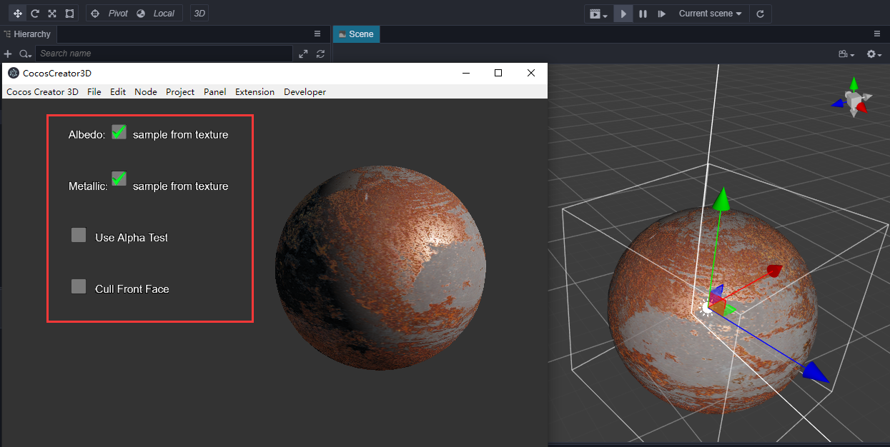

## 预览窗口说明

**预览窗口** 是内嵌于编辑器中的游戏视图功能，它可以不打开浏览器即可在编辑器中运行游戏，这样做的优势在于运行后的游戏可以通过编辑器中的其它插件或 gizmo 实时调整游戏中的模型以及游戏运行时的状态等，做到游戏运行时的"所见即所得"。

## 预览窗口打开方式

在编辑器顶部工具栏的运行方式下拉框中选择 **预览窗口**，即可打开 **预览窗口**。

## 按钮操作说明

打开 **预览窗口** 后，可以看到顶部工具栏多出了 **播放/停止**、**暂停**、**步进** 几个按钮：
- **播放/停止**：点击该按钮可以在编辑器中运行游戏，同时按钮的状态会切换至可停止的状态，点击 **停止** 按钮可停止游戏运行。
- **暂停**：点击该按钮可让运行中的游戏暂停。
- **步进**：点击该按钮可让游戏以步进的方式运行，方便用于调试。

## 预览窗口同步

运行前的 **预览窗口** 可以作为简单的预览功能存在，当调整 gizmo 或通过其它插件调整场景时，**预览窗口** 的画面可以实时同步。

## 预览窗口运行时

运行游戏时，**预览窗口** 可以实时运行各节点组件上的生命周期，这包括了鼠标与键盘事件以及 UI 事件响应等。
