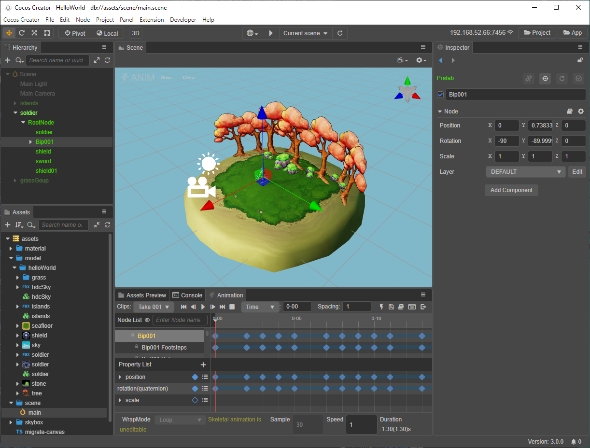
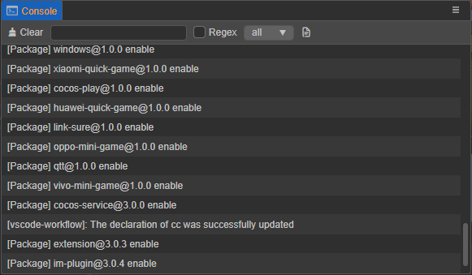
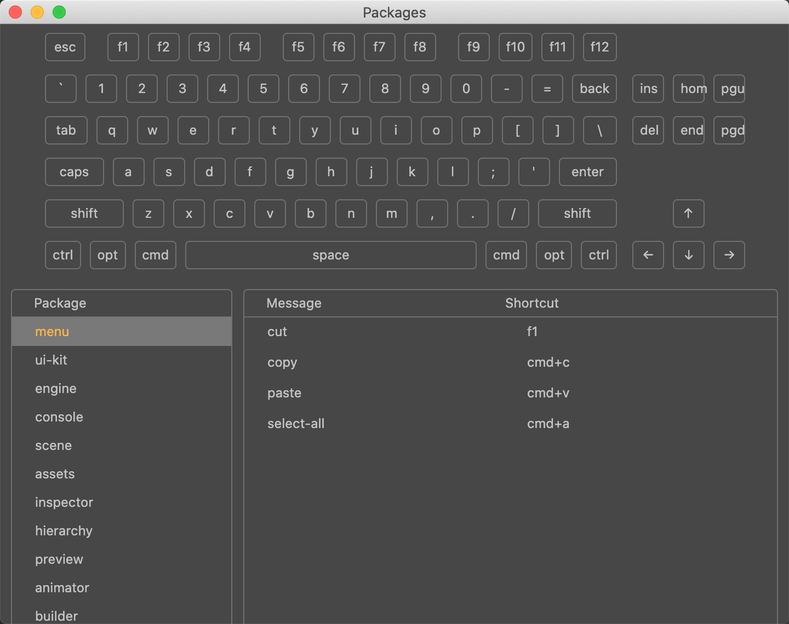

# 编辑器界面介绍

这一章将会介绍编辑器界面，熟悉组成编辑器的各个面板、菜单和功能按钮。Cocos Creator 编辑器由多个面板组成，面板可以自由移动、组合，以适应不同项目和开发者的需要。我们在这里将会以默认编辑器布局为例，快速浏览各个面板的名称和作用：

- （**A**）[层级管理器](./hierarchy/index.md)：以树状列表的形式展示场景中的所有节点和它们的层级关系，所有在 **场景编辑器** 中看到的内容都可以在 **层级管理器** 中找到对应的节点条目，在编辑场景时这两个面板的内容会同步显示，一般我们也会同时使用这两个面板来搭建场景。
- （**B**）[资源管理器](./assets/index.md)：显示了项目资源文件夹（`assets`）中的所有资源。这里会以树状结构显示文件夹并自动同步在操作系统中对项目资源文件夹内容的修改。您可以将文件从项目外面直接拖拽进来，或使用菜单导入资源。
- （**C**）[场景编辑器](./scene/index.md)：用于展示和编辑场景中可视内容的工作区域。通过在场景编辑器中搭建场景，即可获得所见即所得的场景预览。
- （**D**）[动画编辑器](./animation/index.md)：用于编辑并存储动画数据。
- （**E**）[属性检查器](./inspector/index.md)：用于查看并编辑当前选中节点和组件属性的工作区域，这个面板会以最适合的形式展示和编辑来自脚本定义的属性数据。
- （**F**）[项目预览](./preview/index.md)：在场景搭建完成之后，在 Web 或原生平台预览游戏的运行效果。

其他重要的编辑器基础界面包括：

- **控制台**

    

    **控制台** 会显示报错、警告或其他编辑器和引擎生成的日志信息。详情请阅读 [控制台](console/index.md) 一节。

- **偏好设置**

    

    **偏好设置** 里提供各种编辑器个性化的全局设置，包括原生开发环境、游戏预览、其他插件的全局设置等。详情请阅读 [偏好设置](preferences/index.md) 一节。

- **项目设置**

    

    **项目设置** 里提供各种项目特定的个性化设置，包括分组管理、功能裁剪、项目预览、自定义引擎等。详情请阅读 [项目设置](project/index.md) 一节。

- **快捷键**

    

    **快捷键** 里提供了多个功能模块的操作快捷键，从而加快游戏制作效率。详情请阅读 [快捷键](shortcuts/index.md) 一节。

- **服务**

    

    Cocos Service 是集成在 Cocos Creator 内的 **服务** 面板。我们甄选优质技术方案商，提供高性价比服务接入，致力于给用户一键式的接入体验，以及提供相应的技术支撑。同时依托广大 Cocos 开发者群体，我们也将为开发者争取到更加优惠的价格。

    具体内容请参考 [Cocos Service 简介](https://service.cocos.com/document/zh/)。
