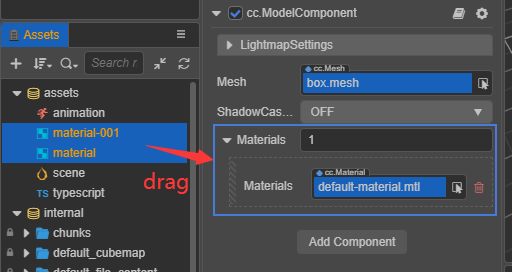

# 属性检查器

**属性检查器** 是我们查看并编辑节点或资源属性的重要渠道。可编辑节点的位置，节点上的组件、图片、材质、模型等资源，面板功能细节多，较为复杂。
在 **场景编辑器** 或者 **层级管理器** 选中节点，或者在 **资源管理器** 选中资源，就可以在 **属性检查器** 中显示并开始编辑它的属性。

## 头部公共部分

左边的 **两个箭头** 是历史记录，点击可切换编辑项。 
右边的 **锁图标** 可锁定面板，固定住编辑的对象，不让面板随新的选中项而变动。

## 编辑节点

节点与 **层级管理器** 中的树形结构里的节点对应，显示一样的名称。

- 左上角的复选框表示节点的激活状态，默认勾选。去掉勾选则表示节点处于非激活状态，此时节点将会被暂停渲染，整个节点包括子节点在运行时就会被隐藏。

- 输入框里是节点的名称，名称可以为空。

- 接下来是节点的几个通用属性：Position（位置）、Rotation（旋转）、Scale（缩放）、Layer。
- 右边的 **设置** 按钮可执行复制、粘贴节点属性的值，也可以粘贴一个新组件。

  

- **添加组件** 按钮，点击后会出现组件列表，包含系统提供的组件和自定义脚本组件。添加组件的列表有一个搜索框，支持键盘上的上下箭头切换，以及 **Enter** 确定选中。

   

## 编辑节点的组件

面板能显示出节点组件及组件的属性。和节点通用属性一样，每个组件都有一个可折叠或展开的头部。当节点挂载多个组件的情况下，可以通过折叠不常修改的组件来减少滚动范围，提高编辑效率。 
组件名称的右侧有帮助文档和组件设置按钮。
- 帮助文档按钮可以跳转到该组件的 API 文档链接
- 组件设置按钮可以执行移除、上移、下移、复制、粘贴值、粘贴为新组件等操作。

对于开发者通过脚本创建的组件，在编辑节点时，可直接拖拽到 **属性检查器** 面板生成一个脚本组件。脚本组件里的不同属性是开发者自己在脚本代码里声明的，不同类型的属性编辑时编辑器会自动识别给与合适的 UI 组件。

关于属性的定义方法，详情可参考 [声明属性](../../scripting/ccclass.md#property)。

## 部分 UI 组件的使用方法

属性分为 **值类型** 和 **引用类型** 两大类。

### 值类型属性

**值类型** 包括数字、字符串、布尔、枚举等简单的占用很少内存的变量类型：

- 数值（Number）：可以直接使用键盘输入，也可以按输入框旁边的上下箭头逐步增减属性值。
- 向量（Vec2）：向量的控件是两个数值输入组合在一起，并且输入框上会以 x、y 标识每个数值对应的子属性名。
- 字符串（String）：直接在文本框里用键盘输入字符串，字符串输入控件分为单行和多行两种，多行文本框可以按回车换行。
- 布尔（Boolean）：以复选框的形式来编辑，选中状态表示属性值为 true，非选中状态表示 false。
- 枚举（Enum）：以下拉菜单的形式编辑，点击枚举菜单，然后从弹出的菜单列表里选择一项，即可完成枚举值的修改。
- 颜色（Color）：点击颜色属性预览框，会弹 **颜色取色器** 窗口，在这个窗口里可以用鼠标直接点选需要的颜色，或在下面的 RGBA 颜色输入框中直接输入指定的颜色。点击 **颜色取色器** 窗口以外的任何位置会关闭窗口并以最后选定的颜色作为属性值。例如颜色取色器组件：

  

### 引用类型属性

**引用类型** 包括 object 对象，比如节点、组件或资源。可通过 **拖动** 或 **弹出资源面板** 的方式选择并赋值。

## 批量操作

1. 可多选节点批量修改节点属性，但不一致的属性不可以修改，在 input 组件中以 `-` 表示的都不可修改。

    

2. 批量赋值材质、图片、动画等资源，支持选中多个拖动。

    

## 编辑 prefab 节点

prefab 节点的编辑，头部按钮包括：取消关联、关联、定位资源、从资源还原、更新到资源。

- 取消关联，是指将 prefab 节点与资源断开联系，变为普通节点，颜色不再是绿色。
- 关联，是指先选中一个 prefab 资源，再与当前 prefab 节点进行关联。

  普通节点和 prefab 资源的全新关联，可在编辑器顶层菜单 **编辑（Edit）** 中找到操作指令：

  

- 定位资源，是指在 assets 面板上定位到 prefab 资源，并让其闪烁。
- 从资源还原，是指将一个已经编辑过的 prefab 节点，连同它的子节点，都回退到初始状态。
- 更新到资源，是指将已经编辑过的 prefab 节点数据更新到 prefab 资源。

## 编辑资源

编辑资源时请注意最后点击保存，如下图中的 **绿色打勾图标** 即为保存按钮。

