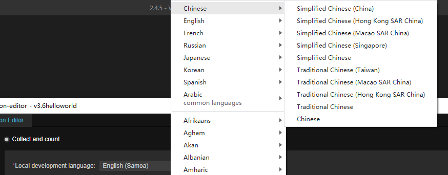
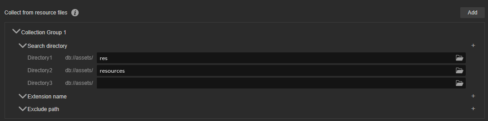

# Collect and count

## 属性和说明

- 本地开发语言: 本地开发语言，指的是开发者在开发时使用的语言。此处选择的语言会作为源语言，提供给译文服务商进行翻译。开发者可以通过下拉菜单，根据当前开发者所在地区选择不同的开发语言：

    

- 从资源文件中收集：多语言编辑功能可以从不同的资源目录搜集所需翻译的文本信息，同时也可以选择过滤或排除某些文件/文件夹。详情请参考下文

## 从资源文件中收集

## 收集并统计

- 收集组：可添加多个，通过 **添加按钮** 添加不同的收集组。
    - 搜索目录
    - 扩展名
    - 排除路径
