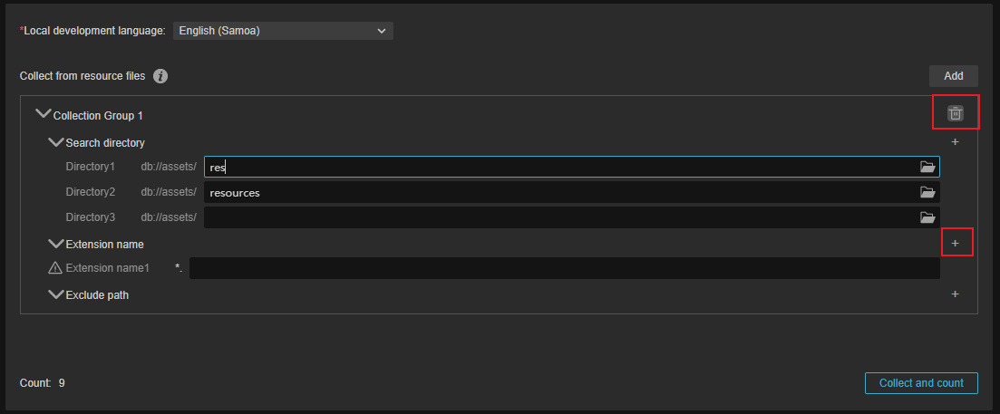

# 收集并统计

收集功能会将项目内文本、Typescript 脚本、场景资源、预制体、视频、引擎和图片等文件搜集起来，并允许开发者进行多语言配置。

## 属性和说明

- 本地开发语言: 本地开发语言，指的是开发者在开发时使用的语言。此处选择的语言会作为源语言，提供给译文服务商进行翻译。开发者可以通过下拉菜单，根据当前开发者所在地区选择不同的开发语言：

    

    该选项为必选。

- 从资源文件中收集：多语言编辑功能可以从不同的资源目录收集所需翻译的文本信息，同时也可以选择过滤或排除某些文件/文件夹。

    

    - 收集组：可添加多个，通过 **添加按钮** 添加不同的收集组，对于已添加的项，鼠标滑过时会显示删除按钮。

      

        - 搜索目录：可以指定当前资源数据库内特定的目录，用于收集需要翻译的资源，最少为 1 个即 `db://assets`。为减少收集时间，我们建议开发者将需要翻译的文本或预制体存放在单独的目录。再通过此选项进行分类整理。
        - 扩展名：指定通过特定的文件后缀名进行收集，若无，则收集所有文件。
        - 排除路径：排除的路径将不会被收集。

当配置好要收集的目录以后，点击收集和统计按钮后，数据会被记录下来，并可通过 [语言编译](compile-language.md) 进行编译和整理。
