# 语言编译

当在 [收集并统计](collect-and-count.md) 视图中选定本地开发语言后，即可对编译过程进行配置。这里将包含 **自动翻译**、**手动翻译**、**变体** 等功能。

## 语言

开发者可以在此处选择目标版本的语言。

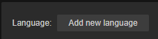

第一行的语言为 **本地开发语言**，记录当前开发过程中所使用的本地语言，通常可以选择为开发者熟悉的语言。在该语言下，**操作** 栏中会出现 **补全** 功能，用于记录 Label 组件的原文，需搭配 [L10nLabel](l10n-label.md) 使用。详情请参考下文。

从第二行开始，则是目标国家/地区所使用的语言，开发者需至少选择一个目标国家/地区的语言，才会出现翻译选项。

## 译文服务商识别的语言

上图用于在自动翻译时选择译文服务商的输入/输出的语言类型：

- 对于本地开发语言，选择的是输入语言类型。

- 对于译文语言来说，选择的是输出语言类型。

例如上图中，本地开发语言为英语（en），那么下拉菜单需要选择 **English**。

而译文是 **简体中文（zh-Hans-CN）**，那么在下拉菜单中请选择 **zh-CHS**。

> **注意**：如果下拉菜单不可用，请检查 [AppKey/AppSecret](translation-service.md) 是否配置正确。

## 翻译进度

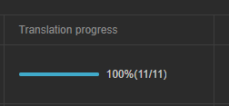

展示当前的翻译进度。

## 操作

操作栏内对本地开发语言提供了 **补齐** 功能，对于目标译文语言提供 **翻译** 功能。两者的通用功能包含 **预览**、**导出** 和 **删除**。

### 补全

**补全** 供仅在当前语言设置为 **本地开发语言** 时生效。补齐功能的作用是记录当前开发语言中所要翻译的内容的原文。所有通过 **搜集并统计** 功能得到的原文数据将会在这里展示。点击后，可以查看所有的结果。

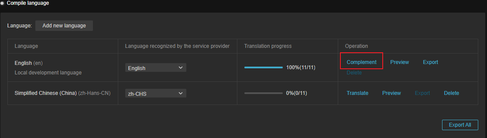

当在预制体或场景内通过 [L10nLabel](l10n-label.md) 组件添加键后：

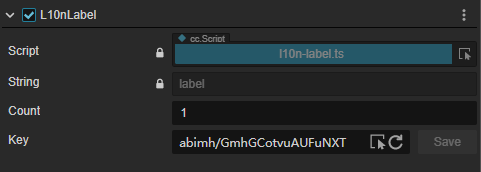

可在 **补全** 界面中找到对应的键值，在 原文（Original） 一栏中输入该键对应的值，然后点击 **保存** 按钮即可将原文保存，如果 Label 的 String 属性有值，这里将被自动填充。

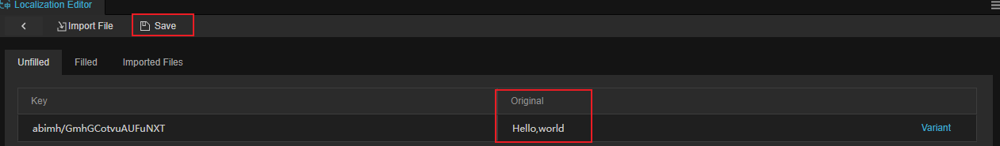

非本文内容如图片、音频等资源也进行补全，具体请参考下文 **非文本资源** 部分。

### 变体

变体功能专门用于解决翻译时遇到的复数问题，系统会根据变体的规则自动调整翻译的内容，用户也可以自由设定变体的规则。

在 **补全** 界面中，点击 **变体** 按钮可以输入新的变体：

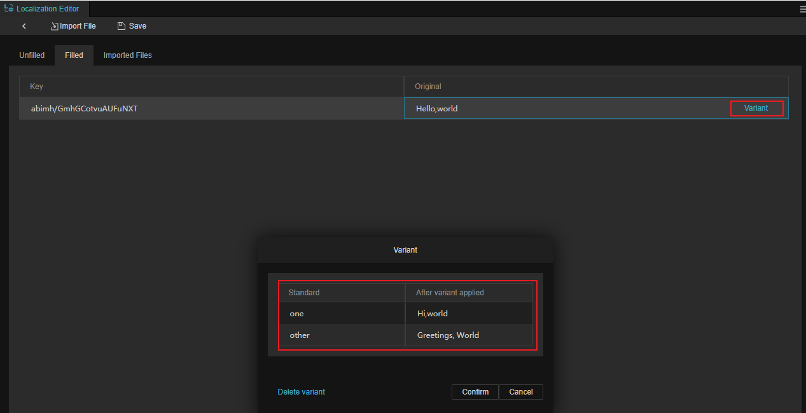

在 **补全** 完成后，记得需要点击上方的 **保存** 按钮进行保存。

变体的数量和语种有关，属于国际规则的一种，感兴趣的用户可移步 [https://cldr.unicode.org/](https://cldr.unicode.org/) 进行查看。

详情可以查看 [L10nLabel 变体数量](l10n-label.md)。

### 翻译

当在 **补全** 功能中，添加了键值和原文后，即可以使用译文服务商的翻译服务进行翻译，点击 **翻译按钮** 可弹出翻译界面：

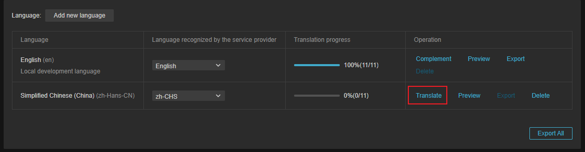

点击右上方的 **翻译** 按钮，进行翻译：

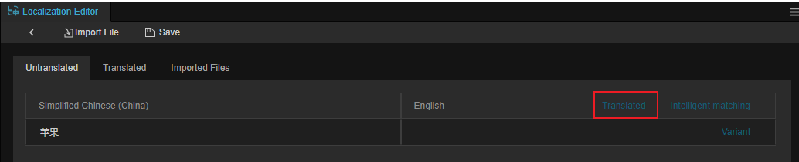

翻译完成后可在 **翻译** 分页内查看翻译结果：

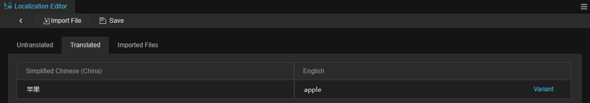

对于已翻译的文本，也可以点击 **变体**，添加不同的翻译：

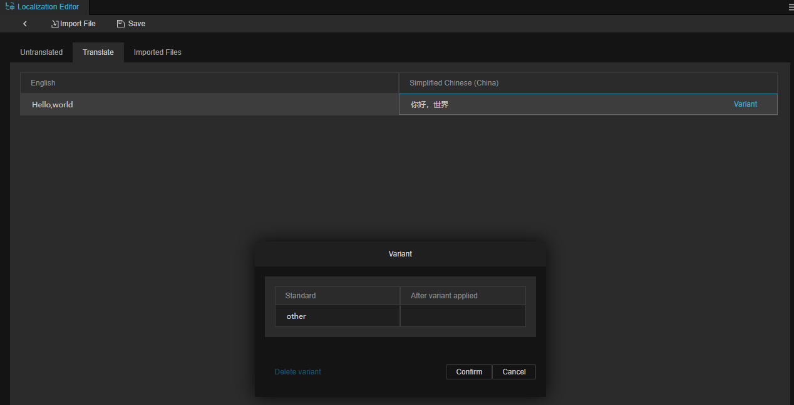

> **注意**：该功能仅在译文服务商正确配置情况下生效。

### 预览

点击预览可快速预览当前场景持有 [L10nLabel](l10n-label.md) 组件的节点/图片资源等在该语言下的展示情况:

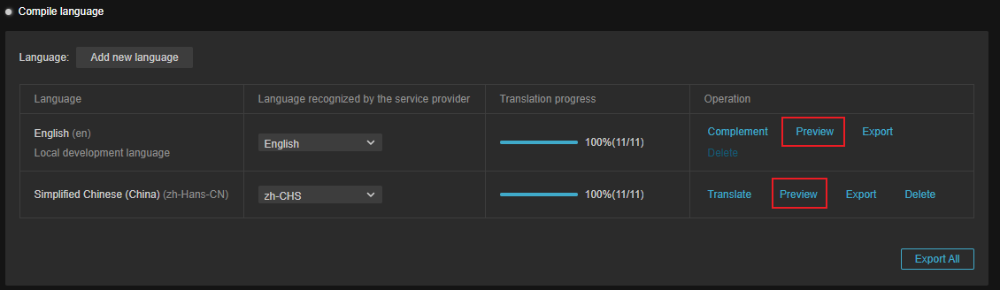

预览翻译前：

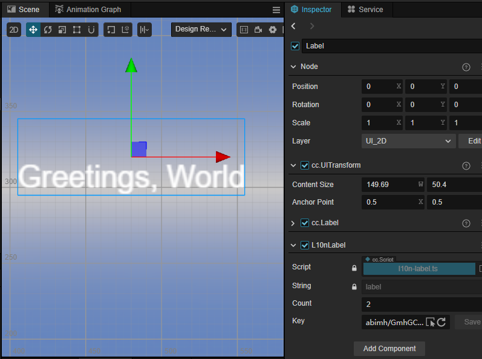

翻译后：

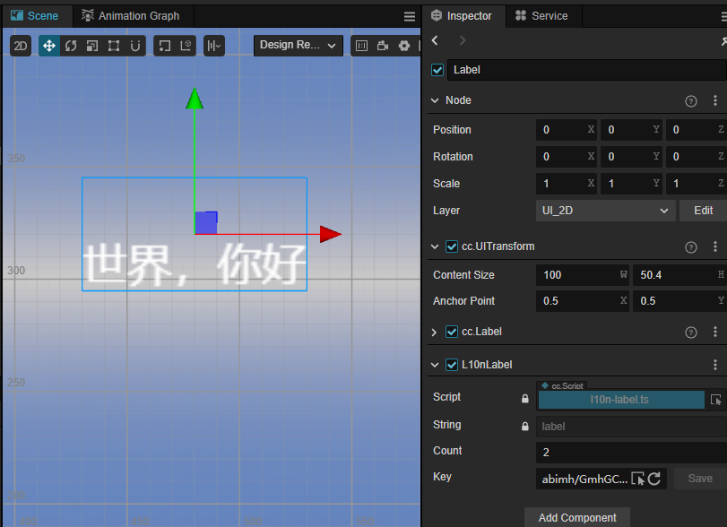

### 导出

点击 **导出** 按钮可以将原文/已翻译的内容导出为 PO 文件。

> PO 文件是软件开发中一种常见的基于文本对象的文件，通常用于记录界面翻译的结果。

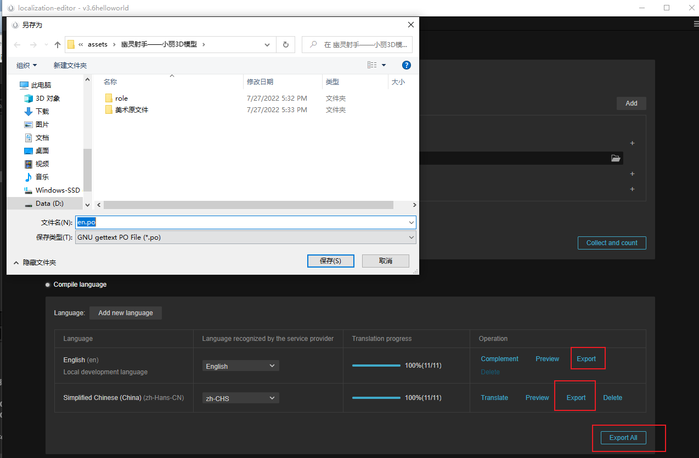

以下是一些辅助翻译工具，开发者可根据需求自行选择：

- Manipulating PO Files
- PO 格式编辑器 [https://poedit.net/](https://poedit.net/)
- PO 格式工具箱 [https://github.com/translate/translate](https://github.com/translate/translate)
- 离线 translation memory 工具 [OmegaT - The Free Translation Memory Tool - OmegaT 3](https://omegat.org/)

### 删除

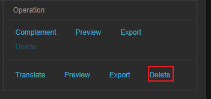

删除当前语言已翻译的进度，确认后结果不会被保存，请谨慎操作。本地开发语言不可删除。

## 非文本资源

当项目中存在画在图片上的文字、不同语种配音的视频和音频时，也可能有本地化的需求。此时翻译界面会提供 **导入** 按钮，此处以图片为示例，展示如何配置本地化：

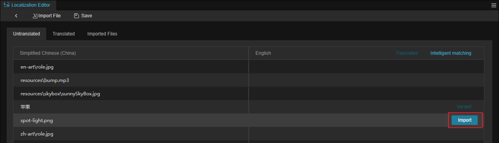

当 **收集和统计** 完成后，被检测出的资源将会以路径作为键值的形式存在。

通过点击 **导入** 按钮，导入目标语言所需的图片即可：

> **注意**：
> 1. 导入时，只可导入项目内的文件。
> 2. 由于自动合图会修改资源的 uuid 会导致重定向失败，致使需要翻译的图片不能勾选自动合图功能

### 智能匹配

智能匹配按钮会弹出二级确认菜单，点击确认后将会开启智能匹配。智能匹配会通过文件名来进行修改并匹配对应的语言。例如：

源文文件为: assets/aassb/cn-abc001.jpg，需将其翻译为英语，其译文文件为：assets/aassb/en-abc001.jpg，我们将自动把 assets/aassb/cn-abc001.jpg 中的 cn 替换为 en。

操作步骤：

- 例如当我们本地开发语言为中文（zh）而需要翻译的语言为英语（en），此时可能会准备如下图中的资源：

    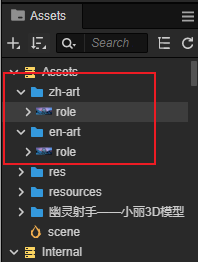

- 点击 **智能匹配** 后，在弹出的二级菜单内选择确认：

    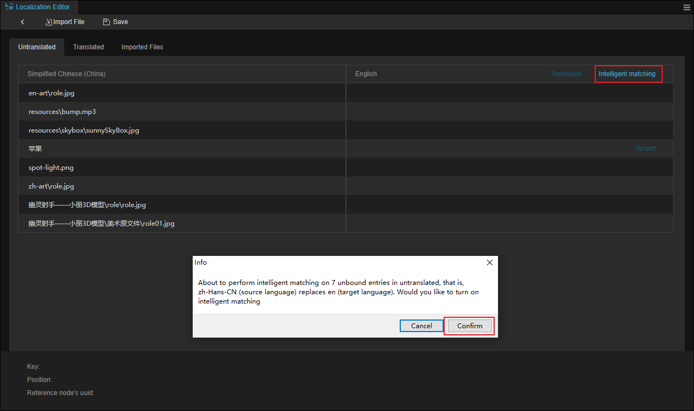

- 开发者无需手动添加，不同语言的 role.jpg 将会被自动匹配：

    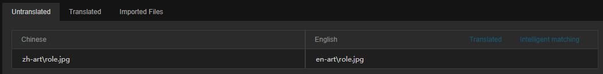

## 导入文件

通过 **导入文件** 按钮可以将外部数据文件进行导入，支持 PO、CSV 以及 XLSX 格式。

对于 CSV 和 XLSX 的格式要求如下图：

文件需采用 UTF-8 编码格式。

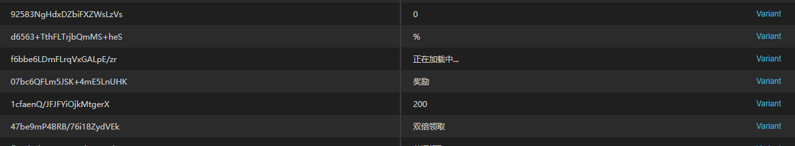

导入后，如需手动翻译，其流程和上述文档一致。
