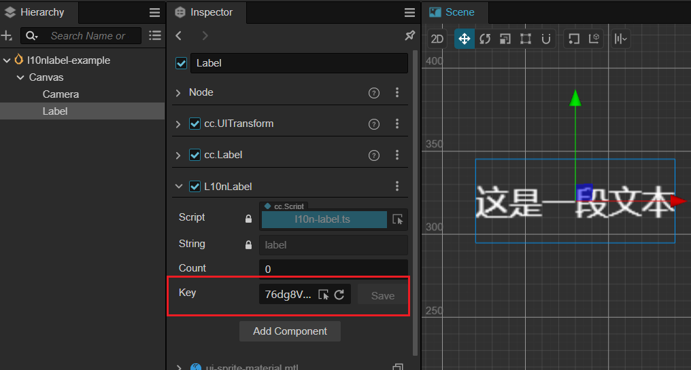
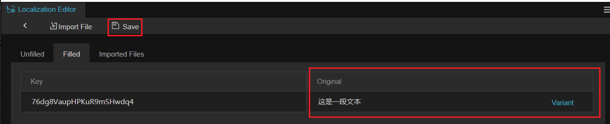
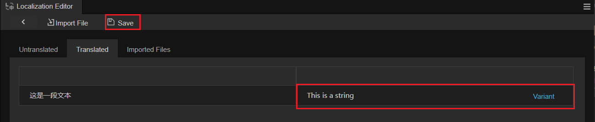
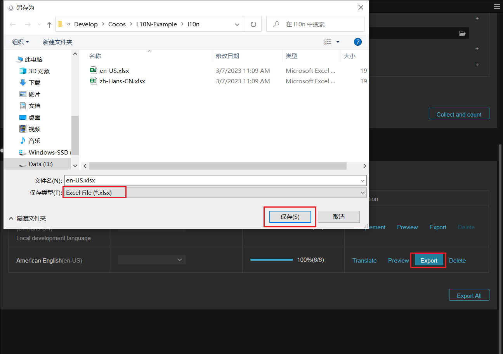
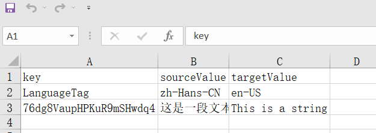
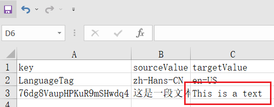

# EXCEL 导入示例

在开始本篇之前，请开发者准备好支持 L10N 的引擎（v3.6以及以上），并创建一个空的项目，我们将通过该示例演示如何在项目中使用 EXCEL 文件作为多语言的数据文件。

> 其他文件类型如 PO、CSV，其使用流程与 EXCEL 类似。

## 准备工作

- 首先打开 Dashboard 创建任意空项目

    

- 通过菜单打开 L10N 的面板

    

- 启用 L10N 功能

    

- 配置好对应的语言，这里 **本地开发语言** 以简体中文为例，目标语言为 **英语（美国）**：

    

## 导出文件

> **注意**：为确保流程正确，请首先使用 **导出** 功能将对应语言的文件导出为 EXCEL。

- 添加 **键**，此处我们将以 L10NLabel 为例.

    在场景中添加任意的 Label ，并在 Label 上添加 L10NLabel 组件。点击刷新按钮生成新的 **键**。

    

- 在 L10N 面板内点击 **补全** 功能填充该 **键** 的原文并点击 **保存** 按钮：

    

- 可选：在 L10N 面板内，点击 **英语（美国）** 的翻译按钮，翻译完成并点击保存。

    

- 点击 **导出** 按钮导出 EXCEL 文件：

    

- 打开 EXCEL 文件可以观察到里面的内容和面板一致：

    

- 此时可将该文件给与项目中的母语者负责润色或翻译该 EXCEL，翻译后结果如下：

    

## 导入文件

- 在 **编译语言** 中选择下图标识的按钮：

    

- 点击 **导入按钮**：

    

- 从文件管理器中选择对应的 EXCEL 文件：

    

- 此时可以观察到 **导入的文件** 分页内已可以查看刚刚导入的数据。

    

    > **注意**：由于此时导入的键值出现冲突，您必须选择一种解决冲突的方式。

    这里我们选择 **覆盖**，这将会使用 EXCEL 内的内容，覆盖项目内原有的内容。

- 点击 **保存** 按钮，将已翻译的字段进行保存。

    

## 使用 L10N

- 此时回到场景中，查看原有的 L10NLabel 节点：

    

- 通过 **预览** 按钮可以切换目标语言，并得到正确的结果：

    

开发者可以下载我们的 [示例](example-excel/en-US.xlsx) 以了解文件格式。但是请注意，如您的项目需要使用数据文件，请从项目中导出。
