# EXCEL 导入示例

在开始本篇之前，请开发者准备好支持 L10N 的引擎（v3.6以及以上），并创建一个空的项目，我们将通过该示例演示如何在项目中使用 EXCEL 文件作为多语言的数据文件。

> 其他文件如 PO、CSV 其流程与 EXCEL 类似。

## 准备工作

- 首先打开 Dashboard 创建任意空项目

    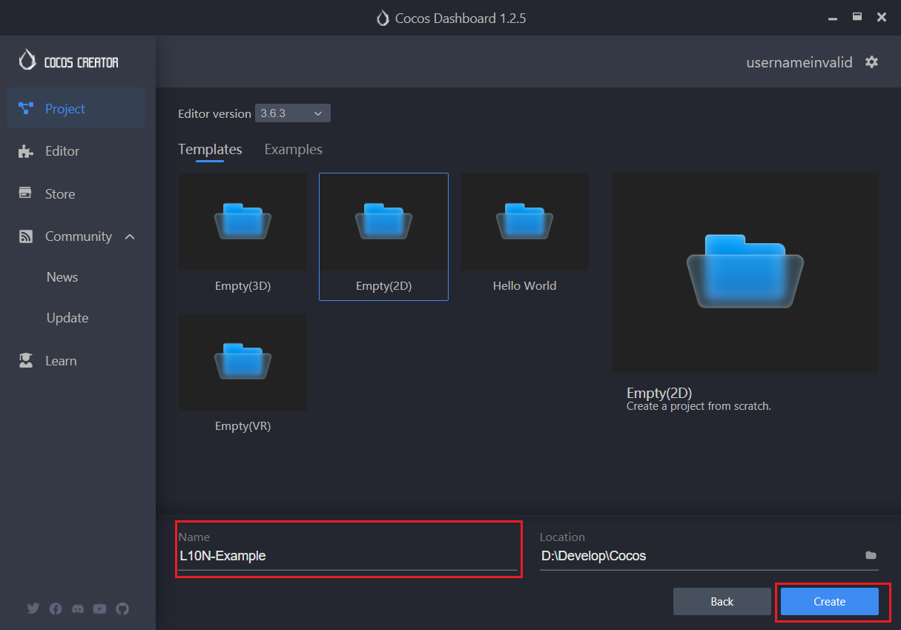

- [下载](example-excel/en-US.xlsx) 语言数据文件并导入到项目中

    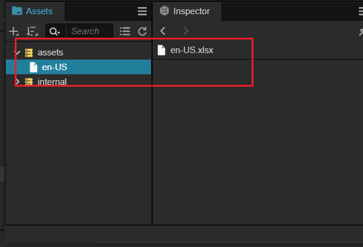

- 通过菜单打开 L10N 的面板

    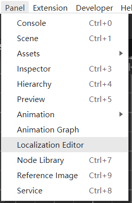

- 启用 L10N 功能

    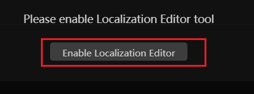

- 配置好对应的语言，这里 **本地开发语言** 以简体中文为例，目标语言为 **英语（美国）**：

    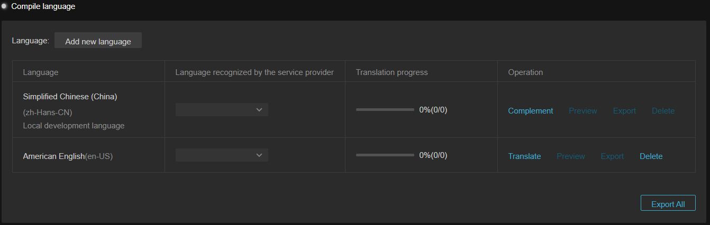

## 导入文件

- 在 **编译语言** 中选择下图标识的按钮：

    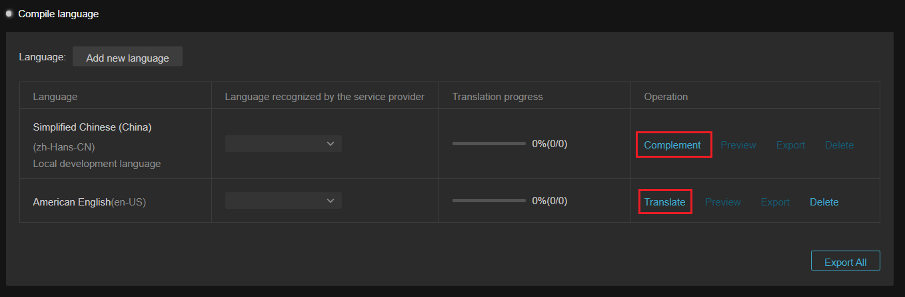

- 点击 **导入按钮**：

    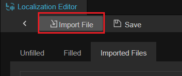

- 从文件管理器中选择对应的 EXCEL 文件：

    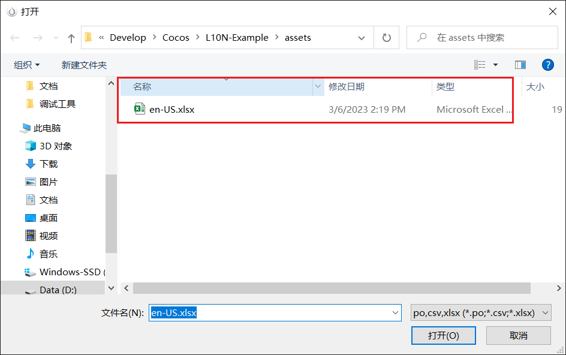

- 此时可以观察到 **导入的文件** 分页内已可以查看刚刚导入的数据：

    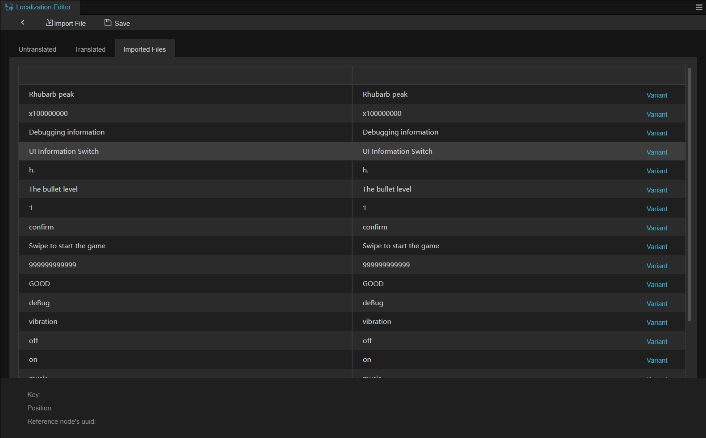

- 点击 **保存** 按钮，既可以将已翻译的字段进行保存。

    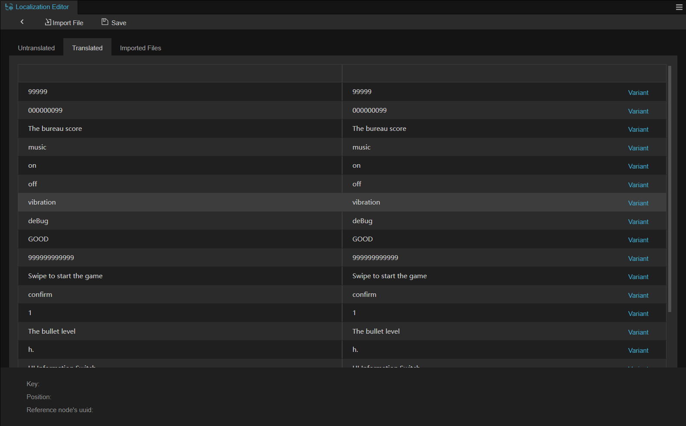

在导入文件后，如果已注册 **译文服务商** 账号，可以通过译文服务商的服务，点击 **翻译** 按钮自动翻译。

## 使用 L10N

- 此时回到场景中，创建一个带有 Label 组件的节点，并添加 L10NLabel

    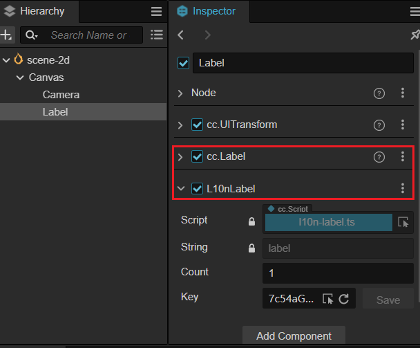

- 从 **Key** 属性中选择对应的键：

    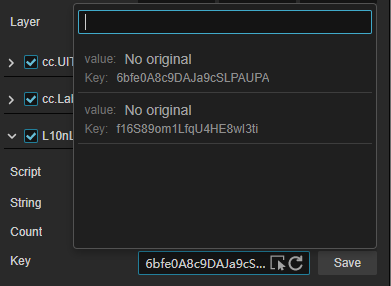

- 预览后可以观察到正确的翻译情况（您也可以选择在 L10N 面板内点击 **预览** 按钮进行预览）：

    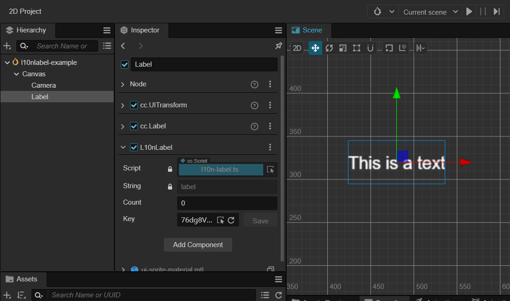
