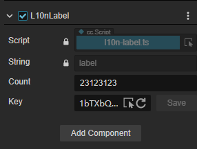
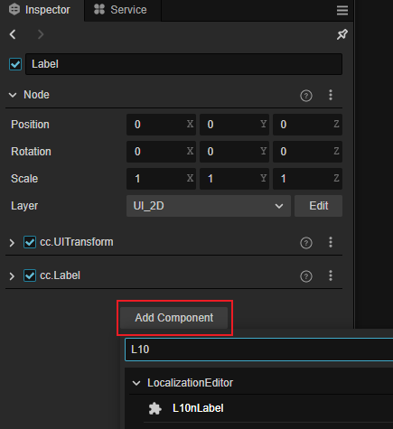
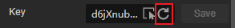
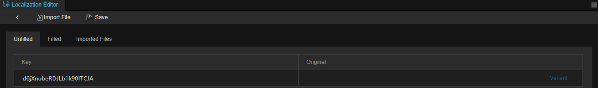

# L10nLabel 组件

L10nLabel 是可以根据内容进行定制化翻译的组件。配合文本组件使用，可对文本组件的内容进行翻译。

## 添加组件

用户可以在 **属性检查器** 上点击 **添加组件** 并选择 L10nLabel 来添加：

> **注意**：L10nLabel 必须搭配 Label 组件才可以使用，如果节点上没有 Label 组件，则会自动创建一个。

## 属性和说明

| 属性 | 说明 |
| :-- | :-- |
| **String** | Label 组件内文本   不可编辑|
| **Count** | 变体数量   详情请参考下文 |
| **Key** | 多语言的键值 |

### 变体数量

### 键

开发者可以自行输入自定义的键。也可以通过 **重置** 增加新的键。

在改变语种后，多语言功能会根据键，获取相对应的翻译结果。

#### 重置键

初始化时，L10nLabel 并没有持有任何 Key，如果需要新的键可以点击图示的按钮，此时 L10N 将会生成新的键，这些键随后也可以在 **多语言编辑** 面板进行编辑：

详情请参考 [语言编译](compile-language.md)

#### 选择键

通过图示的下拉菜单可以选择已有键：

