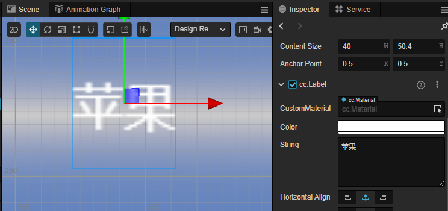
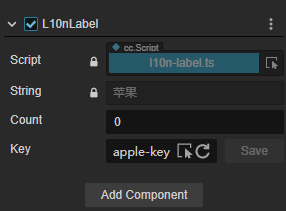
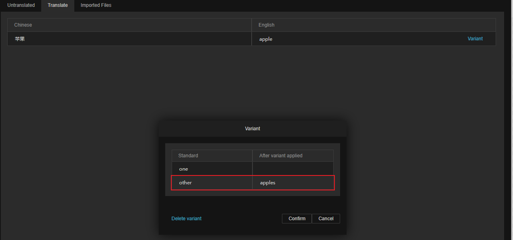

# L10nLabel 组件

L10nLabel 是可以根据内容进行定制化翻译的组件。配合文本组件使用，可对文本组件的内容进行翻译。

## 添加组件

用户可以在 **属性检查器** 上点击 **添加组件** 并选择 L10nLabel 来添加：

> **注意**：L10nLabel 必须搭配 Label 组件才可以使用，如果节点上没有 Label 组件，则会自动创建一个。

## 属性和说明

| 属性 | 说明 |
| :-- | :-- |
| **String** | Label 组件内文本   不可编辑|
| **Count** | 变体数量   详情请参考下文 |
| **Key** | 本地化的键值 |

### 变体数量

通过输入不同的数量，本地化会切换不同的变体。

在某些语言中，表示单数和复数会采用不同的格式，比如在英语中，一个苹果表述为：one apple，而两个苹果则会使用苹果的复数格式：two apples。为了可以在翻译后使用正确的格式，我们可以在 **变体数量** 内填入当前这句话内指定的物体的数量究竟是多少。

通常来说，不同语言的变体数量和当地语言有关，开发者可以向母语者进行咨询。

例如：英语有单数/复数的区别，因此在配置时变体有两种 `one` 和 `other`。某些语言如阿拉伯语有 5 种变体而俄语有 3 种变体。引擎通过适配国际规则来生成变体的数量，如果希望了解这些规则，可以参考下列地址：

- ECMAScript Internationalization API：[https://developer.mozilla.org/en-US/docs/Web/JavaScript/Reference/Global_Objects/Intl/PluralRules](https://developer.mozilla.org/en-US/docs/Web/JavaScript/Reference/Global_Objects/Intl/PluralRules)
- Unicode CLDR Project：[https://cldr.unicode.org/](https://cldr.unicode.org/)

下面我们将通过一个详细的例子来进行说明，对于不熟悉 **本地化编辑** 面板的用户，可以先参考 [本地化](./overview.md)：

- 首先启用 **本地化编辑**，并选择中文作为开发语言：

    

- 在场景内添加一个带有 Label 组件的节点：

    

- 给这个节点添加一个 L10nLabel 的组件，并将 Key 修改为：apple-key:

    

- 添加需要翻译的语言为英语

    

- 在 **翻译** 界面内添加变体：

    

- 点击 **本地化编辑** 面板的 **预览** 操作，可以预览翻译后的结果，在 Count 属性中切换单数/复数时，将会显示不同的变体：

    

### 键

全局唯一的键，本地化会根据键不同，获取到该键在本地化中的结果。开发者可以自行输入自定义的键。也可以通过 **重置** 增加新的键。

#### 重置键

如果需要新的键可以点击图示的重置按钮，此时 L10N 将会生成新的键，这些键随后也可以在 **本地化编辑** 中，在 **编译** 操作打开的面板内进行编辑：

详情请参考 [语言编译](compile-language.md)

#### 选择键

通过图示的下拉菜单可以选择已有键：

