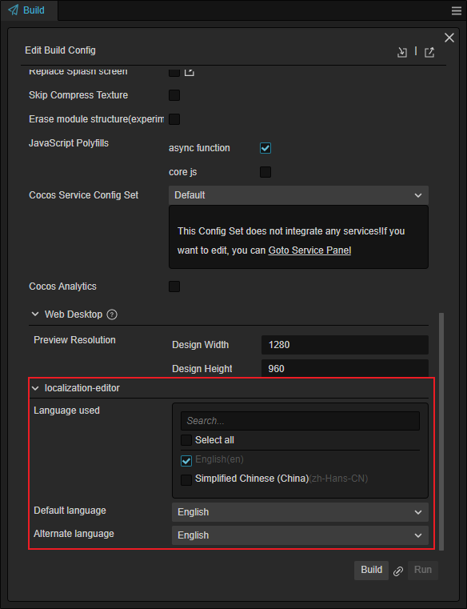

# 多语言本地化（L10N）

多语言本地化（以下简称 L10N 或本地化）是 Cocos Creator 3.6 推出的功能，该功能整合了第三方译文服务商的翻译服务，同时运行将文本、音频和图片等资源的本地化功能整合到引擎内，并支持一键发布到不同语言。

> L10N 是单词 Localization 的首字母以及尾字母的缩写，10 代表 Localization 中间有 10 个字母。

## L10N 总览

在引擎顶部菜单中选择 **面板** -> **本地化编辑器** 中即可打开本地化编辑器面板。  

首次启动时，用户需手动启用 L10N 功能：

启动后即可进行编辑。

在面板的右上角，L10N 提供了 **关闭 L10N** 以及 **卸载数据** 两项功能：

- **关闭 L10N**：关闭 L10N 功能。在弹出的二级菜单内选择确认后，数据依旧保留，开发者可再次启用该功能：

    

- **卸载数据**：在弹出的二级菜单内选择确认后，L10N 的数据将会被清除，场景内相关的组件也会被删除：

    

    > **注意**：卸载后的数据无法恢复，请谨慎操作。

## 译文服务商

引擎整合了多家译文服务商的翻译服务，开发者可以选择不同的译文服务商以提供更完善和多样化的服务。详情请参考 [译文服务商](tranlation-service.md)。

## 收集并统计

收集并统计将项目中可能需要翻译的文本内容进行收集，方便进行翻译，开发者也可以通过指定特定的文件、目录或通过配置进行过滤。详情请参考 [搜集和统计](collect-and-count.md)

## 语言编译

语言编译可以查看当前已配置和翻译的语言，并查看其进度或删除操作。同时也提供对某些非文本资源的手动处理。详情请参考 [语言编译](complie-language.md)

## 程序化使用

请参考 [示例](script-using.md) 以获取程序化使用 L10N 的示例。

API 参考请移步 [Localization Editor Api](localization-editor-api.md)。

## 发布

根据上述的步骤完成翻译后，可以在发布界面进行一键发布：

- 使用的语言：这里将包含所有在 **本地化编辑** 中设置的语言，开发者可根据版本不同按需选择
- 默认语言：发布后，项目启动时所使用的语言
- 备用语言：默认语言出现问题后使用的备用语言

## 范例

我们在 ([GIT](github.com)) | ([GITEE](gitee.com)) 上也准备了范例，开发者可以根据需要下载。

## Q & A

- Q：若我不慎修改了数据文件导致数据文件损坏而无法打开 L10N 时，是否有解决办法？
  A：可以通过在 "{项目地址}\localization-editor\translate-data" 搜索对应文件进行修改。
