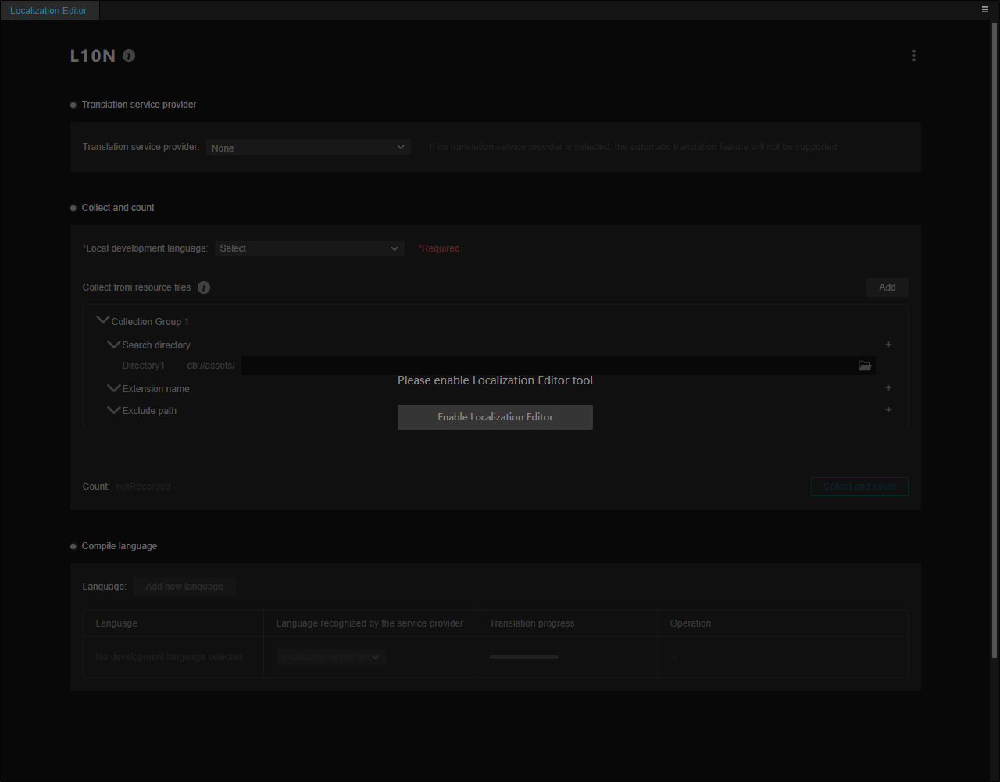
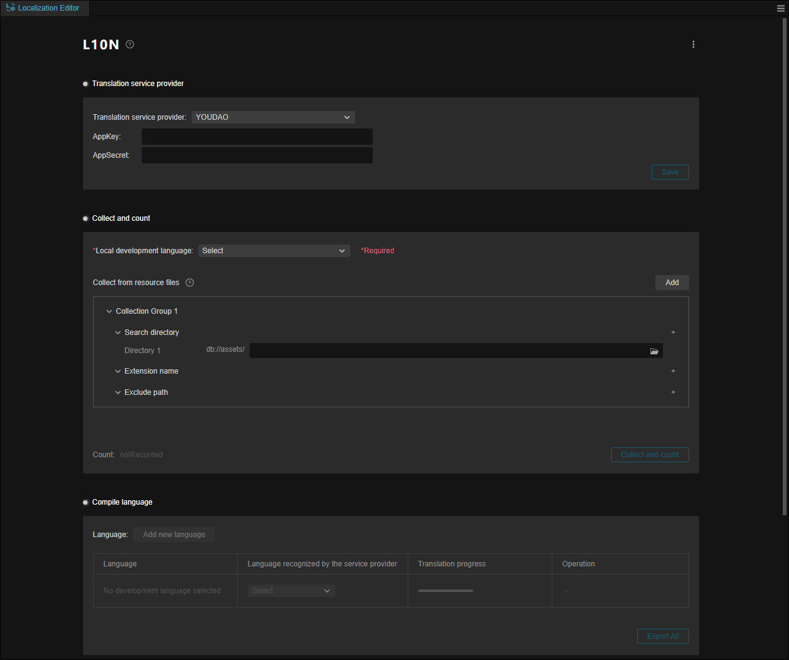
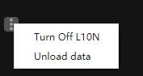
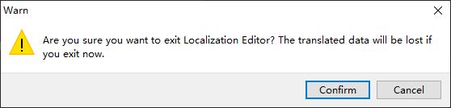
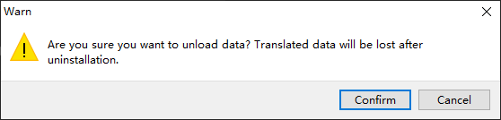
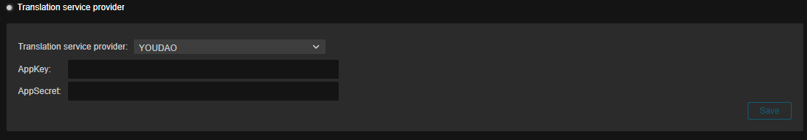
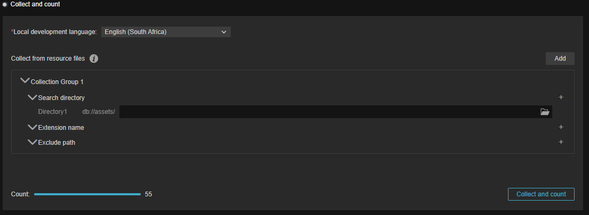
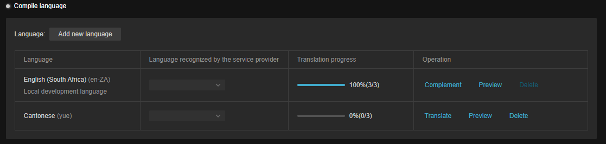

# 本地化编辑器（Localization Editor）

本地化编辑器（以下简称 L10N）是 Cocos Creator 3.6 推出的功能，该功能整合了第三方译文服务商的翻译服务，同时将音频、图片等资源的多语言功能整合到引擎内，并支持一键发布到不同语言。

> L10N 是单词 Localization 的首字母以及尾字母的缩写，10 代表 Localization 中间有 10 个字母。

## L10N 总览

在引擎顶部菜单中选择 **面板** -> **本地化编辑器** 中即可打开本地化编辑器面板。  

首次启动时，用户需手动启用 L10N 功能：

启动后即可进行编辑。

在面板的右上角，L10N 提供了 **关闭 L10N** 以及 **卸载数据** 两项功能：

- **关闭 L10N**：关闭 L10N 功能。关闭后数据依旧保留，开发者可再次启用该功能：

    

- **卸载数据**：点击后会出现警告，在选择 **确认** 后，L10N 的数据将会被清除：

    

    > **注意**：卸载后的数据无法恢复，请谨慎操作。

## 译文服务商

引擎整合了多家译文服务商的翻译服务，开发者可以选择不同的译文服务商以提供更完善和多样化的服务。详情请参考 [译文服务商](tranlation-service.md)。

## 搜集和统计

搜集和统计会将项目中可能需要翻译的文本内容进行搜集，方便进行翻译，开发者也可以通过指定特定的文件、目录或通过配置进行过滤。详情请参考 [搜集和统计](collect-and-count.md)

## 语言编译

语言翻译可以查看当前已配置和翻译的语言，并查看其进度或删除操作。同时也提供对某些非文本资源的手动处理。详情请参考 [语言编译](complie-language.md)

## 范例

我们在 ([GIT](github.com)) | ([GITEE](gitee.com)) 上也准备了范例，开发者可以根据需要下载。
