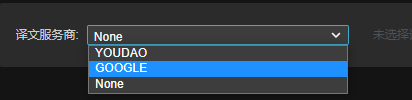
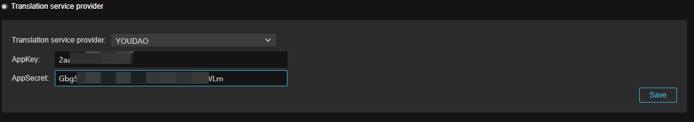

# 译文服务商

Creator 目前支持有道/谷歌翻译作为译文服务商，开发者可以根据需求选择。

- **译文服务商**：该下拉菜单运行开发者选择不同的译文服务商，如选择 **None** 则无法开启 L10N 功能。

    

- **AppKey**/**AppSecret**：选择不同的服务商后，开发者需要输入 AppKey 和 AppSecret 才可以继续后续的操作。通常这些信息需要在译文服务商的网站上获取。

    

    输入完成后，点击保存即可。

## 有道翻译

## 谷歌翻译
