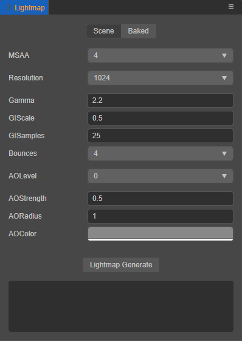
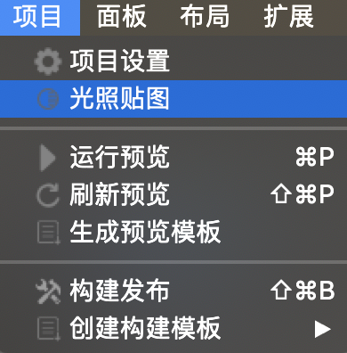
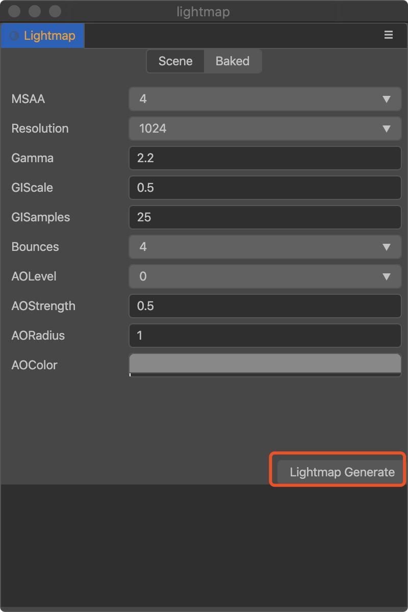
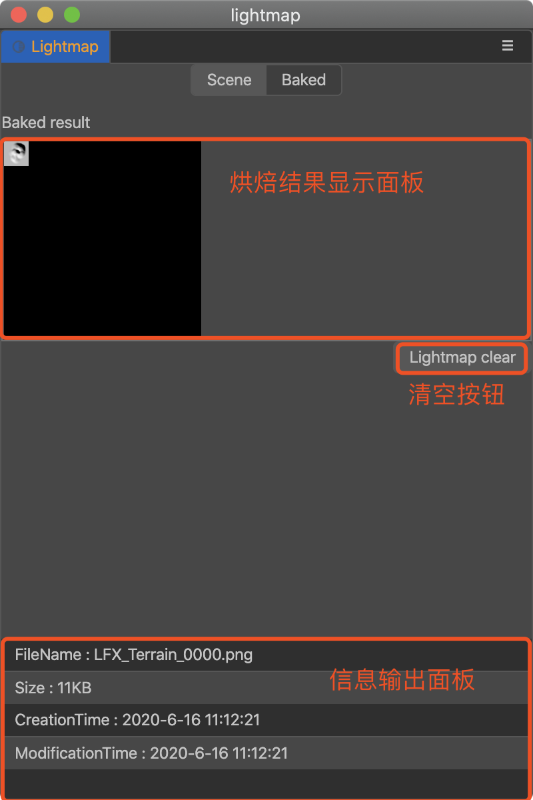
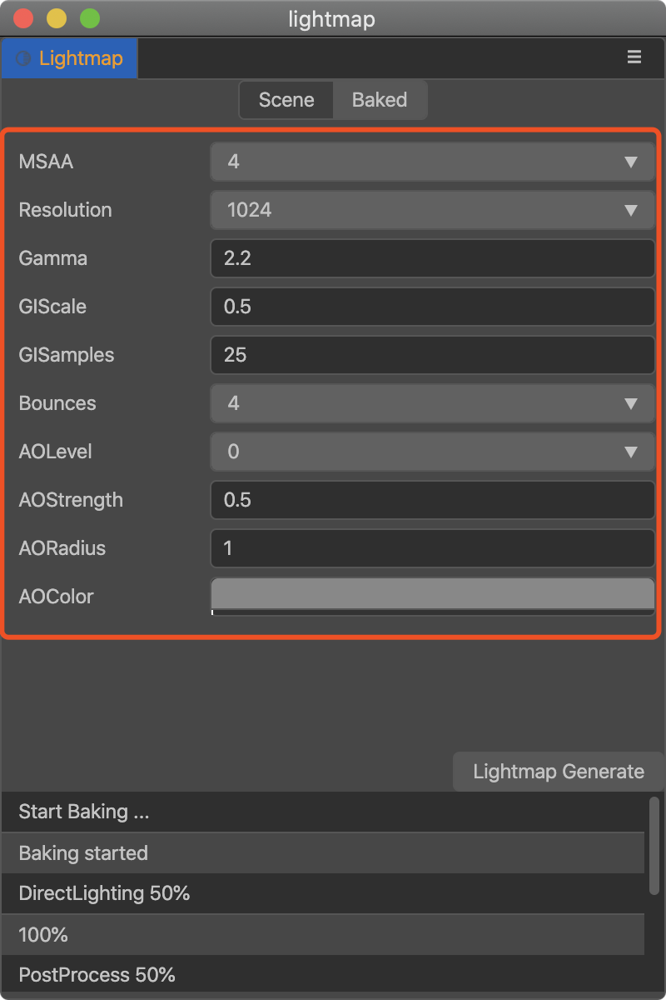

# 烘焙系统

烘焙系统是通过计算引擎场景中所有光源对物体的影响最终生成光照贴图并在场景中应用的过程，该系统的目的是减少实时光源的运算，从而提高场景运行效率。

## 创建

开启烘焙系统需要以下三个步骤：

1. 在顶部菜单栏 `Project(项目)` 中单击该菜单按钮，在弹出菜单栏中单击 `Lightmap(光照贴图)` 按钮，弹出 lightmap 面板。
   
    

2. 在烘焙前需要在编辑器中设置光源组件的 `Bakeable` 属性为 `true`（目前只支持一个主方向光源）。
   
    

3. 在弹出的 lightmap 面板中，设置好对应参数后可点击 `Lightmap Generate(生成光照贴图)` 按钮，选择对应存储文件夹即可生成光照贴图（存储文件夹一定要在 assets 下才可生效）。
   
    

## 使用

生成烘焙贴图过程中会有生成的进度提示，生成后可在 `lightmap` 面板中的 `Baked` 查看。

其中 `Baked result（烘焙结果显示面板）` 显示了烘焙后的 lightmap 贴图，`Lightmap clear（清空按钮）` 可以删除烘焙的生成结果，`信息输出面板` 显示了每张烘焙图片的信息（文件名、大小等）。

**注意**：模型在开启 lightmap 前，需要包含两套 uv，第二套 uv 用来 access lightmap，同时材质也需要勾选 lightmap 选项才能应用模型烘焙后的阴影信息。

## 编辑

烘焙过程是根据面板设置的各个参数来计算生成的结果，如下图：

| 参数 | 说明 |
| :--- | :--- |
| MSAA | 多重采样。可选值包括：1、2、4、8 |
| Resolution | 烘培贴图大小。可选值包括：128、256、512、1024、2048 |
| Gamma | Gamma 矫正值 |
| GIScale | 全局光照缩放系数 |
| GISamples | 全局光照采样系数 |
| AOLevel | AO 级别 |
| AOStrength | AO 强度 |
| AORadius | AO 半径 |
| AOColor | AO 颜色 |
