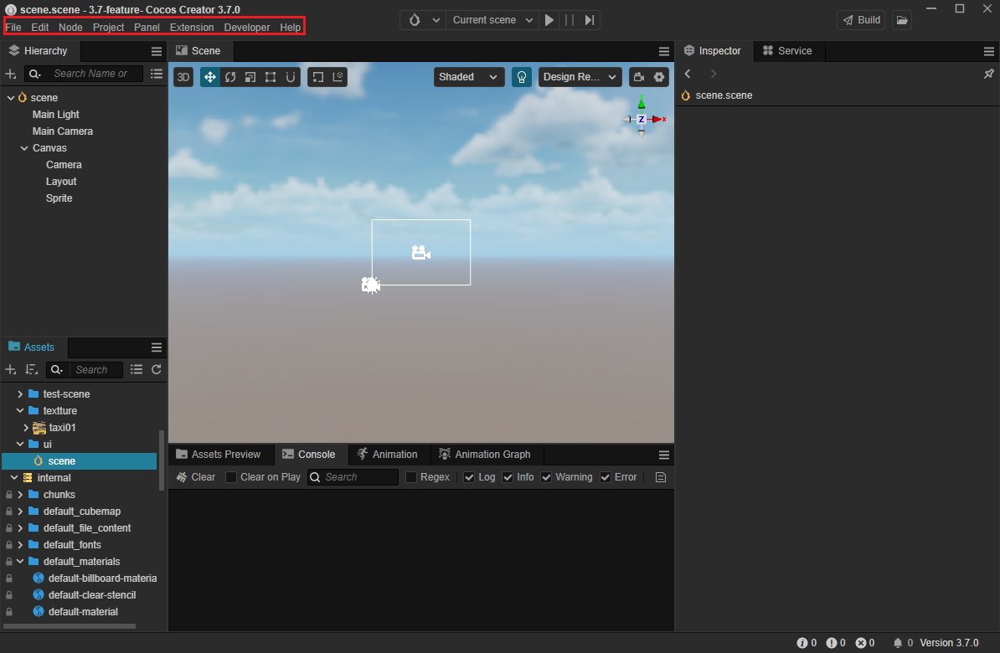
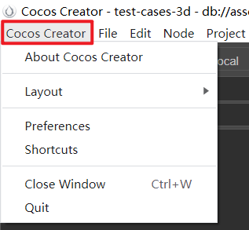
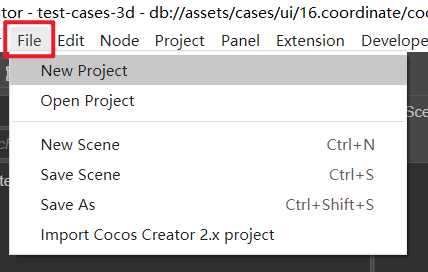
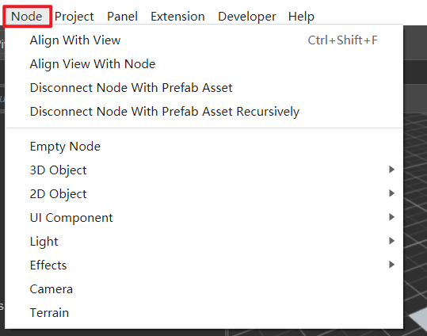
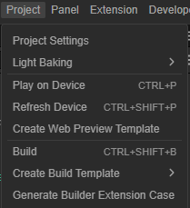
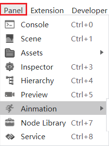
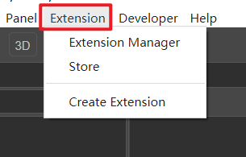
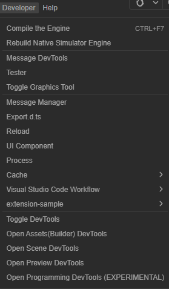
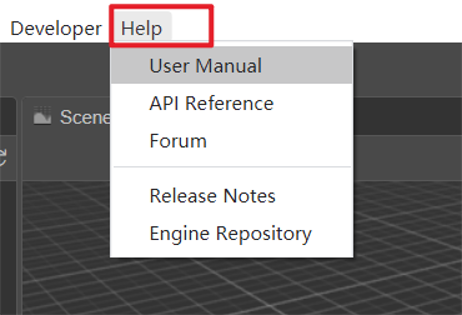

# 主菜单

Cocos Creator 顶部的主菜单栏中包括 **Cocos Creator**、**文件**、**编辑**、**节点**、**项目**、**面板**、**扩展**、**开发者** 和 **帮助** 9 个菜单项，集成了 Cocos Creator 大部分的功能点。

## 关于 Cocos Creator

该项主要包括软件信息、设置、窗口控制等功能：

| 选项 | 说明 |
| :--- | :-- |
| 关于 Cocos Creator | 显示 Cocos Creator 的版本和版权信息 |
| 布局 | 设置编辑器界面布局，暂时只支持默认布局 |
| 偏好设置 | 打开 [偏好设置](../preferences/index.md) 面板。该面板用于编辑器的个性化设置 |
| 快捷键 | 打开快捷键设置面板，查看编辑器各面板或功能模块默认使用的快捷键，支持自定义。 |
| 关闭窗口 | 关闭当前窗口|
| 退出 | 退出 Cocos Creator 编辑器|

## 文件

该项主要用于项目或场景的新建、打开、保存等操作，以及导入 Cocos Creator 2.x 项目。

| 选项 | 说明 |
| :--- | :-- |
| 新建项目 | 打开 Dashboard 的 **新建项目** 分页 |
| 打开项目 | 打开 Dashboard 的 **新建最近打开项目项目** 分页 |
| 新建场景 | 关闭当前场景并创建一个新场景，新创建的场景需要手动保存才会添加到项目路径下|
| 保存场景 | 保存当前正在编辑的场景，如果是使用 **新建场景** 菜单项创建的场景，在第一次保存时会弹出对话框，选择场景文件保存的位置和文件名。场景文件以 `.fire` 作为扩展名 |
| 另存为 | 生成当前场景文件的副本，并保存在项目中|
| 导入 Cocos Creator 2.x 项目 | 导入 Cocos Creator 2.x 项目并升级为 v3.x|

## 编辑

该项主要包括撤销重做、复制粘贴等常用编辑功能。

| 功能 | 说明 |
| :--- | :-- |
| 撤销 | 撤销上一次对场景的修改 |
| 重做 | 重新执行上一次撤销的对场景的修改 |
| 剪切 | 剪切当前选中的节点或字符到剪贴板|
| 复制 | 复制当前选中的节点或字符到剪贴板 |
| 粘贴 | 粘贴剪贴板中的内容到场景或属性输入框中|
| 全选 | 焦点在场景编辑器内为选中所有节点，焦点在控制台则选中所有的日志信息 |

## 节点

该项包含调整视角、取消关联预制节点和在场景中创建节点的功能。

| 功能 | 说明 |
| :--- | :-- |
| 视角对齐 | 移动游戏对象与视图对齐 |
| 将视角和节点对齐 | 移动视图与游戏节点对齐 |
| 取消关联当前的 prefab 资源 | 选中场景中一个预制节点，执行此命令会将预制节点转化成普通节点|
| 递归的取消关联当前的 prefab 资源 | 选中场景中一个预制节点，执行此命令会用递归的方式将预制节点转化成普通节点| |
| 空节点 | 在场景中创建一个空节点，如果执行命令前场景中已经选中了节点，新建的节点会成为选中节点的子节点|
| 3D 对象 | 可以创建编辑器自带的一些比较基础的静态模型控件，目前包括立方体、圆柱体、球体、胶囊、圆锥体、圆环体、平面和四方形。若需要创建其他类型的模型，可参考 [MeshRenderer 组件](../engine/../../engine/renderable/model-component.md)|
| 2D 对象 | 可以在场景中创建由编辑器自带的 2D 渲染节点，目前包括 Graphics（绘图）、Label（文本）、Mask（遮罩）、ParticleSystem2D（粒子）、Sprite（精灵）、SpriteSplash（单色）和 TiledMap（地图）等由节点和基础渲染组件组成的节点类型。关于 2D 渲染组件，详细情况可参考 [2D 渲染组件介绍](../../ui-system/components/editor/render-component.md)|
| UI 组件 | 在场景中创建由编辑器自带的 UI 组件，可以创建包括 Button（按钮）、Widget（对齐挂件）、Layout（布局）、ScrollView（滚动视图）、EditBox（输入框）等节点在内的常用 UI 控件。更多 UI 组件介绍，可以查看 [UI 基础组件](../../ui-system/components/editor/base-component.md)|
| 光线 |  在场景中创建由编辑器自带的光线组件，使场景产生相应的光照和阴影效果，获得更好的视觉效果。目前包括平行光、球面光和聚光。关于光线的更多内容，可以查看 [光照](../../concepts/scene/light.md)|
| 特效 | 在场景中创建一个特效组件，目前仅支持粒子特效，它可以用于模拟火、烟、水、云、雪、落叶等自然现象，也可用于模拟发光轨迹、速度线等抽象视觉效果。详细情况可参考 [粒子系统](../../particle-system/overview.md)|
| 摄像机 | 在场景中创建一个摄像机组件，摄像机是用来捕捉场景画面的主要工具。详细情况可参考 [摄像机组件](../components/camera-component.md)|
| 地形 | 在场景中创建一个地形系统，它以一种高效的方式来展示大自然的山川地貌。开发者可以很方便的使用画刷来雕刻出盆地、山脉、峡谷、平原等地貌。关于地形系统的更多情况可以参考 [地形系统](../terrain/index.md)|

## 项目

该项包括运行、构建项目，以及项目专用个性化配置。

| 功能 | 说明 |
| :--- | :-- |
| 项目设置 | 打开 [项目设置](../project/index.md) 面板。该面板主要用于设置特定项目的相关配置项。 |
| 光照贴图 | 打开 [光照贴图](../.././concepts/scene/light/lightmap.md) 面板。光照贴图主要用于代替实时的光照计算，可以减少资源消耗，从而提高场景运行效率 |
| 运行预览 | 在浏览器或模拟器或预览窗口中运行项目。更多详情，可以查看 [项目预览调试](../preview/index.md)|
| 刷新预览 | 刷新已经打开的预览窗口  |
| 生成预览模板 | 生成[自定义预览模板](../.././editor/preview/browser.md)，该功能主要用于方便用户自定义需要的预览效果|
| 构建发布 | 打开 [构建发布](../.././editor/publish/index.md) 面板，该面板用于将游戏打包发布到目标平台上 |
| 构建项目构建模板 |  生成 [项目构建模板](../.././editor/publish/custom-project-build-template.md)，该功能用于生成对应平台支持的构建模板|
| 新建构建扩展包 | 生成 [构建扩展包](../.././editor/publish/custom-build-plugin.md)，该功能用于扩展构建流程|

## 面板

该项主要用于打开编辑器中的各式面板。

| 功能 | 说明 |
| :--- | :-- |
| 控制台 | 打开 [控制台](../.././editor/console/index.md) 面板。该面板用于输出编辑器或引擎信息 |
| 场景编辑器 | 打开 [场景编辑器](../.././editor/scene/index.md) 面板。该面板用于选择和摆放场景图像、角色、特效、UI 等各类游戏元素 |
| 资源管理器 | 打开 [资源管理器和资源预览](../.././editor/assets/index.md) 面板。该面板用于访问和管理项目资源的重要工作区域|
| 属性检查器 | 打开 [属性检查器](../.././editor/inspector/index.md) 面板。该面板用于查看并编辑当前选中节点、节点组件和资源的工作区域  |
| 层级管理器 | 打开 [层级管理器](../.././editor/hierarchy/index.md) 面板。该面板用于展现当前场景中可编辑的节点之间的关系。|
| 预览 | 打开摄像机预览面板，作为简单的预览功能存在，当调整 gizmo 或通过其它插件调整场景时，摄像机预览的画面可以实时同步。 |
| 动画 |  可以打开 [动画编辑器](../.././animation/index.md) 面板或者 [Joint Texture Layout（骨骼贴图布局设置）](/zh/animation/joint-texture-layout.md) 面板，用于对帧动画或者骨骼动画进行编辑、查看等功能。 |
| 节点预制库 | 打开节点预制库面板。该面板是一个非常简单直接的可视化控件仓库，开发者可以将这里列出的控件拖拽到 **场景编辑器** 或 **层级管理器** 中，快速完成预设控件的创建|
| 服务 | 打开 [服务](https://service.cocos.com/document/zh) 面板，为开发者提供优质服务，以便获得更多引擎之外的扩展能力，让游戏开发工作变得更加简单|
| Cocos 小秘书 | 打开 [Cocos 小秘书](https://www.cocos.com/assistant) 面板，与 Cocos Creator 编辑器紧密结合，⽆缝嵌⼊开发环境，⽆论你遇到任何问题，随时可以发起交流|

## 扩展

该项是和扩展插件相关的菜单项，详情请阅读 [编辑器扩展](../.././editor/extension/readme.md) 一章。

| 功能 | 说明 |
| :--- | :-- |
| 扩展管理器 | 打开扩展管理器面板，用户管理编辑器安装的扩展包，可以进行增加、删除等操作 |
| 商城 | 打开 [商城](https://store.cocos.com/document/zh/) 面板，可供用户浏览、下载和自动安装官方或者第三方插件、源码、资源。同时用户也可以将自己开发的扩展插件、工程源码、美术素材、音乐音效和第三方工具等与 Cocos 开发相关的资源提交到扩展商店，以便分享或者售卖。 |
| 创建扩展 | 生成 [扩展包](/zh/editor/extension/readme.md)，用于对编辑器进行功能扩展|

## 开发者

该项主要包含脚本、引擎和编辑器扩展开发相关的菜单功能。

| 功能 | 说明 |
| :--- | :-- |
| 编译引擎 | 对定制引擎进行重新编译 |
| 编译原生模拟器引擎 | 对定制原生模拟器进行重新编译 |
| 消息调试工具 | 打开消息调试工具面板|
| Tester | 打开 Tester 面板,会根据定义触发消息发送，并根据消息定义，执行扩展里的对应方法，然后在控制台打印出 Hello World 的日志信息 |
| 开关图形工具 | 打开开关图形工具面板|
| 消息列表 |  打开 [消息管理器](../.././editor/extension/contributions-messages.md) 面板,用于显示编辑器每个功能定义的公开消息及其说明|
| Export.d.ts |导出编辑器相关的 API |
| 重新加载 | 重新加载编辑器界面|
| UI 组件 | 打开 UI 组件面板。用于显示在编写 html 的时候，如何使用编辑器内的 UI 组件|
| VS Code Workflow | VS Code 代码编辑器的工作环境相关功能，目前支持添加编译任务和添加 Chrome debug 配置|
| 开关开发人员工具 | 打开开发者工具界面，用户自定义输出到 **控制台** 的日志，更多详细情况，可以查看 [自定义输出消息](/zh/editor/console/index.md/#%E8%87%AA%E5%AE%9A%E4%B9%89%E8%BE%93%E5%87%BA%E4%BF%A1%E6%81%AF)|
| 打开资源调试工具 | 打开资源调试面板，用于显示修改场景期间的日志消息|
| 打开场景调试工具 | 打开场景调试面板，用于显示修改场景期间的日志消息|
| 打开构建调试工具 | 打开构建调试面板，用于显示构建期间的日志消息|

## 帮助

| 功能 | 说明 |
| :--- | :-- |
| 使用手册 | 在默认浏览器打开 [用户手册文档](https://docs.cocos.com/creator/3.0/manual/zh/) |
| API 文档 | 在默认浏览器打开 [API 参考文档](https://docs.cocos.com/creator/3.0/api/zh/) |
| 论坛 | 在默认浏览器打开 [Cocos Creator 论坛](https://forum.cocos.org/c/Creator)|
| 更新日志 |  在默认浏览器打开 [Cocos Creator 版本更新日志](https://www.cocos.com/creator)  |
| 引擎仓库 |  在默认浏览器打开引擎的 [GitHub 仓库](https://github.com/cocos-creator/engine) |
