# 偏好设置

**偏好设置** 面板中提供了编辑器的个性化设置，点击编辑器主菜单栏中的 **Cocos Creator -> 偏好设置** 即可打开。

**偏好设置** 由几个不同的分页组成，包括 **通用设置**、**外部程序**、**设备管理器**、**引擎管理器**、**资源数据库**、**控制台**、**属性检查器**、**预览**、**构建发布** 和 **实验室**。修改设置之后 **偏好设置** 面板会自动保存修改。

## 通用设置

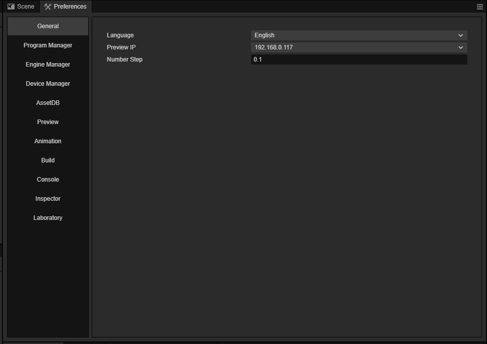

**通用设置** 分页主要是针对编辑器相关的一些基础信息进行配置，包括：

- **编辑器语言**：可以选择中文或英文，修改语言设置后编辑器会自动切换语言，若有点地方没有切换，可刷新一下编辑器。

- **选择本机预览 IP 地址**：用户可以在本机有多个 IP 地址的情况下，手动选择其中之一作为预览时的默认地址和二维码地址。这里会列出所有本机的 IP，编辑器默认自动挑选一个 IP。

- **预览服务器端口号**：修改编辑器预览游戏时使用的端口号，修改完成后需要重启编辑器才能生效。

- **数值默认步长**：用于设置 **属性检查器** 中通过步进按钮调整数值属性时的步长幅度。默认步长为 0.001。**属性检查器** 中的步进按钮包括以下两种：

    - 当鼠标移动到数值属性输入框的右边时，会出现一组上下箭头，可以按照一定的步进幅度连续增加或减小数值。

       

    - 当鼠标悬浮在数值属性的名称附近时，光标会变成  这样的形状，然后左右拖动鼠标，也可以按照一定的步进幅度连续增加或减小数值。

- **配色主题**：设置编辑器的显示颜色，目前包括 **creator** 和 **dark** 两种。

## 外部程序

**外部程序** 分页用于设置构建发布到原生平台时所需的开发环境，以及配置一些第三方程序。当鼠标移动到具体的配置项时，左侧会显示一个灰色的圆形问号图标，点击该图标可设置将配置项应用于当前项目中或者应用于全局所有项目中。当设置为应用于当前项目时，灰色的图标会变成黄色。

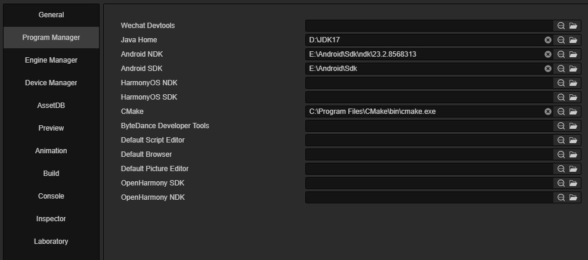

- **WeChat 开发者工具**：配置微信小游戏开发者工具，详情请参考 [发布到微信小游戏](../publish/publish-wechatgame.md)。

- **Android NDK**：设置 Android NDK 路径，详情请参考 [安装配置原生开发环境](../publish/setup-native-development.md)。

- **Android SDK**：设置 Android SDK 路径，详情请参考 [安装配置原生开发环境](../publish/setup-native-development.md)。

- **HarmonyOS NDK**：设置 HarmonyOS NDK 路径，详情请参考 [发布 Huawei HarmonyOS 应用](../publish/publish-huawei-ohos.md)。

- **HarmonyOS SDK**：设置 HarmonyOS SDK 路径，详情请参考 [发布 Huawei HarmonyOS 应用](../publish/publish-huawei-ohos.md)。

- **默认脚本编辑器**：可以选用任意外部文本编辑工具（例如 [VS Code](../../scripting/coding-setup.md)）的可执行文件，作为在 **资源管理器** 中双击脚本文件时的打开方式。可以点击输入框后面的 **搜索图标** 按钮选择偏好的文本编辑器的可执行文件。文件夹图标则用于打开已设置完成的文本编辑器的所在路径。详情可参考 [配置代码编辑环境](../../scripting/coding-setup.md)。

- **默认浏览器**：用于选择编辑器预览时使用的浏览器，可点击输入框后面的 **搜索图标** 按钮指定一个浏览器的路径。

## 设备管理器

**设备管理器** 分页用于管理使用模拟器或者浏览器预览时的设备分辨率，支持在面板右侧手动添加/修改/删除自定义的设备分辨率。编辑器默认的设备分辨率不支持修改/删除。

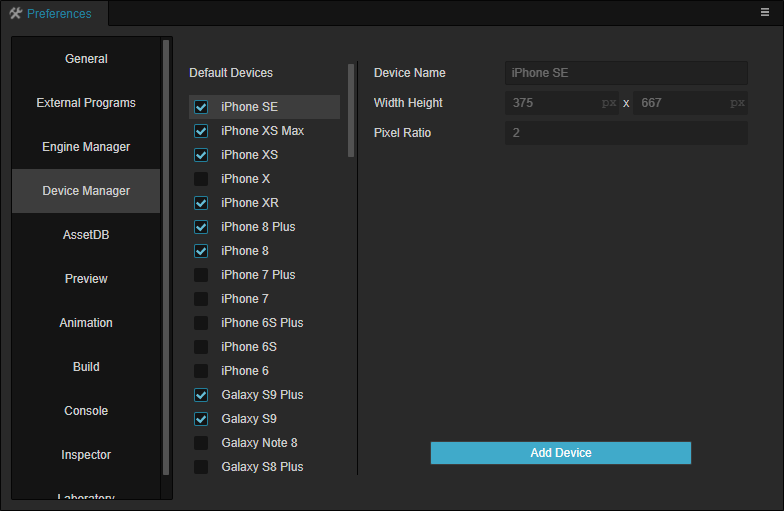

## 引擎管理器

**引擎管理器** 分页用于自定义引擎时配置引擎路径。

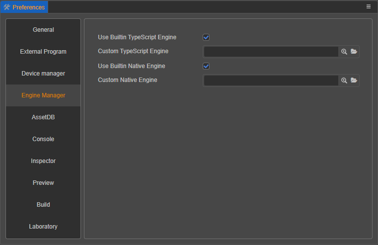

- **使用内置 TypeScript 引擎**：是否使用 Cocos Creator 安装路径下自带的 engine 路径作为 TypeScript 引擎路径。这个引擎用于编辑器里场景的渲染、内置组件的声明（也就是使用代码编辑器，如 VSCode 时的智能提示），以及场景在 Web 环境下的预览。

- **自定义 TypeScript 引擎路径**：除了使用自带的 engine，也可以前往 **engine 仓库**（[GitHub](https://github.com/cocos/cocos-engine/) | [Gitee](https://gitee.com/mirrors_cocos-creator/engine/)）克隆或 fork 一份引擎到本地的任意位置进行定制，然后取消勾选 **使用内置 TypeScript 引擎**，并将 **自定义 TypeScript 引擎路径** 指定为定制好的引擎路径，就可以在编辑器中使用这份定制后的引擎了。

- **使用内置原生引擎**：是否使用 Cocos Creator 安装路径下自带的 `engine/naive` 路径作为原生引擎路径。这个引擎用于构建发布时所有原生平台（iOS、 Android、Mac、Windows）的工程构建和编译。

- **自定义原生引擎路径**：取消上一项 **使用内置原生引擎** 的选择后，就可以手动指定原生引擎路径了。注意这里使用的原生引擎必须从 **engine-native**（[GitHub](https://github.com/cocos/cocos-engine) | [Gitee](https://gitee.com/mirrors_cocos-creator/engine)）或该仓库的 fork 下载。

关于自定义引擎，具体内容可参考 [引擎定制工作流程](../../advanced-topics/engine-customization.md)

## 资源数据库

**资源数据库** 分页用于设置 [资源管理器](../assets/index.md) 面板中的资源数据库的相关信息。

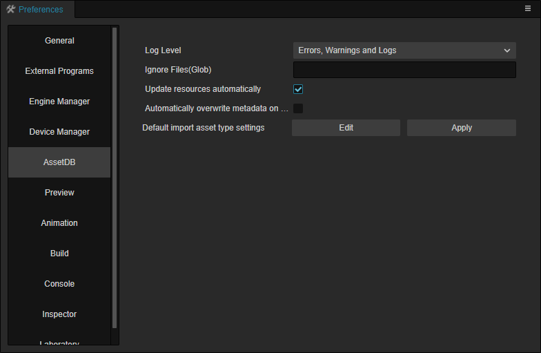

- **日志等级**：用于设置 **资源管理器** 中的资源数据库输出到 **控制台** 的信息类型。目前包括 **仅输出错误**、**仅输出错误和警告**、**输出错误、警告以及日志** 和 **输出所有信息** 四种。
- **忽略文件（Glob）**：使用 Glob 表达式，填入需要忽略的资源路径匹配符，则该资源将会被忽略。例如 `!**/*.txt`，表示忽略所有的 `.txt` 文件。
- **自动刷新资源**：从外部返回编辑器界面时自动刷新资源。详情参考下文介绍。
- **导入资源时自动覆盖 Meta**：在导入资源替换原有资源时，若导入资源自带 Meta，可通过该项设置是否覆盖掉原有资源的 Meta。
- **默认资源导入类型配置**：用于设置项目内资源导入时的默认配置。详情参考下文介绍。

### 自动刷新资源

若开启该项，无论开发者在 Creator 外部是否有对资源进行操作，再回到 Creator 时都会自动对所有资源进行检查。那么当项目中的文件数量过多，或者硬盘随机读写速度偏低时，就容易导致资源系统响应延迟。例如在 **资源管理器** 中选中资源，**属性检查器** 会延迟一会儿才显示资源相关属性。

这时候便可以关闭 **自动刷新资源** 功能，关闭该功能后，如果有对资源进行操作，那么手动点击 **资源管理器** 面板右上方的 **刷新** 按钮即可刷新资源。

> **注意**：如果没有遇到资源系统响应问题，不建议关闭 **自动刷新资源** 选项。

### 默认资源导入类型配置

该项用于设置项目内资源导入时的默认配置。例如希望导入的图片默认为 sprite-frame 类型，那么便可以点击该项右侧的 **编辑** 按钮，然后在打开的 json 文件中填入以下内容：

```json5
{
    // image 表示资源的类型为图片
    "image": {
        "type": "sprite-frame"
    }
}
```

编辑完成并保存后，返回编辑器，点击 **应用** 按钮即可生效。

资源类型为 key，value 需要是一个 object，这个 object 就是最终导入资源时使用的默认配置。<br>
例如上方示例代码中的 key 为 `image`，value 是 `image` 中配置的内容，点击 **应用** 后便会刷新资源数据库的配置信息，将 `image` 中的内容一一对应配置到资源 meta 文件的 `userData` 字段中。例如 `image.type` 设置为 `sprite-frame`，导入图片资源时，默认的 `userData.type` 就会被设置为 `sprite-frame`。便可以根据项目情况，动态地设置各种资源的默认导入配置。

如果想要知道资源类型，可以在 **资源管理器** 中右键点击资源，选择 **在资源管理器中显示**，然后在打开的文件夹中找到资源对应的 meta 文件并打开，`importer` 字段标记的便是资源的类型。

例如材质资源的 meta 文件如下，`importer` 字段中的 `material` 便是资源类型。

```json
{
  "ver": "1.0.9",
  "importer": "material",
  "imported": true,
  "uuid": "482a5162-dad9-446c-b548-8486c7598ee1",
  "files": [
    ".json"
  ],
  "subMetas": {},
  "userData": {}
}
```

## 控制台

**控制台** 分页用于设置 [控制台](../console/index.md) 面板输出的日志，包括 **显示日期** 和 **文字大小**。

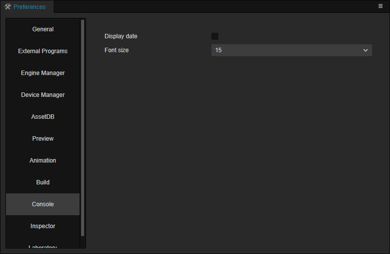

- **显示日期**：是否在 **控制台** 面板输出的日志前面显示日期。
- **文字大小**：用于设置 **控制台** 面板输出的日志文字大小。

## 属性检查器

**属性检查器** 分页中的 **离开编辑自动保存** 功能用于设置 [属性检查器](../inspector/index.md) 面板是否在属性编辑完成后自动保存修改。


## 预览

**预览** 分页主要用于在使用编辑器正上方的 [预览](../preview/index.md) 按钮时，可以设置的各种选项，但只对当前项目有效。

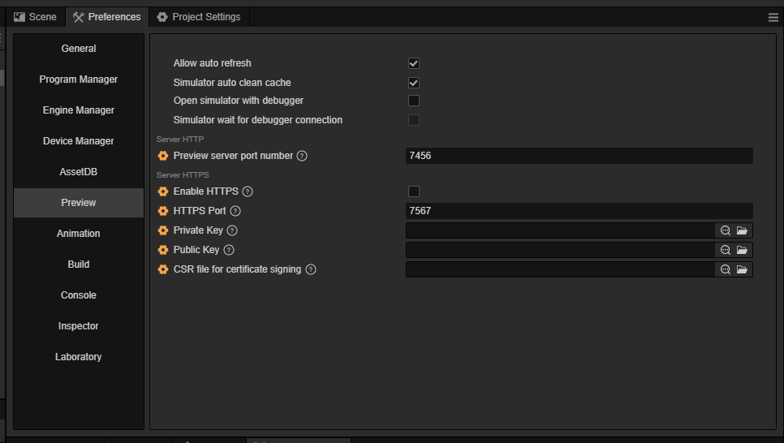

- **保存场景自动刷新预览**：若勾选该项，则在编辑器中保存场景时，会自动刷新已经打开的预览页面，目前暂时不支持使用模拟器预览。
- **模拟器自动清除缓存**：若勾选该项，则使用模拟器预览时会自动清除缓存。
- **模拟器是否开启调试面板**：若勾选该项，则使用模拟器预览项目时将自动打开调试窗口。
- **模拟器是否等待调试面板开启**：该项会在勾选了 **模拟器是否开启调试面板** 后生效，作用是暂停模拟器启动过程直至调试器连接完成，用于调试加载过程。
- **预览服务器端口号**：该配置存储于项目内用于区分不同项目间的服务器端口号
- **开启 HTTPS**：是否开启 HTTPS
- **HTTPS 端口**： HTTPS 服务的端口号
- **私钥 key**：HTTPS 证书的私钥路径
- **公钥 cert**：HTTPS 证书的公钥路径
- **签发文件 csr**： CSR 证书文件的路径

## 动画编辑器

**动画编辑器** 分页用于设置 [动画系统](../../animation/index.md) 在编辑时的一些参数和配置。

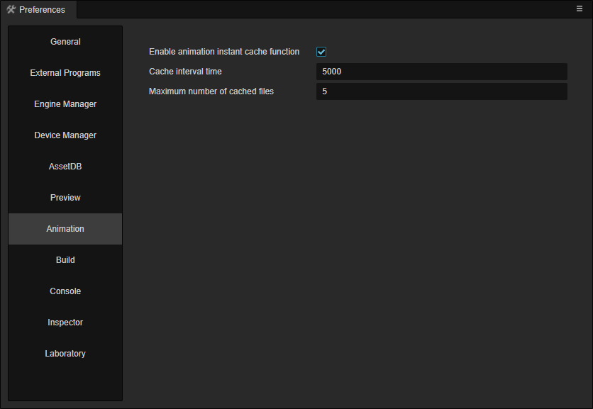

- **开启动画即时缓存功能**：开启后，编辑中的动画会根据 **缓存间隔时间** 来进行自动缓存
- **缓存间隔时间**：缓存间隔时间，单位：毫秒
- **缓存文件数量最大值**：最大可以缓存的动画数量

> **注意**：目前缓存的动画文件并不会自动恢复，如果要恢复缓存的文件，请参考 [动画系统](../../animation/index.md)。

## 构建发布

**构建发布** 分页用于设置执行 [构建发布](../publish/build-panel.md) 时相关的配置和信息。

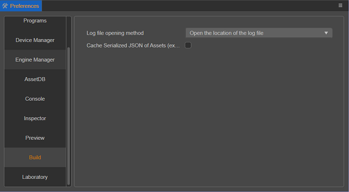

- **日志文件打开方式**：该项用于设置点击 [平台构建任务](../publish/build-panel.md#%E5%B9%B3%E5%8F%B0%E6%9E%84%E5%BB%BA%E4%BB%BB%E5%8A%A1) 左下方的打开日志按钮时，会直接打开构建日志文件还是打开日志文件所在的目录。默认为直接打开日志文件。

- **缓存资源的序列化 JSON**：为了加快构建速度，减少重复反序列化未修改资源，在资源构建过程中将会缓存资源的序列化 JSON，这部分 JSON 会放置在项目的 `temp/asset-db/assets/uuid/build` 目录下，根据 **debug** 和 **release** 模式分为 `debug.json` 和 `release.json` 存放。

    

    当存在缓存资源时构建将会直接取用，这部分缓存资源会在每次资源导入后重新更新，基本不需要关心。该选项默认勾选，但如果遇到了某些特殊需求，希望构建时不存储这部分序列化构建缓存资源，取消勾选该项即可。

- **缓存编译后的引擎**：缓存编译后的引擎，该缓存将在全局目录内生效。开发者可以通过 **开发者 -> 开关开发人员工具** 中使用 `Editor.App.temp` 命令打印该缓存地址：

    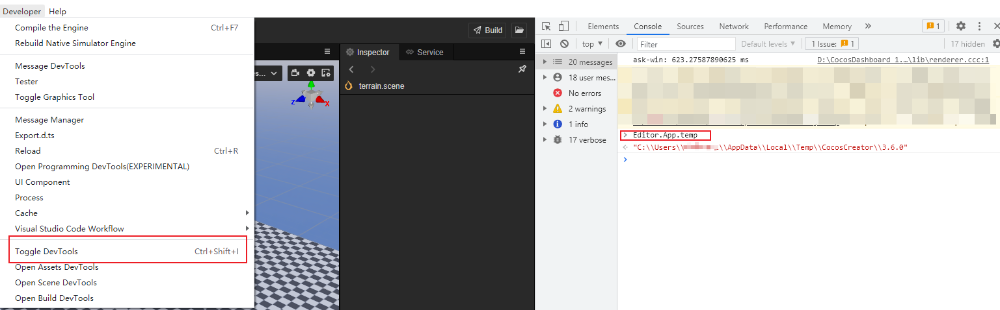

    通过该功能，可以加快构建速度。该功能也可以在日志中进行查看：

    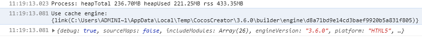

- **缓存纹理压缩资源**：缓存压缩后的纹理资源，如对纹理参数进行修改，则缓存会失效，缓存目录为：`temp/builder/CompressTexture`
- **缓存自动图集资源**：自动化的图集的缓存可以在构建时清理，详情请参考 [构建任务页面](../publish/build-panel.md#%E6%9E%84%E5%BB%BA%E4%BB%BB%E5%8A%A1%E9%A1%B5%E9%9D%A2)
- **保存组件节点序列化的 UUID 数据**：默认的情况下构建，组件的 UUID 都不会序列化进预制体/资源内，而是由引擎在运行时自动生成的，在某些情况下如果需要通过编辑时的组件 UUID 去查找组件，则可以开启此选项。开启后，组件的 UUID 在构建时会序列化到对应预制体或资源内，并在运行时和编辑器时保持一致。

## 实验室

**实验室** 分页中会不定期提供一些新的技术方案或实验性质的功能，可以通过开关选项来选择是否使用，大部分情况下默认开启。

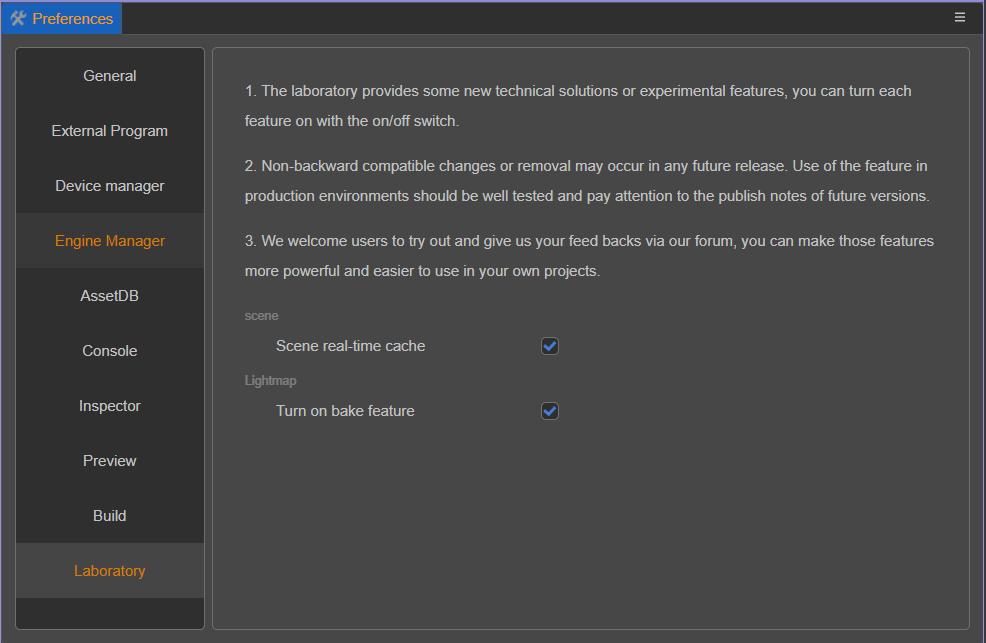

- **启用延迟渲染管线**：启用或者禁用延迟渲染管线。在默认情况下，延迟渲染管线处于关闭状态。详情可参考 [延迟渲染管线](../../render-pipeline/builtin-pipeline.md#%E5%BB%B6%E8%BF%9F%E6%B8%B2%E6%9F%93%E7%AE%A1%E7%BA%BF)。

- **优化调度策略**：该策略会尝试在多次重复导入资源时进行合并，以减少调度次数。

- **场景即时缓存**：该项默认开启，主要用于在场景编辑过程中每隔一段时间（目前时间间隔为 5s）便将场景文件缓存到项目目录下的 `temp/scene/[SCENE_UUID]/[TIME].json` 文件中。如遇突发情况比如场景崩溃、进程卡死等，再次打开编辑器时将会弹窗提示是否应用缓存内最近一次的场景文件。

  > **注意**：在日常使用中，只要场景正常打开了，那么当前场景在打开之前缓存的所有场景文件都会被清空。如有特殊需求需要查看指定场景的缓存文件，请先在编辑器中关闭对应场景。

- **保持场景主循环运行**：是否允许场景的渲染方式和预览时一样不断的进行渲染循环
- **动画嵌入播放器**：此功能支持用户在编辑动画时，同步配合播放其他粒子和动画
- **过渡中断**：是否在 Marionette 动画系统中启用过渡中断功能
- **开启烘焙功能**：用于开启烘焙功能，详情可参考 [光照贴图](./../../concepts/scene/light/lightmap.md)。

### 注意事项

在未来的版本中，**实验室** 中的这些功能可能被合并，但也有可能出现破坏兼容性的修改，甚至可能会被取消。如果想在开发环境中使用这些功能，请务必严格测试，并保持关注新版本的更新公告。

我们欢迎用户开启试用这些功能，并且在 [论坛](https://forum.cocos.org/c/58) 提供宝贵的反馈意见，让这些功能更适合自己的使用场景，为项目提供更强大的助力。

## 自定义偏好设置面板

Creator 支持在 **偏好设置** 右侧添加自定义功能页，详情请参考 [自定义偏好设置面板](../../editor/extension/contributions-preferences.md)。
