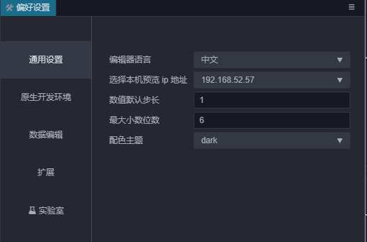
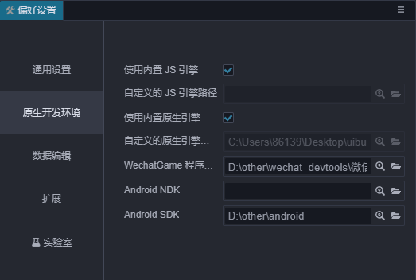
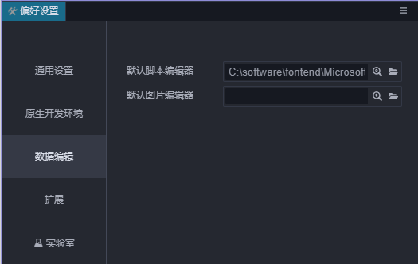
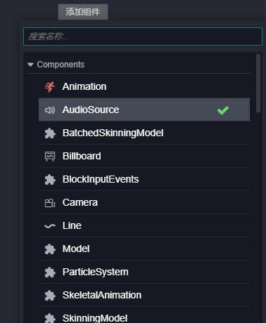

# 偏好设置

**偏好设置** 面板中提供了编辑器的个性化设置，要打开 **偏好设置** 面板，请点击主菜单的 **Cocos Creator -> 偏好设置**。

设置可以分成下列几部分：

## 通用设置

通用设置主要是针对编辑器相关的一些基础数据进行配置。

-   **编辑器语言**：可以选择中文或英文，修改语言设置后要重新启动 Cocos Creator 才能生效。

-   **选择本机 IP 地址**：用户可以在本机有多个 IP 地址的情况下，手动选择其中之一作为预览时的默认地址和二维码地址。这里会列出所有本机的 IP，编辑器默认自动挑选一个 IP。

-   **数值调节钮步长**：在属性检查器里，所有数值属性输入框的旁边都有一组上下箭头，可以用于步进输入的数值：

    

    当鼠标悬浮在数值属性的名称附近时，光标会变成  这样的形状，然后左右拖动鼠标，也可以按照一定的步进幅度连续增加或减小数值。
    以上两种修改数值的方式，默认的步长都是 0.1，而设置里 `数值调节钮步长` 这里设置的就是每次点击步进按钮或拖拽鼠标时数值变化的步长幅度。举例来说，如果您在脚本中使用的数字以整数为主，就可以把这个步长设置为 1，可以更方便的进行调节。

## 预览设置

`项目预览` 分页提供的选项主要用于设置初始预览场景等等，但只对当前项目生效。

### 保存场景后自动刷新

勾选后，只要保存场景，就会刷新所有预览打开的页面。

### 初始化预览场景

指定按下 `预览运行` 按钮时，会打开项目中哪个场景。如果设置为 `当前打开场景`，就会运行当前正在编辑的场景，此外也可以设置成一个固定的场景（比如项目总是需要从登录场景开始游戏）。

### 自定义设备数据

用于添加在预览时的设备信息，添加的设备信息将会出现在预览页面的设备选项里。

## 原生开发环境

这个分类用于设置构建发布到原生平台（iOS、Android、Mac、Windows）时，所需的开发环境路径。

- 使用内置 JavaScript 引擎：是否使用 Cocos Creator 安装路径下自带的 engine 路径作为 JavaScript 引擎路径。这个引擎用于场景编辑器里场景的渲染，内置组件的声明和其他 Web 环境下的引擎模块。

- 自定义 JavaScript 引擎路径：除了使用自带的 engine，您也可以前往 [engine 仓库](https://github.com/cocos-creator/engine) 来克隆或 fork 一份引擎到本地的任意位置进行定制，然后取消勾选 使用内置 JavaScript 引擎，然后设置 JavaScript 引擎路径 到您定制好的引擎路径，就可以在编辑器中使用这份定制后的引擎了。

- WeChatGame 程序路径：设置 WeChatGame 程序路径，详情见 [发布到微信小游戏](../publish/publish-wechatgame.md)。

- Android NDK 路径：设置 Android NDK 路径，详情见 [安装配置原生开发环境](../publish/setup-native-development.md)。

- Android SDK 路径：设置 Android SDK 路径，详情见 [安装配置原生开发环境](../publish/setup-native-development.md)。

## 数据编辑

数据编辑内存放的是一些与资源编辑、数据修改相关的配置。

- **外部脚本编辑器**：可以选用任意外部文本编辑工具的可执行文件，作为在资源管理器里双击脚本文件时的打开方式。

- **外部图片编辑器**：和上面的选项类似，这里用来设置在资源管理器中双击图片文件时，默认打开图片用的应用程序路径。

## 扩展

插件内允许直接注入配置项目到偏好设置里。注册到偏好设置里的配置项就会显示在这里。具体需要参考各个插件的文档。

## 实验室

关于实验室：

1. 实验室会不定期提供一些新的技术方案或实验性质的功能，你可以通过开关选项来开启或关闭相应的功能，大部分情况下我们会默认开启。

2. 在未来的版本中，这些功能可能被合并，但也有可能出现破坏兼容性的修改，甚至可能会被取消。如果你想在开发环境中使用这些功能，请务必严格测试，并保持关注新版本的更新公告。

3. 我们欢迎用户开启试用这些功能，并且在[论坛](https://forum.cocos.org/c/3D)提供宝贵的反馈意见，你可以让这些功能更适合自己的使用场景，给自己的项目更强大的助力。

### 使用弹窗方式添加组件

之前有很多用户反馈添加组件无法进行组件搜索，在遇到一些自定义脚本组件繁多的项目中，找到自己编写的脚本组件十分困难。

但是搜索相对于鼠标直接上移直接显示菜单而言会多一步操作，由于一些内部基础建设的关系，我们暂时无法提供鼠标直接上移并且可以搜索的功能。目前先提供使用搜索弹窗添加组件的功能，当然你可以关闭该选项回到最初的使用方式。

为了方便使用，我们还添加一些辅助设计：

- 打开弹窗时焦点将会在搜索框内，你可以直接搜索相关关键词而无需鼠标点击展开；
- 在搜索找到相关组件时，你可以直接使用 `↑↓`快捷键来快速的切换组件选项，按下 `enter` 键即可添加该组件；

对于这个功能，如果你有更好的建议欢迎到论坛告诉我们。

### 开启地形功能

具体的使用文档可以参考 [地形系统](../terrain/index.md)。
