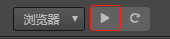
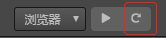
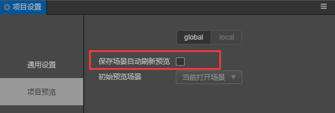
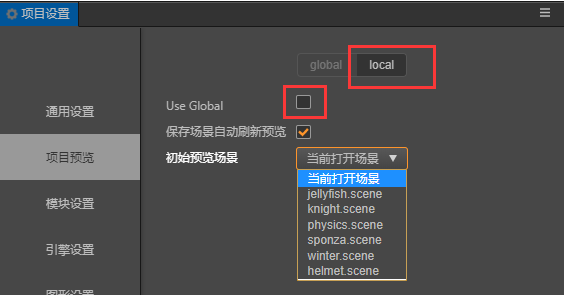

# 浏览器预览

## 预览



在编辑器工具栏上选择 **浏览器** 后，点击旁边的按钮，会在用户的默认桌面浏览器中直接运行游戏的网页版本。推荐使用谷歌浏览器（Chrome）作为开发过程中预览调试用的浏览器，因为谷歌浏览器（Chrome）的开发者工具是最为全面强大的。

浏览器预览界面的最上边有一系列控制按钮可以对预览效果进行控制：

- 最左边选择预览窗口的比例大小，来模拟在不同移动设备上的显示效果
- **Rotate** 按钮决定显示横屏还是竖屏
- **Debug Mode** 里可以选择脚本中哪些级别的日志会输出到浏览器控制台中
- **Show FPS** 按钮可以选择是否显示每秒帧数和 Drawcall 数量等调试信息
- **FPS** 限制最高每秒帧数
- **Pause** 暂停游戏


## 刷新预览



如果在编辑器内对场景做了修改，想要刷新预览效果，直接在浏览器里面刷新或者点击编辑器的刷新按钮即可。不同在于，编辑器的刷新按钮，将会刷新所有的预览页面。如果想要让预览页面自动刷新，保存场景即可。保存场景自动刷新的设置在 **项目设置 -> 项目预览** 里可以修改。


## 预览场景

预览场景默认是当前打开场景，如果需要调整可以在 **项目设置 -> 项目预览** 里修改预览的初始场景（详情请参考[项目设置](../project/index.md)）。



## 手机端预览

调试手机端的预览效果有以下方式：

- 使用 **浏览器开发者工具的手机端预览模式**
- **扫描预览二维码**

  将鼠标移动到编辑器工具栏左边的 ip 预览地址上，会显示一个预览的二维码，用手机扫描即可。

- 直接 **在手机浏览器里输入预览地址**

  

**注意**：手机需要和电脑在 **同一网段**。由于电脑的网络有可能有多个，如果编辑器预览 url 的 ip 地址选择不正确，可以在 **偏好设置 -> 通用设置 -> 选择本机预览 ip 地址** 中修改，详情可以参考偏好设置的说明。

## 自定义预览设备数据

打开 **项目 -> 项目设置 -> 项目设置预览** 可以参考自定义设备菜单选项，在选项虚线区域设置好需要添加的设备信息，点击 **Add** 按钮即可添加。添加的设备信息将会出现在预览页面的设备选项里。


## 自定义预览模板

预览也支持自定义的模板方便用户自定义需要的预览效果，自定义的预览模板可以放置在 **项目目录下的 `preview-template` 文件夹** 内。编辑器内的预览也是使用模板来注入最新的项目数据，预览时将会查找该目录下的 index 文件，如果存在就是要该文件作为预览的模板。点击编辑器菜单的 **项目 -> 生成预览模板** 就可以获取最新的预览模板。

```
project-folder
 |--assets
 |--build
 |--preview-template
        |--index.ejs
```

**注意**：预览模板里存在一些预览菜单项以及预览调试工具等内容，所以在增删一些模板语法写的内容时要稍加注意，如果随意修改有可能会导致预览模板不可用，建议使用 ejs 注入的内容都保留去添加需要的内容即可。另外，假如 `index.html` 与 `index.ejs` 共存时，**index.html 将会替代 index.ejs** 成为预览的页面内容。

### 使用示例

以下示例可以在 [test-case-3d](https://github.com/cocos-creator/test-cases-3d) 仓库内查看

1. 点击菜单 **项目 -> 生成预览模板**，生成预览模板，Console 面板内将会打印出预览模板生成的地址。

2. 添加需要使用的脚本如 test.js，其中 `<%- include(cocosTemplate, {}) %>` 中包含的是默认的启动游戏逻辑，添加的脚本可以根据需要在游戏逻辑启动前、后来决定放置的位置，下面示例中 `test.js` 在游戏启动后加载。

    打开 `index.ejs` 修改如下：

    ```html
    <html>
        ...
        <body>
            ...
            <%- include(cocosTemplate, {}) %> // 游戏启动处理逻辑
            <script src="/test.js"></script> // 新增脚本
        </body>
    </html>
    ```

    `test.js` 放置在页面内标识的相对路径（只能在 `preview-template` 文件夹内）

    ```
    |--preview-template
            |--index.ejs
            |--test.js
    ```

## 使用浏览器开发者工具进行调试

以谷歌浏览器为例，通过功能菜单的 **开发者 -> 开发者工具** 可以打开开发者工具界面。在开发者工具中，我们可以查看运行日志、打断点进行调试、在调用堆栈中查看每一步各个变量的值、甚至进行资源加载和性能分析。

要学习使用开发者工具进行调试，请阅读 [Chrome Dev Tools 使用指南](https://developers.google.com/web/tools/chrome-devtools?hl=zh-cn)，或其他浏览器的开发者工具帮助。

## 浏览器兼容性

Cocos Creator 开发过程中测试的桌面浏览器包括：Chrome，Firefox（火狐），其他浏览器只要内核版本够高也可以正常使用，对部分浏览器来说请勿开启 IE6 兼容模式。

移动设备上测试的浏览器包括：Safari (iOS)，Chrome，QQ 浏览器，UC 浏览器，微信内置 Webview。
