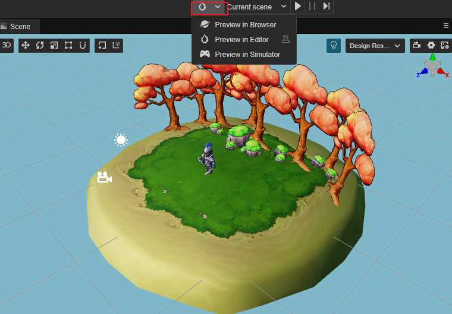
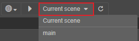
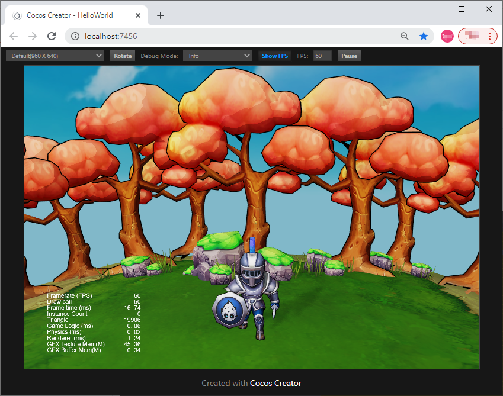
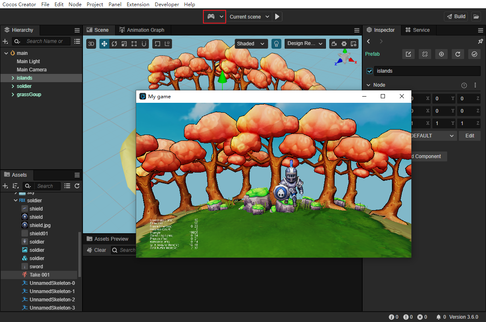
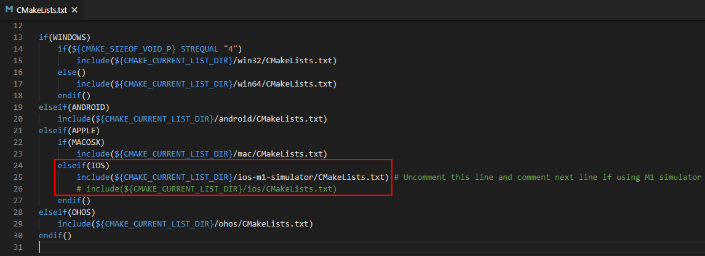
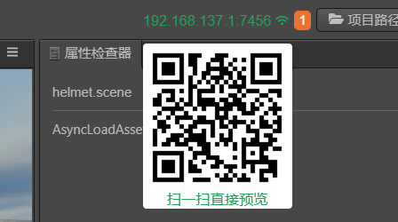

# 项目预览调试

在使用主要编辑器面板进行资源导入、场景搭建、组件配置、属性调整之后，我们可以通过预览和构建来看到游戏在 Web 或原生平台运行的效果了。

## 在编辑器中选择预览平台

在游戏开发过程中我们可以随时点击编辑器窗口正上方的 **预览** 按钮，来看到游戏运行的实际情况。

- 最左边的下拉菜单中可以选择预览的平台，目前支持使用 **浏览器** 和 **模拟器** 预览。
- ：预览按钮，点击可运行预览
- 在 **预览** 按钮右侧可以选择预览的场景，下拉框中会列出项目中所有的场景，默认使用 **当前场景**。

    

- ：刷新按钮，点击该按钮可刷新所有已打开的预览页面。如果想要在执行保存场景操作后自动刷新预览页面，在编辑器主菜单中选择 **Cocos Creator -> 偏好设置 -> 预览**，然后勾选 **保存场景自动刷新预览** 即可。

> **注意**：必须双击打开场景才能预览游戏内容，在没有打开任何场景，或者新建了一个空场景的情况下预览是看不到任何内容的。

### 浏览器

选择使用 **浏览器** 预览后，点击旁边的 **预览** 按钮，会在默认桌面浏览器中直接运行游戏的网页版本。推荐使用谷歌浏览器（Chrome）作为开发过程中预览调试用的浏览器，因为谷歌浏览器（Chrome）的开发者工具是最为全面强大的。

浏览器预览界面的最上边有一系列控制按钮可以对预览效果进行控制：

- 最左边选择预览窗口的比例大小，来模拟在不同移动设备上的显示效果，可以在 **Cocos Creator -> 偏好设置 -> 设备管理器** 中手动添加设备分辨率。
- **Rotate**：决定显示横屏还是竖屏
- **Debug Mode**：可以选择脚本中哪些级别的日志会输出到浏览器控制台中
- **Show FPS**：用于选择是否在左下角显示每秒帧数和 Drawcall 数量等调试信息
- **FPS**：限制最高每秒帧数
- **Pause**：暂停游戏

Cocos Creator 3.0 支持自定义网页预览功能，详情请参考 [网页预览定制工作流程](browser.md)。

#### 浏览器兼容性

Cocos Creator 开发过程中测试的桌面浏览器包括：**Chrome**、**Firefox（火狐）** 和 **QQ 浏览器**，其他浏览器只要内核版本够高也可以正常使用，对部分浏览器来说请勿开启 IE 兼容模式。

移动设备上测试的浏览器包括：**Safari（iOS）**、**Chrome（Android）**、**QQ 浏览器（Android）** 和 **UC 浏览器（Android）**。

#### 使用浏览器开发者工具进行调试

以谷歌浏览器为例，点击编辑器主菜单中的 **开发者 -> 开发人员工具** 便可打开开发者工具界面。在开发者工具中，我们可以查看运行日志、打断点进行调试、在调用堆栈中查看每一步各个变量的值、甚至进行资源加载和性能分析。

要学习使用开发者工具进行调试，请阅读 [Chrome Dev Tools 使用指南](https://developers.google.com/web/tools/chrome-devtools?hl=zh-cn)，或其他浏览器的开发者工具帮助。

<!--
### 预览窗口

选择使用 **预览窗口** 预览后，会打开独立的游戏预览窗口。**预览窗口** 是内嵌于编辑器中的游戏视图功能，它可以不打开浏览器/模拟器即可在编辑器中运行游戏，这样做的优势在于运行后的游戏可以通过编辑器中的其它插件或 Gizmo 实时调整游戏中的模型以及游戏运行时的状态等，做到游戏运行时的"所见即所得"。

打开 **预览窗口** 后，可以看到在编辑器顶部的工具栏中多出了 **播放/停止**、**暂停** 和 **步进** 几个按钮：

- **播放/停止**：用于切换游戏的运行/停止状态。
- **暂停**：用于暂停运行中的游戏。
- **步进**：使游戏以步进的方式运行，方便调试。

**预览窗口** 顶部工具栏中的按钮功能与浏览器的差不多，只不过自定义预览窗口的比例大小是通过设置为 **Custom** 后手动在弹出的窗口中配置的。

-->

### 模拟器

选择使用 **模拟器** 预览后，会使用 Cocos Simulator（桌面模拟器）运行当前的游戏场景。使用模拟器运行游戏时，脚本中的日志信息（使用 `cc.log` 打印的内容）和报错信息会显示在 **控制台** 面板中。

使用 **模拟器** 预览时，支持自动打开调试窗口进行调试，可在 **Cocos Creator -> 偏好设置 -> 预览** 中设置，详情请参考 [偏好设置 — 预览](../preferences/index.md)。

若需要在 Apple M1（Silicon）架构的设备中添加对 iOS 模拟器的支持，需要在 Creator 右上角点击 **编辑器** 按钮，打开编辑器目录 `resources\3d\engine\native\external` 目录下的 `CMakeLists.txt` 文件，取消 iOS 模拟器相关的代码注释，同时注释 iOS 真机相关代码，如下图所示：

## 手机端预览

调试手机端的预览效果有以下方式：

- 使用 **浏览器开发者工具的手机端预览模式**

- **扫描预览二维码**

  将鼠标移动到编辑器工具栏左边的 IP 预览地址上，会显示一个预览的二维码，用手机扫描即可。

  

- 直接 **在手机浏览器里输入预览地址**

> **注意**：手机需要和电脑在 **同一网段**。由于电脑的网络有可能有多个，如果编辑器预览 URL 的 IP 地址选择不正确，可以在主菜单栏的 **Cocos Creator -> 偏好设置 -> 通用设置 -> 选择本机预览 IP 地址** 中修改。

## 构建发布

预览和调试之后，如果您对您的游戏比较满意了，就可以通过主菜单的 **项目/构建发布** 打开 **构建发布** 面板，将游戏打包发布到目标平台上，包括 Web、iOS、Android、各类"小游戏"、PC 客户端等平台。详细的构建发布流程，请参考 [跨平台发布游戏](../publish/index.md) 一章的内容。

> **注意**：使用 **模拟器** 运行游戏的效果，和最终发布到原生平台可能会有一定差别，对于任何重要的游戏功能，都请以构建发布后的版本来做最终的测试。

## 其他参考

- [预览流程简介与常见错误处理](preview-guid.md)
