# 项目设置

**项目设置** 面板通过点击编辑器主菜单栏中的 **项目 -> 项目设置** 即可打开，主要用于设置特定项目的相关配置项。这些设置会保存在项目的 `settings/packages` 文件夹中。如果需要在不同开发者之间同步项目设置，请将 `settings` 目录加入到版本控制。

**项目设置** 由几个不同的分页组成，包括 **项目数据**、**Layers**、**物理**、**脚本**、**Macro Config**、**功能裁剪** 和 **纹理压缩**。修改设置之后 **项目设置** 面板会自动保存修改。

## 项目数据

**项目数据** 分页主要用于设置默认 Canvas、渲染管线等，只对当前项目生效。

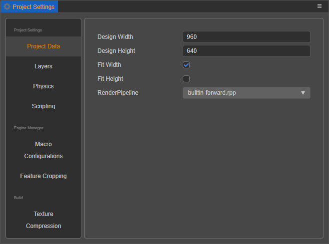

### 默认 Canvas 设置

默认 Canvas 设置包括 **设计分辨率** 和 **适配屏幕宽度/高度**，用于规定在新建场景或 Canvas 组件时，Canvas 中默认的设计分辨率数值，以及 `Fit Height` 和 `Fit Width`。详情请参考 [多分辨率适配方案](../../ui-system/components/engine/multi-resolution.md)。

### 渲染管线

渲染管线用于控制场景的渲染流程，目前内置的渲染管线包括 **builtin-forward** (前向渲染管线) 和 **builtin-deferred** (延迟渲染管线)，详情请参考 [内置渲染管线](../../render-pipeline/builtin-pipeline.md)。

## Layers

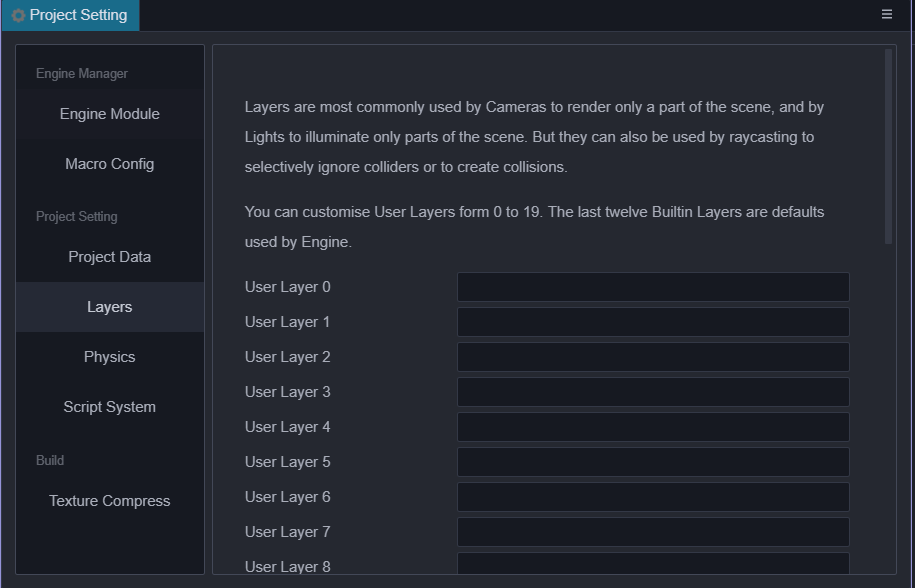

- Layers 能让相机渲染部分场景，让灯光照亮部分场景。
- 可自定义 0 到 19 个 Layers，清空输入框则删除原先的设置。
- 后 12 个 Layers 是引擎内置的，不可修改。
- 目前使用到 Layer 的位置包括：

  1. Node 节点在 **属性检查器** 中的 [Layer 属性](../../concepts/scene/node-component.md#%E8%AE%BE%E7%BD%AE%E8%8A%82%E7%82%B9%E7%9A%84%E5%8F%AF%E8%A7%81%E6%80%A7)。

      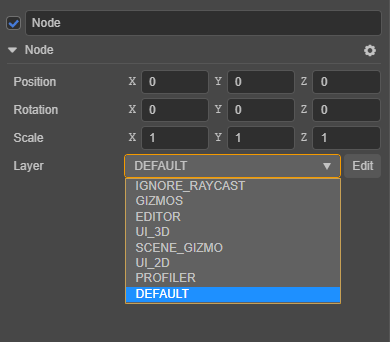

  2. Camera 节点在 **属性检查器** 中的 Visibility 属性，节点的 Layer 属性匹配相机的 Visibility 属性。只有当节点设置的 Layer 属性包含在相机的 Visibility 中时，节点才可以被相机看见。更多说明可以参考 [Camera 组件](./../components/camera-component.md)。

      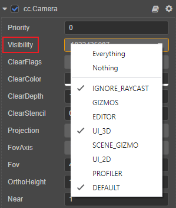

<!-- native 引擎设置的修改主要影响的是构建原生项目时使用 cocos2dx 引擎模板，修改后可以实时生效。 -->

## 物理

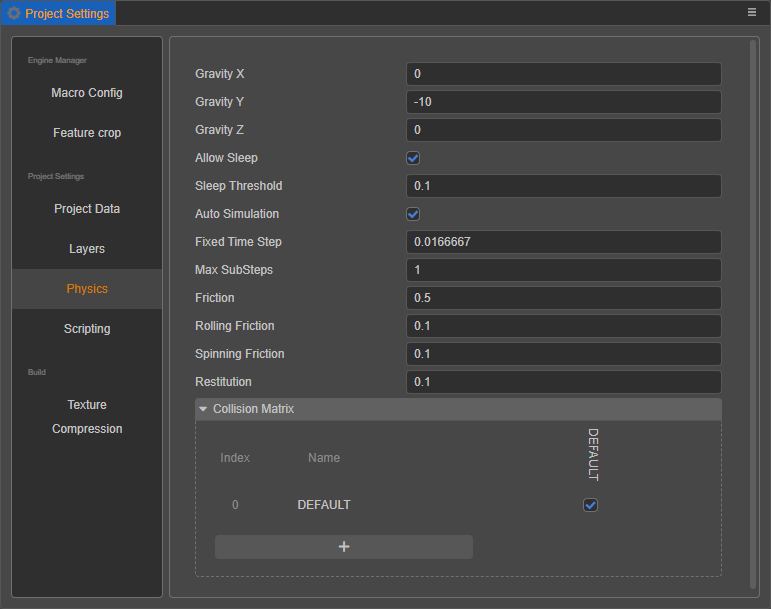

用于配置物理的各项参数，详情请参考 [物理配置](physics-configs.md)。

## 脚本

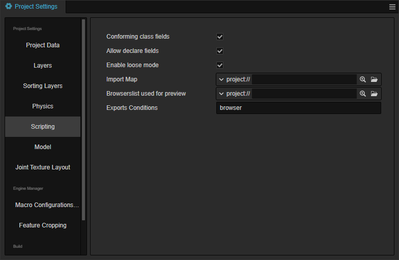

- **符合规范的类字段**：当开启时，将使用 Define 语义实现类字段，否则，将使用 Set 语义实现类字段。

- **允许声明类字段**：当开启时，在 TypeScript 脚本中将允许使用 declare 关键字来声明类字段。当字段以 declare 声明且未指定显式的初始化式时，将依照规范初始化为 undefined。

- **启用宽松模式**：启用宽松模式进行脚本编译。

- **导入映射**：该项用于控制 TypeScript/JavaScript 的导入行为，详情请参考 [Import Map](../../scripting/modules/import-map.md)。

- **用于预览的浏览器列表**：设置在预览时 TypeScript/JavaScript 代码编译的浏览器列表文件。

- **导出条件**：为条件化导出模块指定解析条件，详情可参考 [条件性导出](../../scripting/modules/spec.md#%E6%9D%A1%E4%BB%B6%E6%80%A7%E5%AF%BC%E5%87%BA)。

## Macro Config（引擎宏配置）

**引擎宏设置** 提供了修改宏配置的快捷方式，配置的宏将会在预览、构建时生效，同时也会跟随自定义引擎的配置更新当前宏配置的默认值。

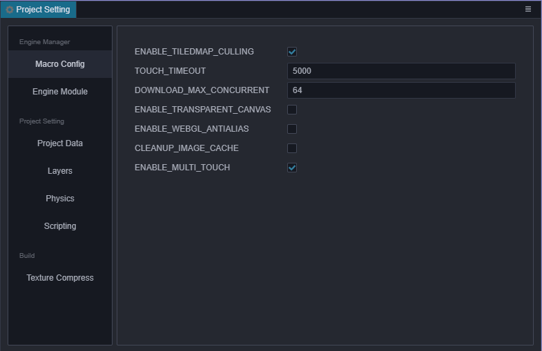

- **ENABLE_TILEDMAP_CULLING**：是否开启 TiledMap 的自动裁减功能，默认开启。需要注意的是 TiledMap 如果设置了 `skew` 和 `rotation` 的话，建议手动关闭该项，否则会导致渲染出错。

- **TOUCH_TIMEOUT**：用于甄别一个触点对象是否已经失效并且可以被移除的延时时长。开发者可通过修改这个值来获得想要的效果，默认值是 5000 毫秒。详情请参考 API 文档 [TOUCH_TIMEOUT](https://docs.cocos.com/creator/3.4/api/zh/#/docs/3.4/zh/core/ObjectLiteral/macro?id=touch_timeout)。

- **ENABLE_TRANSPARENT_CANVAS**：用于设置 Canvas 背景是否支持 Alpha 通道，默认不开启支持。

    - 若希望 Canvas 背景是透明的，并显示背后的其他 DOM 元素，便可开启该项。

    - 若关闭该项，则会有更高的性能表现。

- **ENABLE_WEBGL_ANTIALIAS**：是否开启 WebGL 的抗锯齿配置，默认开启。这个配置只影响 WebGL 后端，对应在创建 WebGL Context 时是否传入抗锯齿选项（仅适用于前向渲染管线）。

- **ENABLE_ANTIALIAS_FXAA**：用于开启 FXAA 抗锯齿（仅适用于延迟渲染管线）。

- **ENABLE_BLOOM**：用于开启 BLOOM 后处理特效。

- **CLEANUP_IMAGE_CACHE**：是否在将贴图上传至 GPU 之后删除原始图片缓存，删除之后图片将无法进行 [动态合图](../../advanced-topics/dynamic-atlas.md)。该项默认不开启。

- **ENABLE_MULTI_TOUCH**：是否开启多点触摸，默认开启。

- **MAX_LABEL_CANVAS_POOL_SIZE**：设置 Label 使用的 Canvas 对象池的最大数量，请根据项目同场景的 Label 数量进行调整。

- **ENABLE_WEBGL_HIGHP_STRUCT_VALUES**（v3.4.1 新增）：在带有 WebGL 后端的 Android 平台上，片元着色器中定义的结构体内部变量使用的是 mediump 精度，可能会导致一些需要高精度的数据（如位置信息）计算出现错误结果。可以通过勾选该项开启 WebGL 使用 highp 精度计算变量来避免该问题。

    - 若开启该项，在片元着色器代码中需要使用 `HIGHP_VALUE_STRUCT_DEFINE` 宏来定义结构体变量，使用 `HIGHP_VALUE_TO_STRUCT_DEFINED` 和 `HIGHP_VALUE_FROM_STRUCT_DEFINED` 在结构体变量和非结构体变量之间赋值。

    - 关于上述宏调用的具体信息与代码，详情请参考 **packing.chunk**（[GitHub](https://github.com/cocos-creator/engine/blob/v3.4.1/editor/assets/chunks/packing.chunk#L40) | [Gitee](https://gitee.com/mirrors_cocos-creator/engine/blob/v3.4.1/editor/assets/chunks/packing.chunk#L40)）。

- **BATCHER2D_MEM_INCREMENT**（v3.4.1 新增）：该项会影响每个 MeshBuffer 可容纳的最大顶点数量，默认值为 144KB，数量与值之间的转换关系请参考 [MeshBuffer 合批说明](../../ui-system/components/engine/ui-batch.md#meshbuffer-%E5%90%88%E6%89%B9%E8%AF%B4%E6%98%8E)。

- **Custom Macro**：用于自定义宏配置，为当前项目脚本提供一个宏标记的功能，便于可视化配置。点击下方的 **+** 按钮即可添加新的宏配置，将鼠标悬浮在已添加的宏配置上，左侧会显示 **删除** 和 **修改** 按钮，分别用于删除/重命名当前宏配置。

  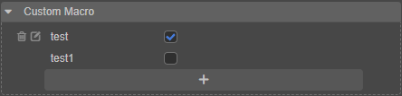

更多关于引擎宏模块的具体信息与代码可以参考 **Engine Macro**（[GitHub](https://github.com/cocos-creator/engine/blob/3d/cocos/core/platform/macro.ts#L824) | [Gitee](https://gitee.com/mirrors_cocos-creator/engine/blob/3d/cocos/core/platform/macro.ts#L824)）。

## 功能裁剪

**功能裁剪** 分页主要是针对发布游戏时引擎中使用的模块进行裁剪，达到减小发布版引擎包体的效果。列表中未选中的模块在打包、预览时将会被裁剪掉。建议打包后进行完整的测试，避免场景和脚本中使用到了被裁剪掉的模块。

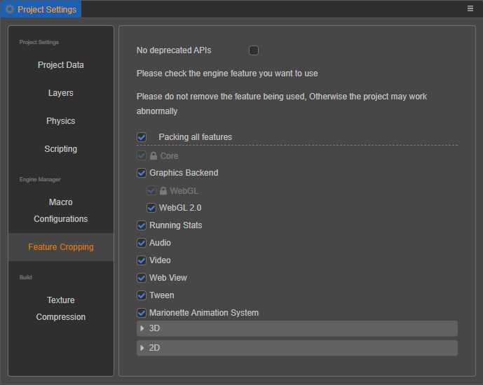

## 压缩纹理

与 Cocos Creator 2.x 不同，Cocos Creator 3.0 的压缩纹理是在 **项目设置** 中配置预设，然后在 **属性检查器** 中选择图片资源的预设方式。旧版本的项目在升级到 v3.0 后，编辑器会自动扫描项目中所有的压缩纹理配置情况，整理出几个预设，由于是自动扫描的，所以预设名称可能不匹配项目，可以自行在此处修改。

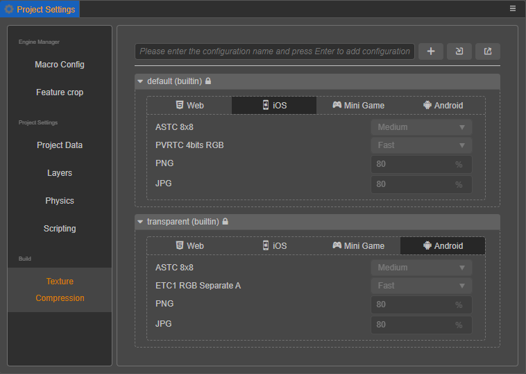

该分页主要用于添加压缩纹理预设配置，可添加多个，每个压缩纹理配置允许针对不同的平台制定配置细则。添加完成后，在 **层级管理器** 中选中图片资源，就可以在 **属性检查器** 中快速添加压缩纹理预设。同时也可以在该分页中直接修改预设来达到批量更新压缩纹理配置的使用需求。

目前配置压缩纹理支持以下平台：

1. Web：包括 Web-Mobile 和 Web-Desktop 两个平台
2. iOS
3. Mini Game: 包括目前 Creator 支持的所有小游戏平台，比如微信小游戏、华为快游戏等
4. Android

各平台对纹理压缩的支持情况，详情请参考 [压缩纹理](../../asset/compress-texture.md)。

### 添加/删除纹理压缩预设

在上方的输入框中输入压缩纹理预设名称，点击 Enter 键或者右侧的加号按钮即可添加一个预设。另外两个按钮是用于导入/导出压缩纹理预设，详情请参考下文介绍。

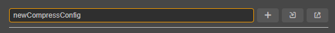

添加完压缩纹理后，如需删除可以直接将鼠标移到预设名称上，点击右侧的删除按钮即可。

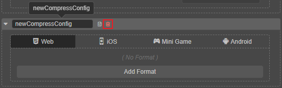

> **注意**：面板中内置的 **default** 和 **transparent** 这两个预设不可修改/删除。

### 添加/删除纹理压缩格式

选择平台，然后点击 **Add Format** 按钮，选择需要的纹理格式，再配置好对应的质量等级即可，目前同类型的图片格式只能添加一次。

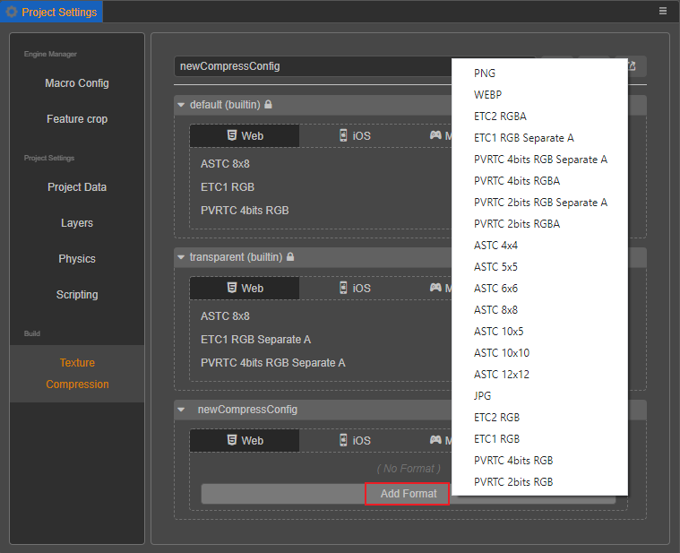

如需删除，将鼠标移至纹理格式上方，点击右侧的红色删除按钮即可。

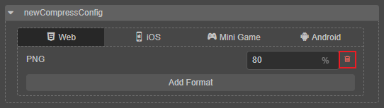

### 修改压缩纹理预设名称

压缩纹理预设的名称仅仅是作为 **显示** 使用，在添加压缩纹理预设时，就会随机生成 uuid 作为该预设的 ID，因而直接修改预设名称并不会影响图片资源处对预设的引用。

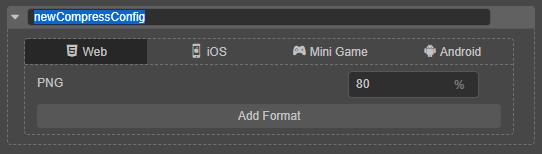

### 导出/导入压缩纹理预设

压缩纹理配置页面允许导入/导出压缩纹理预设，以便更好地跨项目复用配置，也可以自行在外部编辑好压缩纹理预设再导入到编辑器。

大部分情况下直接导入导出即可，如果需要自行编写压缩纹理配置，请参考下方接口定义与范例：

**接口定义**：

```ts
type IConfigGroups = Record<ITextureCompressPlatform, IConfigGroupsInfo>;
type ITextureCompressPlatform = 'miniGame' | 'web' | 'ios' | 'android' | 'pc';
type ITextureCompressType =
    | 'jpg'
    | 'png'
    | 'webp'
    | 'pvrtc_4bits_rgb'
    | 'pvrtc_4bits_rgba'
    | 'pvrtc_4bits_rgb_a'
    | 'pvrtc_2bits_rgb'
    | 'pvrtc_2bits_rgba'
    | 'pvrtc_2bits_rgb_a'
    | 'etc1_rgb'
    | 'etc1_rgb_a'
    | 'etc2_rgb'
    | 'etc2_rgba'
    | 'astc_4x4'
    | 'astc_5x5'
    | 'astc_6x6'
    | 'astc_8x8'
    | 'astc_10x5'
    | 'astc_10x10'
    | 'astc_12x12';
type IConfigGroupsInfo = Record<ITextureCompressType, IQuality>
interface ICompressPresetItem {
    name: string;
    options: IConfigGroups;
}
```

**示例参考**：

```json
{
    "default": {
        "name": "default",
        "options": {
            "miniGame": {
                "etc1_rgb": "fast",
                "pvrtc_4bits_rgb": "fast"
            },
            "android": {
                "astc_8x8": "-medium",
                "etc1_rgb": "fast"
            },
            "ios": {
                "astc_8x8": "-medium",
                "pvrtc_4bits_rgb": "fast"
            },
            "web": {
                "astc_8x8": "-medium",
                "etc1_rgb": "fast",
                "pvrtc_4bits_rgb": "fast"
            },
        }
    },
    "transparent": {
        "name": "transparent",
        "options": {
            "miniGame": {
                "etc1_rgb_a": "fast",
                "pvrtc_4bits_rgb_a": "fast"
            },
            "android": {
                "astc_8x8": "-medium",
                "etc1_rgb_a": "fast"
            },
            "ios": {
                "astc_8x8": "-medium",
                "pvrtc_4bits_rgb_a": "fast"
            },
            "web": {
                "astc_8x8": "-medium",
                "etc1_rgb_a": "fast",
                "pvrtc_4bits_rgb_a": "fast"
            },
        }
    }
}
```

## 扩展项目设置面板

Creator 支持在 **项目设置** 右侧添加自定义功能页，详情请参考 [扩展项目设置](../../editor/extension/contributions-project.md)。
