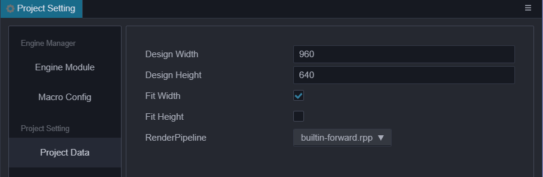
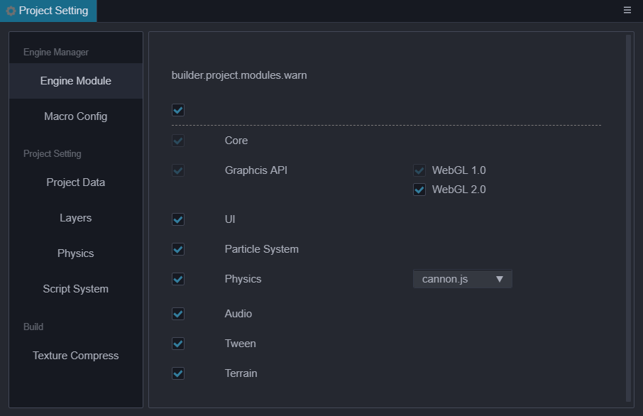

# 项目设置

通过点击主菜单的 **项目 -> 项目设置** 打开 **项目设置** 面板，这里包括所有特定项目相关的设置，这些设置将会影响到整个游戏项目的预览、构建等。这些设置会保存在项目的 `settings / packages` 文件夹里。如果需要在不同开发者之间同步项目设置，请将 settings 目录加入到版本控制。

## 通用设置



### 默认 Canvas 设置

默认 Canvas 设置包括设计分辨率和适配屏幕宽度/高度，用于规定在新建场景或 Canvas 组件 时，Canvas 中默认的设计分辨率数值，以及 `Fit Height、Fit Width` 选项。

更多内容可以参考 [多分辨率适配方案](../ui-system/components/engine/multi-resolution.md)。

## 引擎模块设置



这里的设置是针对发布游戏时引擎中使用的模块进行裁剪，达到减小发布版引擎包体的效果。在列表中未选中的模块在打包、预览时将会被裁剪掉。建议打包后进行完整的测试，避免在场景和脚本中使用裁剪掉的模块。

## 引擎宏配置

关于引擎宏模块的具体信息与代码可以参考 [Engine macro](https://github.com/cocos-creator/engine/blob/3d/cocos/core/platform/macro.ts#L824)，这里提供了修改宏配置的快捷方式，配置的宏将会在预览、构建时生效，同时也会跟随自定义引擎的配置更新当前宏配置的默认值。


## 压缩纹理预设配置

在 Creator 3.0，压缩纹理修改为在 **项目设置** 中配置预设，图片资源处选择预设的方式。旧版本的项目在升级上来后，编辑器将会自动扫描项目内的所有压缩纹理配置情况，整理出几个预设，由于是自动扫描的，在名称的生成可能不会是项目想要的，可以自行在此处修改。

用于添加压缩纹理预设配置，在对应图片资源处可以直接选择此处的压缩纹理预设来快速添加。同时添加完预设后，也可以直接修改预设来达到批量更新配置的使用需求。项目设置允许用户添加多个压缩纹理配置，每个压缩纹理配置允许再针对不同的平台大类来制定配置细则。

目前大致设置以下几个平台大类：

1. Web：指 Web-Mobile、Web-Desktop 两个平台
2. Mac & Windows
3. iOS
4. Mini Game: 指代各个产商平台的小游戏，比如微信小游戏、华为快游戏等待；
5. Android

对应的平台大类的纹理压缩支持情况可以参考 [压缩纹理章节](../../asset/compress-texture.md)。

### 添加 / 删除纹理压缩预设

在输入框内输入压缩纹理预设名称，点击 Enter 键或者左侧的加号按钮即可添加。


添加完压缩纹理后，如需删除可以直接将鼠标移到预设名称上，点击右侧的删除按钮即可。


### 添加 / 删除纹理压缩格式

点击 `Add Format` 按钮，选择需要的纹理格式，再配置好对应的质量等级即可，目前同类型的图片格式同时只能添加一种。


如需删除，将鼠标移至纹理格式上方，点击红色删除按钮即可。

### 修改压缩纹理预设名称

压缩纹理的名称仅仅是作为显示使用，在添加压缩纹理预设时，就会随机生成 uuid 作为该预设的 ID，因而直接修改预设名称并不会影响图片资源处对预设的引用。


### 导出 / 导入压缩纹理预设

压缩纹理配置页面允许导入、导出压缩纹理预设来更好的跨项目复用配置，也可以自行在外部编辑好压缩纹理预设再导入到编辑器内。

大部分情况下直接导入导出即可，如果需要自行编写这份配置需要参考下方接口定义与范例：

```ts
type IConfigGroups = Record<ITextureCompressPlatform, IConfigGroupsInfo>;
type ITextureCompressPlatform = 'miniGame' | 'web' | 'ios' | 'android' | 'pc';
type ITextureCompressType =
    | 'jpg'
    | 'png'
    | 'webp'
    | 'pvrtc_4bits_rgb'
    | 'pvrtc_4bits_rgba'
    | 'pvrtc_4bits_rgb_a'
    | 'pvrtc_2bits_rgb'
    | 'pvrtc_2bits_rgba'
    | 'pvrtc_2bits_rgb_a'
    | 'etc1_rgb'
    | 'etc1_rgb_a'
    | 'etc2_rgb'
    | 'etc2_rgba'
    | 'astc_4x4'
    | 'astc_5x5'
    | 'astc_6x6'
    | 'astc_8x8'
    | 'astc_10x5'
    | 'astc_10x10'
    | 'astc_12x12';
type IConfigGroupsInfo = Record<ITextureCompressType, IQuality>
interface ICompressPresetItem {
    name: string;
    options: IConfigGroups;
}
```

示例参考：

```json
{
    "default": {
        "name": "default",
        "options": {
            "miniGame": {
                "etc1_rgb": "fast",
                "pvrtc_4bits_rgb": "fast"
            },
            "android": {
                "astc_8x8": "-medium",
                "etc1_rgb": "fast"
            },
            "ios": {
                "astc_8x8": "-medium",
                "pvrtc_4bits_rgb": "fast"
            },
            "web": {
                "astc_8x8": "-medium",
                "etc1_rgb": "fast",
                "pvrtc_4bits_rgb": "fast"
            },
        }
    },
    "transparent": {
        "name": "transparent",
        "options": {
            "miniGame": {
                "etc1_rgb_a": "fast",
                "pvrtc_4bits_rgb_a": "fast"
            },
            "android": {
                "astc_8x8": "-medium",
                "etc1_rgb_a": "fast"
            },
            "ios": {
                "astc_8x8": "-medium",
                "pvrtc_4bits_rgb_a": "fast"
            },
            "web": {
                "astc_8x8": "-medium",
                "etc1_rgb_a": "fast",
                "pvrtc_4bits_rgb_a": "fast"
            },
        }
    }
}
```

## Layers


- Layers 能让相机渲染部分场景，让灯光照亮部分场景。
- 可自定义 0 到 19 个 Layers，当您把输入框清空时即删除原先的设置。
- 后 12 个 Layers 是引擎内置的，不可修改。
- 目前使用的位置有：
  1. 编辑 node 节点时，inspector 面板上的 Layer 属性;

  

  2. 编辑 Camera 节点时的 Visibility 属性。节点的 layer 属性匹配相机的 visibility 属性，只有相机 visibility 中包含的 layer 所代表的节点可以被相机看见。更多说明可以参考 [Camera 组件介绍](./../components/camera-component.md);

  

<!-- native 引擎设置的修改主要影响的是构建原生项目时使用 cocos2dx 引擎模板，修改后可以实时生效。 -->

## 物理配置

用于配置物理的各项参数，请参考[这里](physics-configs.md)。

## 骨骼贴图布局设置

显式指定骨骼贴图布局，用于辅助蒙皮模型的 instancing，具体参考 [骨骼贴图布局设置](joints-texture-layout.md)。
