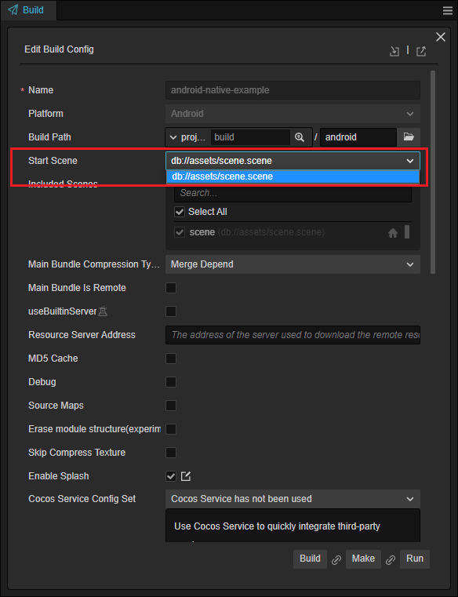
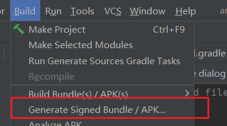
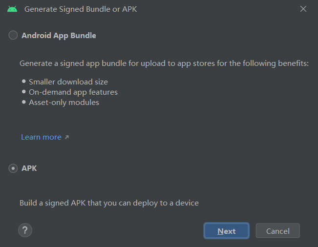
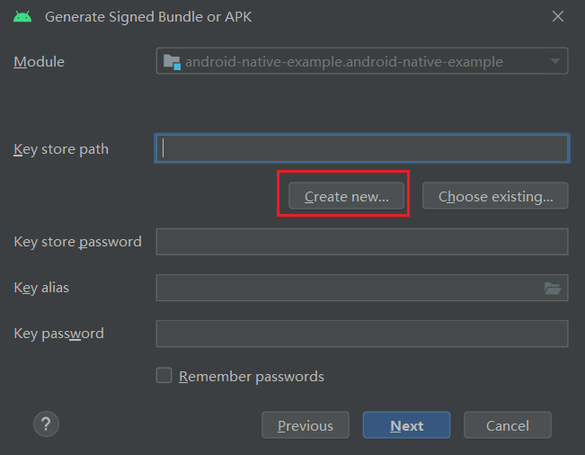
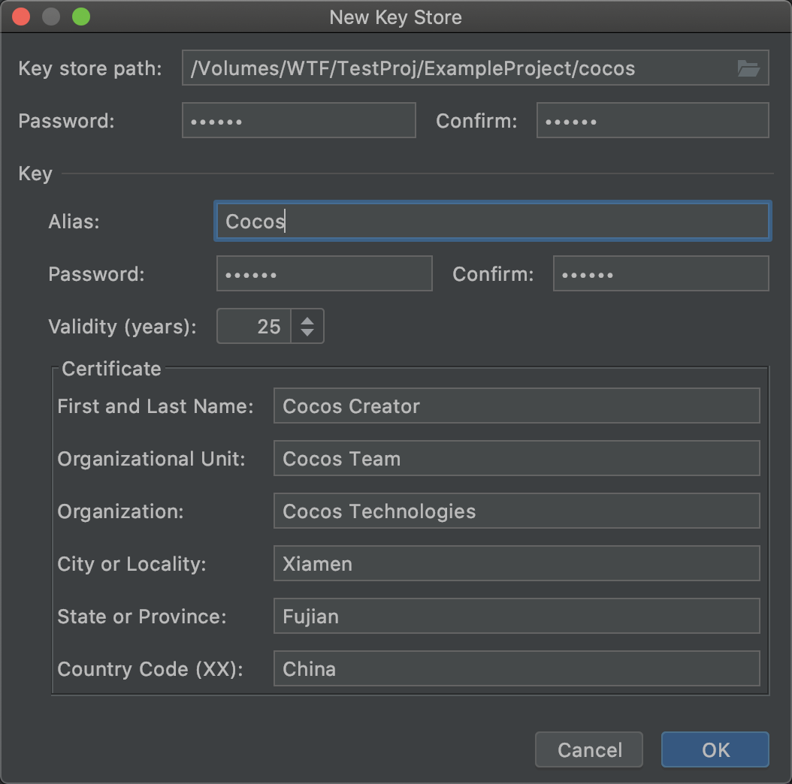
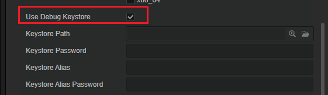

# 安卓构建示例

本文将演示 Cocos Creator 项目发布为 Android 应用程序的流程。

请准备一个至少含有一个场景的 Cocos Creator 项目。

## 发布环境搭建

要想发布 Android 原生应用，需要安装 Android Studio 开发环境，以及特定版本的 JDK（或者 OpenSDK），Android SDK 和 NDK 等。详情请参考 [配置 Android 原生开发环境](build-setup-evn-android.md)。

## 发布流程

接下来，在 Cocos Creator 找到 **项目** 菜单，点击 **构建发布** 按钮，弹出 **构建发布** 面板。

### 创建发布任务

1. 选择 **项目** -> **构建** 菜单，打开构建面板

    

2. 点击面板上的 **新建构建任务** 选项：

    

3. 选择构建平台为安卓：

    

4. 选择至少一个场景作为应用载入的首场景，当仅有一个场景时会被默认添加：

    

5. 参考 [Android 平台构建选项 - 渲染后端](../native-options.md#%E6%B8%B2%E6%9F%93%E5%90%8E%E7%AB%AF) 选择渲染后端

    

6. 填入包名

    

    > 名称规范请参考 [应用 ID 名称](../native-options.md#%E5%BA%94%E7%94%A8-id-%E5%90%8D%E7%A7%B0)

7. 选择 Target API Level

    

    > 如果没有下拉框，请检查上面的 **配置 SDK 和 NDK** 是否正确。

其他选项请参考 [Android 平台构建选项](../native-options.md#android-%E5%B9%B3%E5%8F%B0%E6%9E%84%E5%BB%BA%E9%80%89%E9%A1%B9) 进行配置。

### 构建与发布

1. 构建：点击下方的 **构建** 按钮会创建一个新的构建任务并开始构建

    

2. 等待构建完成

    

3. 在点击下面的按钮打开生成好的 Android Studio 工程：

    

4. 找到工程对应的目录

    

5. 打开 Android Studio 的菜单：

    

6. 打开已经构建好的项目，`{项目路径}/build/android/proj`：

    

7. 使用 Android Studio 构建 APK

    打开 Android Studio 后，会花一段时间进行准备工作，待 Android Studio 将项目准备完成后，即可打包 APK。准备过程可能会耗时较久，如果长时间无响应，请检查网络，或者切换到其他镜像。此时如果您需要中断目前的后台任务，可参考下列关闭方法：

    > Android Studio 有后台任务时，可以点击窗口下方的后台任务栏：
    >   
    > 在弹出窗中点击右侧的 × 以结束后台任务：
    > 

8. 打开 **Build** 菜单选择 **Build Bundle(s) / APK(s)**：

    

9. 发布成功后可以在 proj/build 目录内找到 Debug 版本的 APK：

    

## 秘钥生成与使用

正式版本的发布，不能使用调试密钥，需要自行创建密钥。

### 创建密钥

秘钥可以通过 Android Studio 来生成：

1. 在 Android Studio 中点击 Build 菜单，选中 Generate Signed Bundle / APK：

    

2. 在弹出菜单的窗口中选择 APK，点击 Next 按钮：

    

3. 在引导的窗口中点击 Create new：

    

4. 在弹出的窗口中，填好相应信息即可：

    

    > 不同的项目，建议使用不同的密钥。可以将每个项目的密钥保存在项目根目录下。

### 使用密钥

密钥创建成功后，会在选择的目录下生成一个密钥文件，我们可以在 Android 构建面板上，将密钥信息填好。 这样不管是调试版还是发布版，都使用的是自己创建的密钥。

如下图所示，取消 **使用调试秘钥**，并从下方的 **秘钥库路径** 中找到自定义的秘钥文件，填好相关信息即可。

### 注意事项

1. 建议项目第一次发布时，就为项目创建一个专用的密钥。
2. 一些 SDK 的服务接入需要 APK 密钥签名验证，使用默认的调试密钥可能导致服务调用失败。

## 进阶

### JAVA 和 TypeScript 互相通信

引擎提供多样化的方法用于解决 TypeScript 和 Native 层交互问题。

常见的 SDK 接入时，我们需要通过 SDK 的登陆接口进行登陆操作，获取到登陆结果后再将结果传入到 TypeScript 层以方便游戏进行处理。

引擎提供了三种用于 TS 与 Android 原生通信的方法。

- [使用 JsbBridge 实现 JavaScript 与 Java 通信](../../../advanced-topics/js-java-bridge.md) ：用于对接 SDK 中如注册、登陆、广告弹出等行为是非常方便的，可以较为快速的解决这类问题。

- [JSB 2.0 绑定教程](../../../advanced-topics/JSB2.0-learning.md)：需要高频调用，或者批量导出 API 时，推荐使用这个方法。

- [基于反射机制实现 JavaScript 与 Android 系统原生通信](../../../advanced-topics/java-reflection.md) ：在一些非高频调用时，非常有效。

### 导入第三方库

为了将应用发布到应用市场，通常需要对接某些第三方的 SDK，通常这些 SDK 会提供给您 JAR 或 AAR 格式，您可以参考 [在其他项目中使用您的库](https://developer.android.com/studio/projects/android-library?hl=zh-cn#psd-add-library-dependency) 将本地的库导入到工程内。

### 扩展发布机制

参考 [自定义构建流程](../custom-build-plugin.md) 通过扩展系统对发布机制进行扩展。

## Q&A

- Q：发布时的错误如何调试
    - A：点击日志按钮，进行查看

        

- Q：提示缺少 LIB_EGL
    - A：更换 NDK 版本为文中所述的版本

- Q：文件命名
    - A：由于安卓是基于 Linux 的，因此 Linux 的一些文件规范在安卓依然适用，如：
        - 1. 安卓是大小写敏感的，确保路径的大小写是正确的，否则将无法正确加载
        - 2. 文件夹或文件名中不要含有空格等字符

## 特性与系统版本

不同的特性会依赖特定的系统版本，请往 [特性与系统版本](./../../../advanced-topics/supported-versions.md) 查看详情。
