# 安卓构建示例

本节我们介绍如何通过 Android Studio 构建安卓工程。

请准备一个至少含有一个场景的 Cocos Creator 项目。


## 发布流程

### 配置安卓开发环境

- 下载 Android Studio

    开发者可以从 [Android Studio 官方网站](https://developer.android.com/studio) 下载对应的 IDE。

- 参考 [安装配置原生开发环境](../setup-native-development.md##android-%E5%B9%B3%E5%8F%B0%E7%9B%B8%E5%85%B3%E4%BE%9D%E8%B5%96) 搭建开发环境

    - JDK
        - 参考 [安装配置原生开发环境 - 下载 Java SDK（JDK）](../setup-native-development.md#%E4%B8%8B%E8%BD%BD-java-sdk%EF%BC%88jdk%EF%BC%89)
        - 在终端中输入 `java -version` 查看是否安装成功

            

            > 在 Windows 上需要配置对应的环境变量
            > **注意**：笔者采用的 [OpenJDK](https://openjdk.org/)

    - Android SDK
        - Android Studio 下载 Android SDK 示例

            - 通过下列菜单打开 Setting 面板

                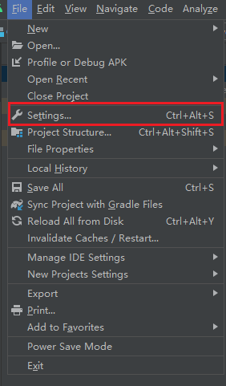

            - 在 Setting 内找到 SDK 下载分页

                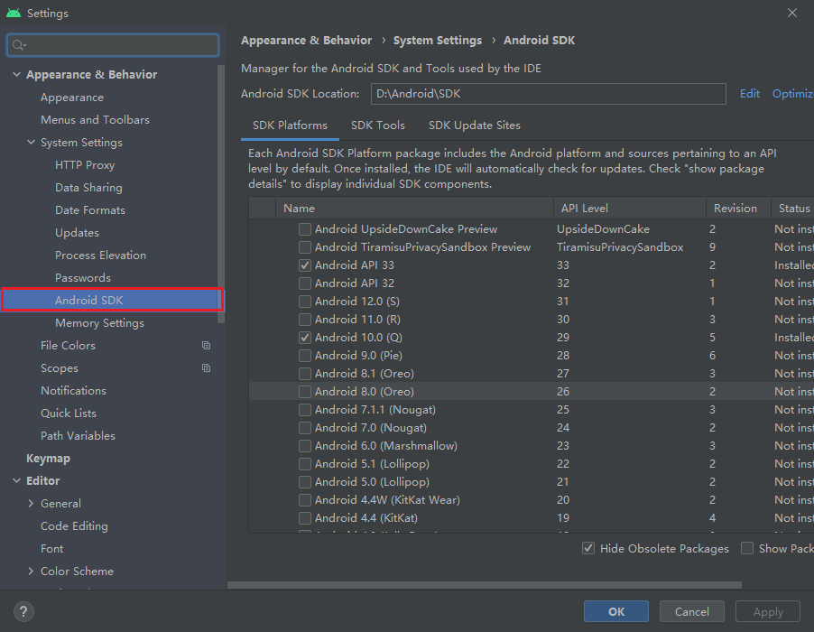

            - 选中对应版本的 SDK 并加载，可以选择使用  [下载发布 Android 平台所需的 SDK 和 NDK](../setup-native-development.md#%E4%B8%8B%E8%BD%BD%E5%8F%91%E5%B8%83-android-%E5%B9%B3%E5%8F%B0%E6%89%80%E9%9C%80%E7%9A%84-sdk-%E5%92%8C-ndk) 中推荐的版本

                - 以 Android 11.0(R) 为示例，点击上图中的 OK 或者 Apply 按钮。

                - 在弹出框中选择 OK

                    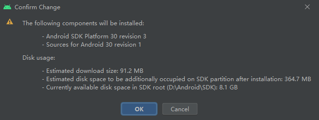

                - 下载

                    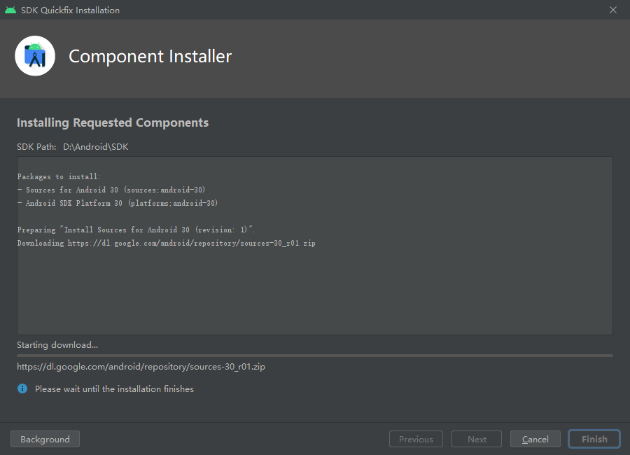

        - 手动下载 Android SDK

            如果出现网络问题无法下载 SDK，可以通过手动的方式下载并放在 **Android SDK Location** 配置的目录内

            > 您也可以点击后方的 **Edit** 按钮选择不同的路径

            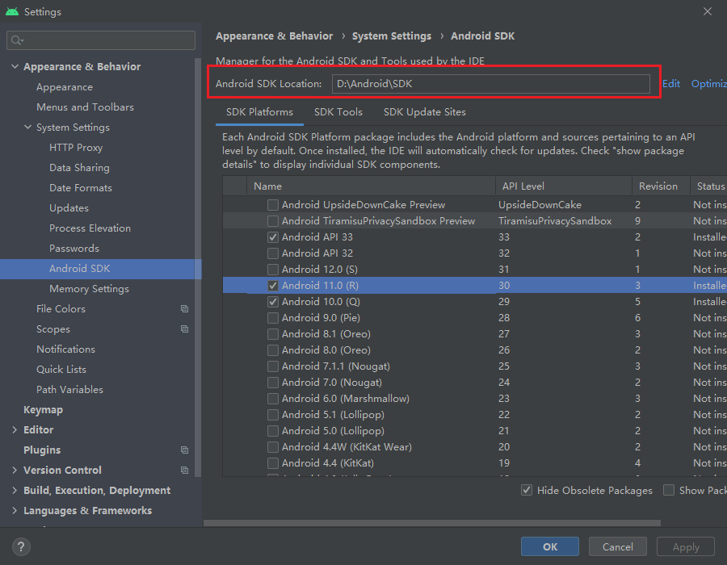

    - NDK
        - 根据 [安装配置原生开发环境 - 下载发布 Android 平台所需的 SDK 和 NDK](../setup-native-development.md) 推荐的版本区间下载 NDK

        - 您可以在 [历史版本](https://github.com/android/ndk/wiki/Unsupported-Downloads) 找到下载。

            在上述地址中找到对应平台的 NDK 版本并下载，此处以 r20b 为例：

            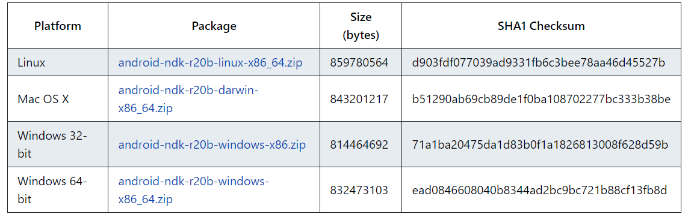

### 配置 SDK 和 NDK

在 **文件** -> **偏好设置** 内找到 **程序管理器**，并配置好 Android NDK 和 Android SDK：

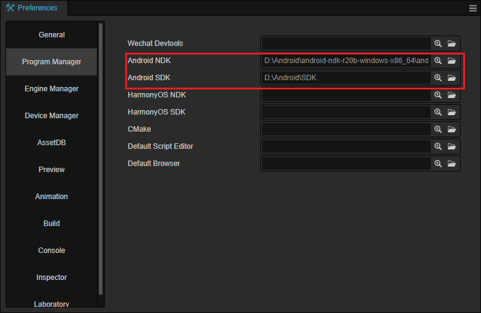

目录选择如下：

- NDK：

    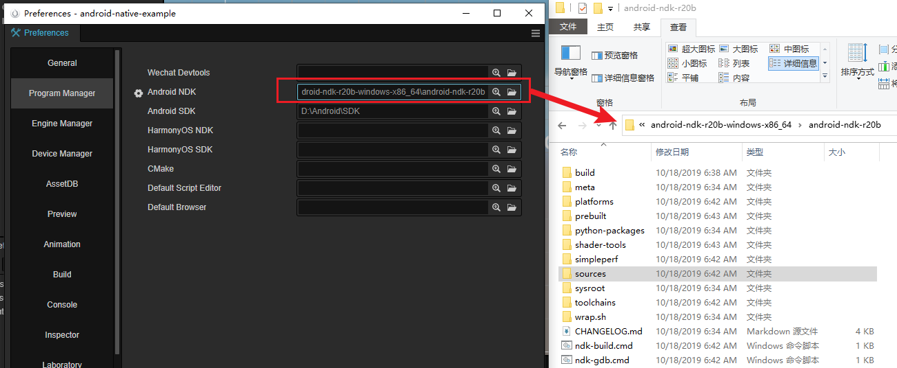

- SDK：

    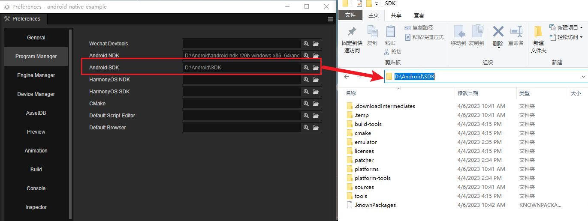

### 发布

- 创建发布任务

    - 选择 **项目** -> **构建** 菜单，打开构建面板

        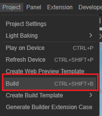

    - 点击面板上的 **新建构建任务** 选项：

        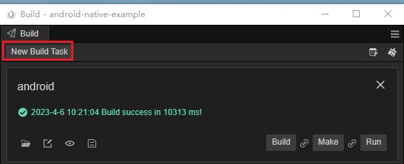P

    - 选择构建平台为安卓：

        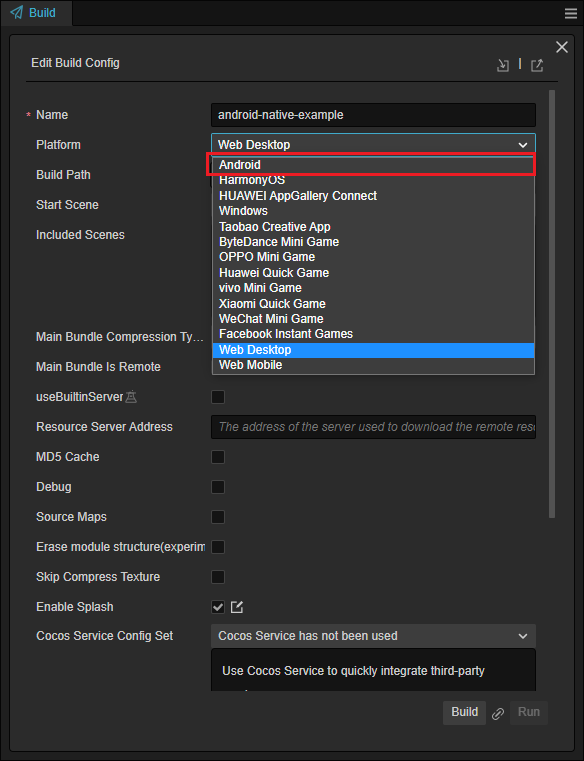

    - 参考 [Android 平台构建选项 - 渲染后端](../native-options.md#%E6%B8%B2%E6%9F%93%E5%90%8E%E7%AB%AF) 选择渲染后端

        

    - 填入包名

        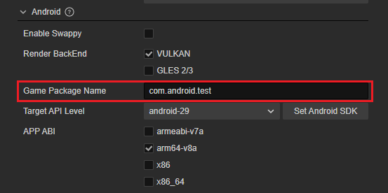

        > 名称规范请参考 [应用 ID 名称](../native-options.md#%E5%BA%94%E7%94%A8-id-%E5%90%8D%E7%A7%B0)

    - 选择 Target API Level

        

        > 如果没有下拉框，请检查上面的 **配置 SDK 和 NDK** 是否正确。

    - 其他选项请参考 [Android 平台构建选项](../native-options.md#android-%E5%B9%B3%E5%8F%B0%E6%9E%84%E5%BB%BA%E9%80%89%E9%A1%B9)

- 发布

    - 构建：点击下方的 **构建** 按钮会创建一个新的构建任务并开始构建

        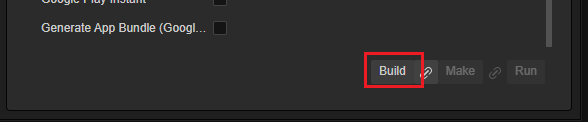

    - 等待构建完成

        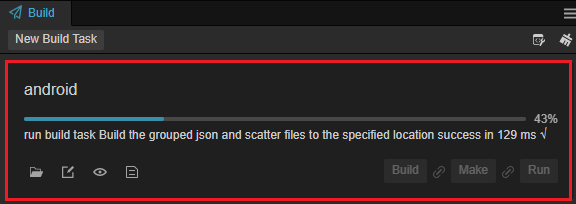

    - 编译导出的工程

        - 在点击下面的按钮打开生成好的 Android Studio 工程：

          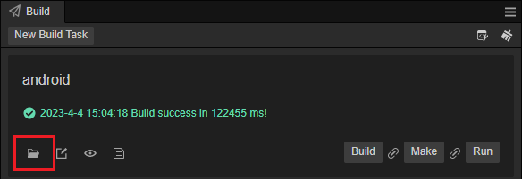

        - 找到工程对应的目录

          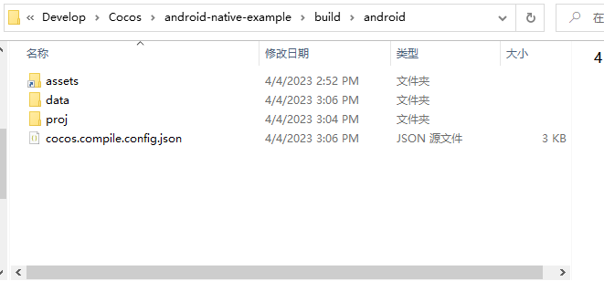

        - 打开 Android Studio 的菜单：

          

        - 打开已经构建好的项目，默认在 {项目路径}/build 里，工程名默认为 android：

          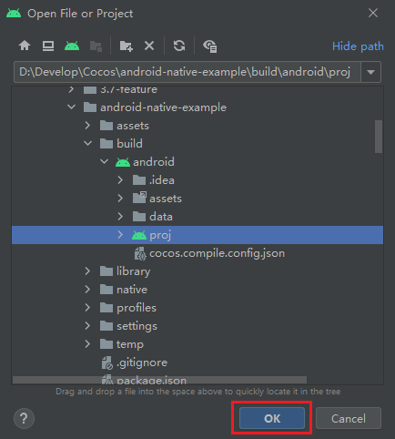

    - 使用 Android Studio 构建 APK

        待 Android Studio 将项目准备完成后，即可打包 APK。

        - 打开 **Build** 菜单选择 **Build Bundle(s) / APK(s)**：

            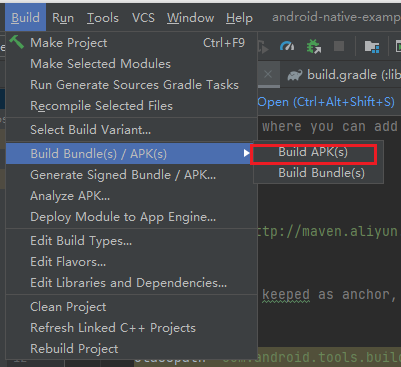

        - 发布成功后可以在 proj/build 目录内找到 Debug 版本的 APK：

            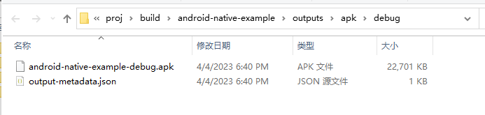

    - 正式版本需要避免使用调试秘钥：取消 **使用调试秘钥** 并从下方的 **秘钥库路径** 中找到自定义的秘钥。

        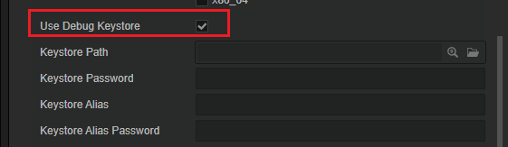

        > 如果无秘钥，可以使用 JAVA 来生成对应的秘钥

## 进阶

### 导入第三方库

为了将应用发布到应用市场，通常需要对接某些第三方的 SDK，通常这些 SDK 会提供给您 JAR 或 AAR 格式，您可以参考 [在其他项目中使用您的库](https://developer.android.com/studio/projects/android-library?hl=zh-cn#psd-add-library-dependency) 将本地的库导入到工程内。

### 和 TypeScript 通信

引擎提供多样化的方法用于解决和 TypeScript 或 Native 层交互问题。

常见的 SDK 接入时，我们需要通过 SDK 的登陆接口进行登陆操作，获取到登陆结果后再将结果传入到 TypeScript 层以方便游戏进行处理。

引擎提供 [简化使用 JavaScript 调用 Java 方法](../../../advanced-topics/js-java-bridge.md) 可以较为快速的解决这类问题。通常来说，这个机制用于对接 SDK 中如注册、登陆等行为是比较方便的。

- 在安卓工程中找到 `AppActivity.java` 并在 `onCreated` 方法中添加如下代码：

    ```java
    @Override
    protected void onCreate(Bundle savedInstanceState) {
        super.onCreate(savedInstanceState);
        // DO OTHER INITIALIZATION BELOW
        SDKWrapper.shared().init(this);

        JsbBridge.setCallback(new JsbBridge.ICallback() {
            @Override
            public void onScript(String arg0, String arg1) {
                Log.d("[AppActivity]", "onScript: " + arg0 + "," + arg1);
                JsbBridge.sendToScript("sdklogin", "result json here");
            }
        });
    }

    ```

- 在编辑器中创建一个脚本并添加如下代码：

    ```ts
    import { _decorator, Component, Label, native } from 'cc';
    import { NATIVE } from 'cc/env';
    const { ccclass, property } = _decorator;

    @ccclass('DebugOnNative')
    export class DebugOnNative extends Component {

        @property(Label)
        debugLabel: Label = null;

        start() {
            if (NATIVE) {
                native.bridge.onNative = (arg0: string, arg1?: string | null) => {
                    console.log('onNative', arg0, arg1);

                    this.debugLabel.string = 'onNative' + arg0 + "," + arg1;
                }
            }       
        }

        onSendToNative() {
            if (NATIVE) {
                native.bridge.sendToNative("logInToGameSerivceResult", "isOK=true");
            }
        }
    }
    ```

    编译并启动游戏，触发 `onSendToNative` 方法后即可观察到日志情况：

    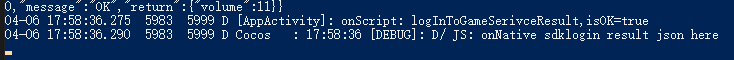

    > **注意**：
    > 1. 注意使用 **NATIVE** 宏来控制访问权限
    > 2. 注意待引擎初始化完成后再调用 `JsbBridge.sendToScript`
    > 3. 该方法只能传输字符串，复杂数据可以编码为 JSON 格式后传输

对于复杂的数据结构可以参考 [JSB Swig](../../../advanced-topics/jsb-swig.md) 或 [JSB](../../../advanced-topics/JSB2.0-learning.md)。

### 扩展发布机制

参考 [自定义构建流程](../custom-build-plugin.md) 通过扩展系统对发布机制进行扩展。

## Q&A

- Q：发布时的错误如何调试
- A：点击日志按钮，进行查看

    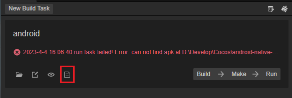

- Q：提示缺少 LIB_EGL
- A：更换 NDK 版本为文中所述的版本
