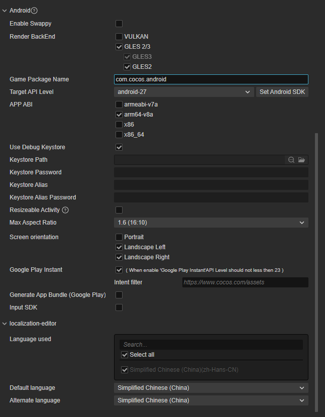

# Android 平台构建选项

Android 平台的构建选项如下：

## 平滑帧率

**平滑帧率（Enable Swappy）**：是否启用引擎里集成的 Swappy 功能。目前支持 GLES 和 Vulkan。

该选项会主动配合屏幕刷新率调整渲染时间，以达到稳定帧率和减少无效绘制。构建参数为 swappy。

更多信息可参考官网 [Frame Pacing Library Overview](https://source.android.com/devices/graphics/frame-pacing)。

## 渲染后端

目前支持 [VULKAN](https://www.vulkan.org/)、[GLES3](https://www.khronos.org/registry/OpenGL-Refpages/es3/) 和 [GLES2](https://www.khronos.org/registry/OpenGL-Refpages/es2.0/) 三种，要求至少勾选一项，默认使用 **GLES3**。

若选择 **GLES 2/3**，则默认必须勾选 **GLES3**，不允许单独选择 **GLES2**。

在同时勾选多个的情况下，运行时将会根据设备实际支持情况选择使用的渲染后端。

## 应用 ID 名称

**应用 ID 名称**（Game Package Name）通常以产品网站 URL 倒序排列，如 `com.mycompany.myproduct`。

> **注意**：包名中只能包含数字、字母和下划线，此外包名最后一部分必须以字母开头，不能以下划线或数字开头。

## Target API Level

设置编译 Android 平台时所需的 Target API Level。点击旁边的 **Set Android SDK** 按钮即可快速跳转到配置页，具体配置规则请参考 [Android 原生发布环境配置](./build-setup-evn-android.md)。

## APP ABI

设置 Android 需要支持的 CPU 类型，可以选择一个或多个选项，目前包括 **armeabi-v7a**、**arm64-v8a**、**x86** 和 **x86_64** 四种类型。

> **注意**：
>
> 1. 当你选择一个 ABI 构建完成之后，在不 Clean 的情况下，构建另外一个 ABI，此时两个 ABI 的 so 都会被打包到 apk 中，这个是 Android Studio 默认的行为。若用 Android Studio 导入工程，选择一个 ABI 构建完成之后，先执行一下 **Build -> Clean Project** 再构建另外一个 ABI，此时只有后面那个 ABI 会被打包到 apk 中。
>
> 2. 项目工程用 Android Studio 导入后，是一个独立的存在，不依赖于构建发布面板。如果需要修改 ABI，直接修改 **gradle.properties** 文件中的 **PROP_APP_ABI** 属性即可。
>
>     

## 使用调试密钥库

Android 要求所有 APK 必须先使用证书进行数字签署，然后才能安装。Cocos Creator 提供了默认的密钥库，勾选 **使用调试密钥库** 就是使用默认密钥库。若开发者需要自定义密钥库可去掉 **使用调试密钥库** 勾选，详情请参考 [官方文档](https://developer.android.google.cn/studio/publish/app-signing?hl=zh-cn)。

## 屏幕方向

屏幕方向目前包括 **Portrait**、**Landscape Left**、**Landscape Right** 三种。

- **Portrait**：屏幕直立，Home 键在下
- **Landscape Left**：屏幕横置，Home 键在屏幕左侧
- **Landscape Right**：屏幕横置，Home 键在屏幕右侧

## Google Play Instant

勾选该项即可将游戏打包发布到 Google Play Instant。Google Play Instant 依赖于 Google Play，并不是一个新的分发渠道，而是更接近一种游戏微端方案。它能够实现游戏的免安装即开即玩，有利于游戏的试玩、分享和转化。

> **使用时需要注意以下几点**：
>
> 1. Android Studio 的版本要在 4.0 及以上
>
> 2. Android Phone 6.0 及以上。Android SDK 版本在 6.0 到 7.0 之间的设备需要安装 Google 服务框架，SDK 版本在 8.0 以上的则不需要，可直接安装使用。
>
> 3. 首次编译的话需要用 Android Studio 打开构建后的工程以下载 **Google Play Instant Development SDK（windows）** 或 **Instant Apps Development SDK（Mac）** 支持包。如果下载不成功的话建议设置一下 Android Studio 的 HTTP 代理。
>
>    

## 生成 App Bundle（Google Play）

勾选该项即可将游戏打包成 App Bundle 格式用于上传到 Google Play 商店。具体请参考 [官方文档](https://developer.android.google.cn/guide/app-bundle/)。
