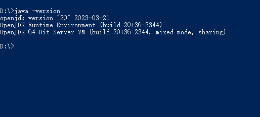
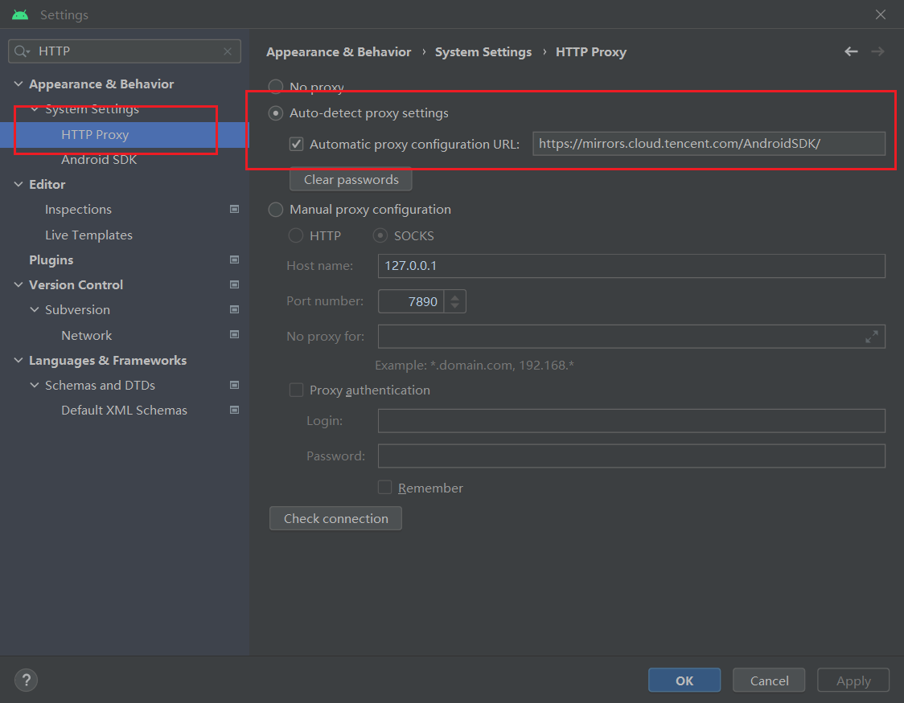
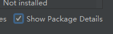

# Android 原生开发环境配置

## 下载 Android Studio

开发者可以从 [Android Studio 官方网站](https://developer.android.com/studio) 下载对应的 IDE。

参考 [安装配置原生开发环境](../setup-native-development.md##android-%E5%B9%B3%E5%8F%B0%E7%9B%B8%E5%85%B3%E4%BE%9D%E8%B5%96) 搭建开发环境。

## 下载并安装 JDK

参考 [安装配置原生开发环境 - 下载 Java SDK（JDK）](../setup-native-development.md#%E4%B8%8B%E8%BD%BD-java-sdk%EF%BC%88jdk%EF%BC%89)

在终端中输入 `java -version` 查看是否安装成功

> 需要配置对应的环境变量，请参考 [如何设置或更改 JAVA 系统环境变量](https://www.java.com/zh_CN/download/help/path.xml)。  
>
> **注意**：[OpenJDK](https://openjdk.org/) 和 JDK 仅是开源协议不同，功能和配置方法没有本质区别。

## 下载并安装 Android SDK

### 自动下载

在 Android Studio 中下载 Android SDK 步骤如下：

1. 启动 Android Studio

2. 通过下列菜单打开 Setting 面板
    

3. 在 Setting 内找到 SDK 下载分页
    

4. 选中对应版本的 SDK 并加载，可以选择使用 [下载发布 Android 平台所需的 SDK 和 NDK](../setup-native-development.md#%E4%B8%8B%E8%BD%BD%E5%8F%91%E5%B8%83-android-%E5%B9%B3%E5%8F%B0%E6%89%80%E9%9C%80%E7%9A%84-sdk-%E5%92%8C-ndk) 中推荐的版本

    - 以 Android 11.0(R) 为示例，选中 Name 前的勾并点击上图中的 OK 或者 Apply 按钮。

    - 在弹出框中选择 OK
        

    - 下载
        

### 手动下载

如果出现网络问题无法在 Android Studio 中下载 Android SDK，可以通过手动的方式下载并放在 **Android SDK Location** 目录内。

下载完成后，可以在 Android Studio 内配置 SDK，如下图所示：

无法下载 SDK 时，可以修改代理，配置镜像：

在 Android Studio 中配置 HTTP 代理：

**自动配置代理**：在 Setting 中找到 HTTP Proxy，勾选 Auto-detect proxy settings，填入下方描述的镜像源，以腾讯源为例：

**可选的镜像源**：安卓 SDK 以及下文中提到的 Gradle 都会有一些镜像源用于帮助您解决无法从官网下载的问题，如果下方表格的镜像也无法解决，也可以从搜索引擎获取。

| 镜像源 | 地址 |
| :--- | :--- |
| 腾讯 | <https://mirrors.cloud.tencent.com/AndroidSDK/> |
| 阿里云 | <https://mirrors.aliyun.com/android.googlesource.com/> |

> 如果出现镜像不可用的情况，您可以视可用性更换不同的镜像源。

## 下载并安装 NDK

根据 [安装配置原生开发环境 - 下载发布 Android 平台所需的 SDK 和 NDK](../setup-native-development.md) 推荐的版本区间下载 NDK（推荐使用版本为 **r18~21**）。

### 通过 Android Studio 下载 NDK

打开 Android Studio 的 **Setting** 窗口，找到 **Android SDK** 分页：

> **注意**：需要勾选 **Show Package Details**:  

勾选合适的版本进行下载，如果无法刷新出所有 NDK 版本，请查看下文手动下载部分。

### 手动下载 NDK

您可以在 [历史版本](https://github.com/android/ndk/wiki/Unsupported-Downloads#r20b) 找到下载。

在上述地址中找到对应平台的 NDK 版本并下载，此处以 r20b 为例，选择您的操作系统所需的安装包，下载并解压到本地。

## 配置 SDK 和 NDK

回到 Cocos Creator 中，在 **文件** -> **偏好设置** 内找到 **程序管理器**，并配置好 Android NDK 和 Android SDK：

目录选择如下：

**NDK：**

**SDK：**

