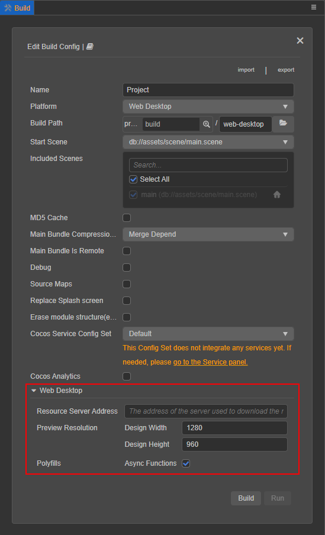
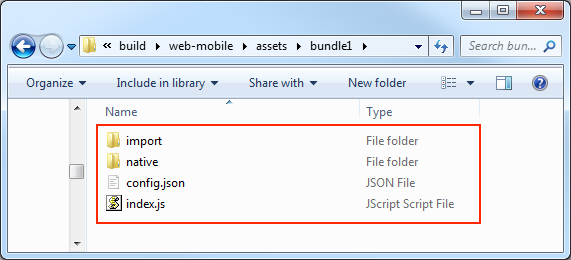

# 构建流程简介与常见问题指南

## 构建基础结构介绍

构建流程主要包括以下两部分内容：

- **通用构建处理**
- **各平台构建处理**

由于 v3.0 在构建机制上的调整，不同平台的构建处理均以 **构建插件** 的形式注入 **构建发布** 面板，以及参与构建流程。各平台特有的构建选项也会以展开选项的形式显示在 **构建发布** 面板，开发者可以通过 [构建插件](custom-build-plugin.md) 将自定义的构建选项注入到面板中。



## 通用构建处理流程

Cocos Creator 的通用构建流程，主要包括以下内容：

1. 构建选项初始化
2. 构建数据整理
3. 将构建后的资源写入文件系统
4. 整理 `settings.json`/`config.json` 数据
5. `config.json` 中的 UUID 压缩与文件写入

### 构建选项初始化

这个步骤主要是将构建时传递给构建的 **初始 options** 初始化为 **构建内部的 options**，完成部分构建选项的格式转换、构建资源数据库的资源数据初始化，以及加载最新的资源信息并分类。

### 构建数据整理

构建时，编辑器会先汇总当前参与构建的场景以及所有 [Bundle](../../asset/bundle.md) 中的资源，再通过引擎的反序列化查找出依赖资源，递归查找出所有需要打包的资源列表。资源列表汇总完成后，便会根据 Bundle 配置对资源进行分类，并收集脚本、图片压缩任务和 json 分组信息等。

引擎在反序列化之前会先配置整个项目的脚本环境，也就是加载所有的非插件脚本。因为脚本是否加载成功会直接影响到反序列化的进行，所以如果因为脚本编写不合法而加载失败，会直接导致构建失败。<br>
如果引擎在反序列化过程中发现有依赖资源丢失便会发出警告，但会继续进行构建。这里的警告并不意味着问题不需要解决，如果资源丢失不解决，很难保证构建后的内容没有问题。

### 将构建后的资源写入文件系统

构建后的资源会根据 [Asset Bundle](../../asset/bundle.md#%E9%85%8D%E7%BD%AE%E6%96%B9%E6%B3%95) 的配置分布在不同的位置。构建完成后，Asset Bundle 便会被打包到对应平台发布包目录下的 `assets/[Bundle 名称]` 中，目录结构如下：



更多关于 Asset Bundle 的配置、构建、文件说明等内容，请参考 [Asset Bundle](../../asset/bundle.md) 文档。

在整理完基本的构建任务后，构建将会按照每个 Bundle 未处理单元处理完其他的构建流程。

具体可以分为以下几个步骤：

- **脚本构建**：编辑器内对脚本的构建分为 **插件脚本** 和 **非插件脚本** 两类。

    - 插件脚本会直接把源文件按照原来的目录结构拷贝到构建后生成的发布包目录下的 `src` 目录中，所以插件脚本是不支持任何需要编译的脚本形式的，比如 TypeScript 或者是使用 ES6 写法的 JavaScript。插件脚本的资源信息则会写进 settings 里的 jsList 数组内。

    - 非插件脚本将会全部打包成 `project.js`（调试模式下是 `project.dev.js`），放在对应的 src 目录下。勾选 sourceMap 选项将会生成对应的 map 文件，根据 debug 选项来确定脚本是否压缩。

- **自动图集处理**：查询项目内部的自动图集资源信息，根据自动图集资源的配置将图集下的 SpriteFrame 小图打包成大图、生成序列化文件等等。这一步骤会修改 json 分组信息、asset 资源分组信息以及添加纹理压缩任务。

- **纹理压缩**：根据整理好的图片压缩任务，进行图片资源的压缩处理并写入到构建文件夹内。

- **引擎构建**：根据项目设置内的 **功能裁剪** 剔除没有使用到的引擎模块，打包到 cocos-js 目录下。勾选 sourceMap 选项将会生成对应的 map 文件，根据 debug 选项来确定脚本是否压缩。

    引擎打包的主要步骤包括：

    - 获取 **项目设置里的引擎模块信息**；

    - **检查缓存** 中的引擎版本与当前需要编译的引擎是否一致，内容一致直接拷贝不编译；

    - 如需编译，根据引擎接口，执行打包引擎的任务，之后拷贝编译后的 js 文件，并保存引擎的修改时间；

      编译引擎时，可以查看 [输出的 log 信息](./build-panel.md#%E6%9E%84%E5%BB%BA-log-%E4%BF%A1%E6%81%AF%E6%9F%A5%E7%9C%8B)：

      

      关于引擎文件的复用规则，这里有必要阐述下：<br>
      打包好的引擎文件将会放置在编辑器全局的临时目录下 (在构建进程内使用 `Build.globalTempDir` 打印)。缓存文件按照会影响引擎编译的参数生成的 hash 值作为名称存放。

      ```bash
      global-temp-folder
      |--CocosCreator
          |--x.xx(3.0.0)
              |--builder
                  |--engine
                      |--1dc4a547f9...63a43bb8965.watch-files.json
                      |--1dc4a547f9...63a43bb8965
                      |--1dc4a547f9...63a43bb8965.meta
                  ...
      ```

      只要任何相关的引擎构建参数发生更改，就会重新编译引擎，具体影响构建引擎缓存使用的有：

        - debug：是否打开调试模式
        - includeModules：引擎模块设置
        - sourceMaps：是否开启 sourceMap
        - platform：构建平台
        - 引擎修改时间
        - 是否勾选分离引擎（仅微信小游戏平台）
        - 使用引擎路径

- **json 构建**：序列化 json 时会根据 json 分组以及所属 Bundle 进行合并写入文件系统（`assets/xxxBundle/import` 文件夹内），如果是 **release 模式还会对序列化 json 内的 UUID 进行压缩处理**。

- **普通资源拷贝**：一些原始资源（rawAssets）直接从 library 拷贝到构建后的 `assets/xxxBundle/native` 文件夹内。

- **md5 处理**：将 res 文件夹内的资源全部加上 md5 后缀，并整理数据准备记录在 settings 内。

- **application.js 模板文件生成**：根据用户选项注入一些项目设置到 `application.js` 文件中并生成到构建后生成的发布包目录下。

### 整理 settings/config 数据

主要是根据之前资源整理的数据，准备游戏启动必要的配置信息。

关于 `settings.json` 结构的通用解析：

```js
{
    debug: boolean; // 是否为调试模式，取自构建发布面板
    designResolution: ISettingsDesignResolution; // Canvas 分辨率设置，取自项目设置中的数据
    jsList: string[];
    launchScene: string; // 初始场景 url
    moduleIds: string[]; // 所有用户脚本组件的信息
    platform: string;
    renderPipeline: string;// renderPipeline 信息，取自项目设置
    physics?: IPhysicsConfig;// 物理模块设置（仅在勾选了物理引擎模块时生成）
    BundleVers: Record<string, string>; // Bundle 的 md5 值
    subpackages: string[]; // 分包信息
    remoteBundles: string[]; // 记录远程包 Bundle 的集合
    // server: string;
    hasResourcesBundle: boolean; // 是否含有 resources 内置 Bundle
    hasStartSceneBundle: boolean; // 是否含有初始场景内置 Bundle
    customJointTextureLayouts?: ICustomJointTextureLayout[];
    macros?: Record<string, any>; // 引擎 Macro 配置值，取自项目设置
}
```

关于 `config.json` 的通用解析如下：

```js
{
    importBase: string; // Bundle 中 import 目录的名称，通常是 'import'
    nativeBase: string; // native 中 native 目录的名称，通常是 'native'
    name: string; // Bundle 的名称，可以通过 Bundle 名称加载 Bundle
    deps: string[]; // 该 Bundle 依赖的其他 Bundle 名称
    scenes: Array<{url: string, uuid: string}>; // Bundle 内包含的场景信息数组
    rawAssets: { [index: string]: { [uuid: string]: string[] } };
    // 存储 resources 下加载的资源 url 与类型
    // 示例: "bba00d3a-2f17-4511-b47c-0d584b21b763@6c48a": ["test/right/texture", "cc.Texture2D", "bba0...@6c48a"]
    // "bba0...@6c48a": ["test/right/texture", 1, 1]
    packs: Record<string, IUuid[] | number[]>; // json 分组信息
    versions: { 
        import: Array<string | number>;
        native: Array<string | number>;
     }; // 勾选 md5Cache 后才有，数组部分以 [uuid_1, md5_1, uuid_2, md5_2, ...] 的格式存储，其中 uuid_1 如果是个简单数字说明存储的是 uuids 数组内的 uuid 索引
    uuids: string[]; // uuid 数组，仅 release 模式下
    types?: string[]; // 资源类型数组，仅 release 模式下
    encrypted?: boolean; // 原生上使用，标记该 Bundle 中的脚本是否加密
    isZip?: boolean; // 是否为 zip 模式
    zipVersion?: string;
}
```

这里的结构仅列举了通用流程下 `settings.json`/`config.json` 的结构，实际上在不同的平台打包时，是根据需要来添加配置的。

### config.json 中的 UUID 压缩与文件写入

资源打包过程中会不断地收集参与资源构建的资源 UUID，最终整理到构建后生成的 Bundle 的 `config.json` 中，在生成 `config.json` 之前会根据是否为调试模式来决定是否对文件中的 UUID 做压缩处理。

构建时会对所有使用到的 UUID 进行整理，出现 **两次及以上** 的会存储到 `uuids` 数组中，并将之前使用到的 UUID 的位置替换为索引。<br>
所有出现 **两次及以上** 的 `types` 也会存储到 `types` 数组中，并将之前使用到的位置替换为索引。

#### 构建资源

该步骤对资源的构建是打包除了脚本以外的资源文件，因为脚本是作为特殊文件另外打包处理的。在打包资源阶段，编辑器会先汇总 **当前参与构建的场景以及所有 Bundle 目录下的资源，每个资源的打包都会经过引擎的反序列化，查找出依赖资源再递归进行资源的打包**。在反序列化之前会先配置整个项目的脚本环境，也就是加载所有的非插件项目脚本。因为脚本的加载正确与否会直接影响到反序列化的进行，因而如果脚本编写的不合法加载失败会直接导致构建失败。如果在反序列化过程中发现有依赖的资源丢失会发出警告，但会继续进行构建。这里的警告并不意味着问题不需要解决，**如果资源丢失不解决，是难于保证构建后的内容不出问题的**。

资源在打包过程中执行反序列化后会重新压缩序列化，以减小打包之后的包体。texture 资源的序列化文件会全部打包成一个 json 文件，其他序列化文件则根据构建配置参数来决定是否分包。

#### 构建脚本

编辑器内对脚本的构建分为 **插件脚本** 和 **非插件脚本** 两类，详情请参考上部分内容中对 **脚本构建** 的说明。

## 各平台构建处理

构建提供了部分生命周期的钩子函数，方便开发者在构建的不同处理时期参与构建，影响构建结果。同时构建也提供了开发者直接添加部分自定义构建选项的方法，可以修改构建选项配置页的 UI 界面、数据检验等等，详情请参考 [构建插件](custom-build-plugin.md)。构建插件注入的构建选项将会存放在 `options.packages` 内部，因而目前通过命令行构建的选项参数编写方式也需要遵循此规则。

### 各平台的编译/生成流程

自 Cocos Creator 3.0 起，所有需要/支持单独编译、生成的平台的构建流程都已经拆分出来，可能会有部分开发者疑惑现今的小游戏平台为何新增了 **生成** 按钮，事实上之前这部分逻辑也一直存在，只不过合并在 **构建** 中，无法进行单独控制。

编辑器的 **构建** 类似于一个 **导出对应平台游戏包** 的功能，主要是完成引擎对各个平台的接口、以及游戏包基本格式兼容，并不代表完成全部工作。各个平台通常还会有自己的编译流程，例如微信小游戏平台自带的开发者工具的编译上传功能，以及各个原生平台相关 IDE 的编译运行调试功能。如果开发者需要针对特定平台进行定制化打包处理，就需要编辑器先支持流程上的拆分才能更好地接入。

## 常见问题指南

构建的整个进程是在一个单独的 worker 内的，所以如果想要查看构建过程的日志信息或者查看出现报错时完整的调用栈，可以点击主菜单的 **开发者 -> 打开构建调试工具** 查看。构建时其实会输出很多的日志信息，但是为了不干扰用户，默认只有错误、警告和一些重要 log 会被打印到编辑器的控制台，调试工具中的日志信息才是最完整的。

> **注意**：在构建之前 **请先确保参与构建的场景是可以正常预览的**。一些场景的资源丢失或者其他脚本问题，是在预览阶段便能暴露出来的。在保证预览正常的情况下构建能更好地节约时间以及排查问题。

### 资源加载 404

这种情况下，请复制报错资源丢失的日志中的 UUID 到 **资源管理器** 中查找对应的资源，查看该资源依赖的资源是否都正常。资源加载 404 通常有以下几种情况：

1. **在脚本内动态加载了没有放在 Bundle 中的资源**。

    - **原因**：通过上面的介绍，我们知道只有在 Bundle 目录下的资源及其依赖资源，以及参与构建场景的资源及其依赖资源才会被打包到最终的构建文件夹中，并且 **只有直接放进 `Bundle` 文件夹中的资源 url 才会写入到 config.json**。所以如果在脚本中使用了某个资源但这个资源没有放在任何 Bundle 目录下，加载的时候便会出现 404 了。

    - **解决方案**：将使用到的资源移动在 Bundle 文件夹下。

2. **加载的资源导入有问题，未能正常生成数据到 library 中**

    - **原因**：构建时所有的原始数据都是通过读取 library 中的资源文件获得的，如果导入失败将无法获取到正确对应的资源信息。

    - **解决方案**：通过 **资源管理器** 找到对应资源，点击右键，选择菜单中的 **重新导入资源**。

3. **资源丢失**

    - **原因**：在前面的构建流程中介绍过，**资源的构建会经过反序列查找依赖资源**，而最经常出现问题的就是所依赖的资源在项目迭代过程中被不小心删除而导致资源丢失。这些资源的丢失可能平时并没有注意到，但一旦执行构建便会暴露出来。

    - **解决方案**：通过代码编辑器查找该 UUID 被哪些资源所引用，修改对应资源。

### 脚本资源加载报错

在前面介绍的 **构建数据整理** 部分内容时有提到过，构建时需要配置脚本环境。如果报错信息与脚本相关，请参考报错内容对脚本进行修改。如果不清楚是哪个脚本的报错，可以在报错信息调用栈中找到对应脚本的 uuid，然后在 **资源管理器** 中查找定位。

### 如何查找到小图自动合图后的大图

自动图集在构建过程中会打印出原始小图与合成的大图的 UUID 信息，在构建调试工具中便可以查找到，然后用查找到的大图的 UUID 在打包后生成的 `XXXBundle/native` 目录中查看即可。如果合图太多，可以打开构建日志用搜索 UUID 的方式查找。


### 如何解压缩 UUID

在 release 模式下打包出来的资源 JSON 以及 `config.json` 中的 UUID 都是压缩后的，需要将其解压才能找到对应原项目中的资源。构建进程中内置了一些工具方法在全局变量 Build 上，直接点击主菜单中的 **开发者 -> 构建调试工具**，在控制台里输入以下命令：

```js
Build.Utils.decompressUuid('425o80X19KipOK7J1f5hsN');
// 42e68f34-5f5f-4a8a-938a-ec9d5fe61b0d
```

<!-- ### 如何查找到资源序列化 json 在构建后包体内的位置

json 打包后都会存放在 `assets/XXXBundle/import` 文件夹内，如果是普通资源直接用 uuid 去文件夹内搜索即可。 -->

### 引擎编译失败

如果是自定义引擎编译失败，请检查你修改的代码，或者自定义引擎路径。<br>
如果是引擎编译失败，请附上 Creator 版本、构建选项配置、构建任务中的构建日志文件以及可复现问题的 demo 到 [论坛](https://forum.cocos.org/c/58) 反馈。

### 其他报错

如果遇到其他无法自行解决的构建报错信息，请附上 Creator 版本、构建选项配置、构建任务中的构建日志文件以及可复现问题的 demo 到 [论坛](https://forum.cocos.org/c/58) 反馈。
