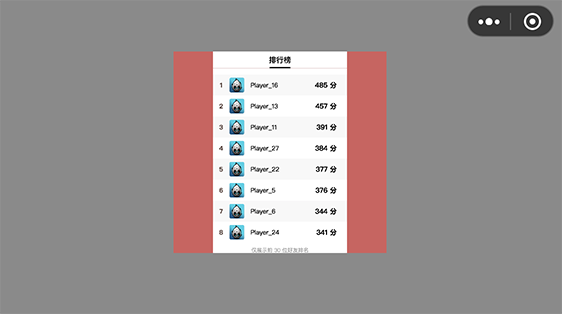
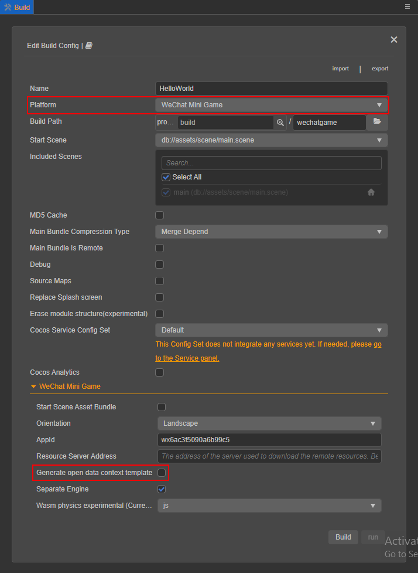
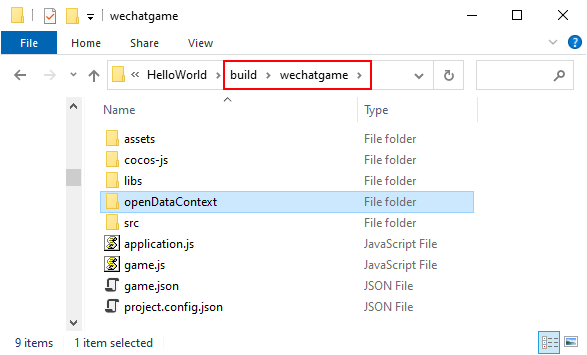
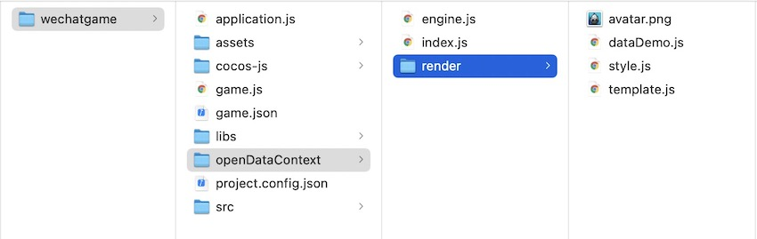

# 开放数据域

目前，**微信**、**百度** 和 **抖音** 小游戏这些平台为了保护其社交关系链数据，增加了 **开放数据域** 的概念，这是一个单独的游戏执行环境。开放数据域中的资源、引擎、程序，都和主游戏（主域）完全隔离，开发者只有在开放数据域中才能通过平台提供的开放接口来访问关系链数据，用于实现一些例如排行榜的功能。

开放数据域目前只支持 Canvas 渲染，在 Cocos Creator 3.0 中，我们废弃了之前的 Canvas Renderer 模块，使用微信团队基于 **XML** + **CSS** 设计研发的一个前端轻量级 Canvas 引擎来替代。并且将该引擎整合进了 Creator 3.0 内置的开放数据域工程模板中，开发者只需要掌握一些基本的前端技能，就能在该模板的基础上定制排行榜功能。

## SubContextView 组件说明

由于开放数据域只能在离屏画布 sharedCanvas 上渲染，所以在项目中，需要有一个节点作为渲染开放数据域的容器，并在该节点上添加 **SubContextView** 组件，该组件会将 sharedCanvas 渲染到容器节点上。

SubContextView 组件主要包含 **设计分辨率** 和 **FPS** 两个属性。


### 设计分辨率

若将 **SubContextView** 组件的 **设计分辨率** 设置为 **640 * 960**，则在组件加载完成阶段，sharedCanvas 的尺寸会被设置为 **640 * 960**。意味着构建之后，开放数据域工程都是在一张 **640 * 960** 的离屏画布上做渲染的。那么，在定制开放数据域（参考下文）时，`style.js` 中标签的样式最大尺寸为 **640 * 960**，否则渲染的内容会超出画布。例如：

```js
// style.js
export default {
    container: {
        width: 640, // max width
        height: 960,  // max height
    },
}
```

同时为了避免数据耦合，标签的样式还支持设置宽高的百分比：

```js
// style.js
export default {
    container: {
        width: '100%',
        height: '100%',
    },
}
```

在实际渲染过程中，引擎会采用 **SHOW ALL** 的适配策略将 sharedCanvas 渲染到 **SubContextView** 组件节点上，避免渲染时因拉伸导致的 UI 变形。例如在以下两张图片里，我们使用了不同尺寸的 **SubContextView** 组件节点，开放数据域的贴图都不会被拉伸：




### 设置 FPS

**FPS** 属性主要用于设置主域更新 sharedCanvas 到 **SubContextView** 组件上的频率，避免因频繁更新开放数据域贴图造成的性能损耗。

## 发布流程

1. 打开项目并双击场景，然后在需要渲染开放数据域的节点上添加 **SubContextView** 组件。

2. 场景设置完成后保存场景，然后在 **菜单栏 -> 项目** 中打开 **构建发布** 面板，选择需要发布的 **微信** / **百度** / **抖音小游戏** 平台，勾选 **生成开放数据域工程模版**，然后点击 **构建**。

    

3. 构建完成后点击 **构建任务** 左下角的文件夹图标按钮，可以看到在对应小游戏平台的发布包目录下生成了 **openDataContext** 文件夹（例如 `build/wechatgame/openDataContext`），该文件夹就是 Cocos Creator 内置的开放数据域工程模版。

    

    开发者可以基于这个模板定制所需的开放数据域内容，定制方法参考下文 **定制开放数据域工程** 部分的内容。当再次构建时，如果发布包目录下存在 **openDataContext** 目录，则会直接跳过，开发者不用担心定制的开放数据域内容被覆盖掉。

4. 使用对应平台方的开发者工具打开构建生成的发布包（例如 `build/wechatgame`），即可打开小游戏项目查看开放数据域内容，以及预览调试游戏。

    

    > **注意**：由于百度小游戏的开放数据域只支持加载百度返回的玩家头像，所以构建后生成的开放数据域模版工程可能会因此无法正常加载本地的头像贴图。

## 定制开放数据域工程

在定制开放数据域工程之前，开发者需要先了解一些基础信息：
- [minigame-canvas-engine 快速入门](https://wechat-miniprogram.github.io/minigame-canvas-engine/overview/guide.html)
- [doT 模版引擎使用](http://olado.github.io/doT/?spm=a2c6h.12873639.0.0.36f45227oKu0XO)

对这些基础信息有了大致的了解之后，我们来看一下构建后默认生成的开放数据域模版，目录结构如下：



- **render/dataDemo.js**：模拟随机的排行榜数据，开发者可以在这里请求平台方的关系链数据，并传给 **doT 模版引擎** 生成相应的 XML 文本
- **render/style.js**：记录 CSS 样式文本信息，可参考 [样式文档](https://wechat-miniprogram.github.io/minigame-canvas-engine/api/style.html#%E5%B8%83%E5%B1%80)
- **render/template.js**：记录 XML 文本信息，默认使用 **doT 模版引擎** 生成 XML 文本。可参考 [标签文档](https://wechat-miniprogram.github.io/minigame-canvas-engine/api/tags.html#%E6%A0%87%E7%AD%BE%E5%88%97%E8%A1%A8)
- **render/avatar.png**：开放数据域模板默认使用的头像贴图，可删除
- **engine.js**：小游戏 Canvas 引擎源码
- **index.js**：开放数据域工程入口文件，在该文件中通过将 XML 文本和 CSS 样式传递给 Canvas 引擎，即可渲染开放数据域

## 推荐做法

1. 由于项目构建后生成的 build 目录默认会被 git 排除在版本控制外，所以如果开发者希望将定制后的开放数据域纳入版本控制，可以将 `openDataContext` 文件夹（例如 `build/wechatgame/openDataContext`）放入项目的 `build-templates` 目录中，具体可参考 [定制项目构建流程](./custom-project-build-template.md)

2. 在开放数据域工程中，如果需要监听来自主域的消息，则需要先判断消息是否来自主域引擎，以微信接口为例：

    ```js
    wx.onMessage(res => {
        if (!(res && res.type === 'engine')) {
            console.log('do something...');
        }
    });
    ```

    当主域向开放数据域发送消息时，建议附带上 type 信息以避免处理错误的消息源。例如上述代码中的 `res.type === 'engine'` 表示消息来源于主域引擎。

## 参考链接

- [微信官方文档 — 小游戏 Canvas 引擎](https://wechat-miniprogram.github.io/minigame-canvas-engine/)
- [小游戏 Canvas 引擎源码](https://github.com/wechat-miniprogram/minigame-canvas-engine)
- [doT 模版引擎](http://olado.github.io/doT/?spm=a2c6h.12873639.0.0.36f45227oKu0XO)
- **Cocos Creator 小游戏开放数据域范例工程**：[GitHub](https://github.com/cocos/cocos-example-open-data-context) | [Gitee](https://gitee.com/mirrors_cocos-creator/OpenDataContext_TestCase)
