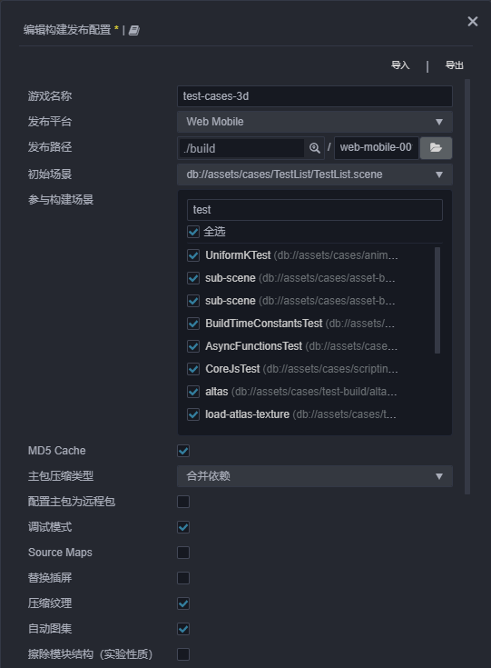
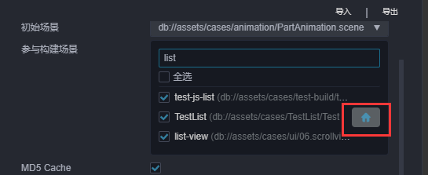
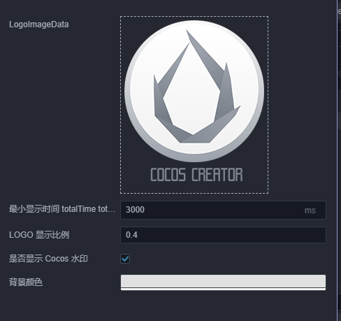

# 构建选项介绍

## 通用构建选项

**构建发布** 面板中的通用构建参数如下：



### 发布路径

通过在 **发布路径** 的输入框中输入路径或者通过旁边的按钮直接选择，我们可以为游戏指定一个发布路径，**后续的多平台发布都会在这个发布路径中的子文件夹中创建资源或工程**，发布后的文件夹名称会与构建任务对应名称（参见构建进度条项左上角）一致。

默认的发布路径在项目文件夹下的 `build` 文件夹中，如果您使用 git、svn 等版本控制系统，可以将 `build` 文件夹在版本控制中忽略。

需要注意的是许多平台的构建路径不允许有有空格或者非法字符，这里已经统一做了显示，如果遇到提示需要更换目录。

### 参与构建场景

在构建过程中，除 `resources` 内的资源和脚本会全部打包出来外，其他资源都是根据参与构建的场景的使用情况来按需打包的。因而不勾选不需要发布的场景，可以减少构建后的包体体积。

### 初始场景

进入游戏后的第一个场景，可以直接在面板的 **初始场景** 处选择，也可以在参与构建的场景列表处搜索到对应场景，在鼠标上移后点击出现的按钮即可。



### MD5 Cache

给构建后的所有资源文件名加上 MD5 信息，解决 CDN 或者浏览器资源缓存问题。

启用后，如果出现资源加载不了的情况，说明找不到重命名后的新文件。这通常是因为有些第三方资源没通过 `assetManager` 加载引起的。这时可以在加载前先用以下方法转换 URL，转换后的路径就能正确加载。

```typescript
const uuid = assetManager.utils.getUuidFromURL(url);
url = assetManager.utils.getUrlWithUuid(uuid);
```

> **注意**：原生平台启用 MD5 Cache 后，如果出现资源加载不了的情况，通常是因为有些 C++ 中用到的第三方资源没通过 `assetManager` 加载引起的。也可以通过以下代码转换 URL 来解决：
>
> ```cpp
> auto cx = ScriptingCore::getInstance()->getGlobalContext();
> JS::RootedValue returnParam(cx);
> ScriptingCore::getInstance()->evalString("cc.assetManager.utils.getUrlWithUuid(cc.assetManager.utils.getUuidFromURL('url'))", &returnParam);
>
> string url;
> jsval_to_string(cx, returnParam, &url);
> ```

### 主包压缩类型

设置主包的压缩类型，具体内容可参考文档 [Asset Bundle — 压缩类型](../../asset/bundle.md#%E5%8E%8B%E7%BC%A9%E7%B1%BB%E5%9E%8B)。

### 配置主包为远程包

该项为可选项，需要与 **资源服务器地址** 选项配合使用。
勾选后，主包会配置为远程包，并且与其相关依赖资源一起被构建到发布包目录 remote 下的 [内置 Asset Bundle — main](../../asset/bundle.md#%E5%86%85%E7%BD%AE-asset-bundle) 中。开发者需要将整个 remote 文件夹上传到远程服务器。

### 资源服务器地址

该项为可选项，用于填写资源存放在服务器上的地址。
- 若 **不填写** 该项，则发布包目录下的 `remote` 文件夹会被打包到构建出来的游戏包中。
- 若 **填写** 该项，则不会打包到游戏包中，开发者需要在构建后手动将发布包目录下的 `remote` 文件夹上传到所填写的资源服务器地址上。

### 调试模式

若不勾选该项，则处于发布模式，会对资源的 uuid、构建出来的引擎脚本和项目脚本进行压缩和混淆，并且对同类资源的 json 做分包处理，减少资源加载的次数。

若勾选该项，则处于调试模式，可对项目进行调试，方便定位问题。

### Source Maps

若勾选该项，构建时会默认压缩引擎文件和项目脚本。如果需要生成 sourcemap，请勾选该项。

Source map 是从已转换的代码映射到原始源的文件，使浏览器能够重构原始源并在调试器中显示重建的原始源。详情请参考 [使用 source map](https://developer.mozilla.org/zh-CN/docs/Tools/Debugger/How_to/Use_a_source_map)。

### 替换插屏

鼠标上移到该选项后就会出现 **编辑图标** 的按钮，点击按钮后会打开插屏设置面板，项目在第一次使用该功能时会需要填写一份问卷，问卷里会有一些项目基础信息的调查，我们希望能更多收集到我们的游戏，接触到我们的 CP，未来也会有更多的扶持计划，希望开发者可以真实地填写。数据编辑后将会实时保存。



### 压缩纹理

编辑器内可以对图片资源添加一些压缩选项，开启后构建时会根据这些压缩选项来生成对应的图像资源。如未勾选该项，即便配置了压缩纹理也不会在构建时生效。具体配置选项可以参考 [压缩纹理](../../asset/compress-texture.md)。

### 自动图集

自动图集是编辑器自带的合图功能，勾选后将会根据图集配置进行合图处理。如未勾选该项，即便配置了合图也不会在构建时生效。如果在 `resources` 文件夹中配置了自动图集，将会同时打包出大图和小图的图片资源以及对应的序列化信息，会增大包体，如非必要请不要这样使用。详情请参考 [自动图集资源](../../asset/auto-atlas.md)

### 擦除模块结构（实验性质）

若勾选该项，脚本导入速度更快，但无法使用模块特性，例如 `import.meta`、`import()` 等。

<!--
### 内联所有 SpriteFrame
自动合并资源时，将所有 SpriteFrame 与被依赖的资源合并到同一个包中。建议网页平台开启，启用后会略微增大总包体，多消耗一点点网络流量，但是能显著减少网络请求数量。建议原生平台关闭，因为会增大热更新时的体积。

### 合并初始场景依赖的所有 JSON

自动合并资源时，将初始场景依赖的所有 JSON 文件都合并到初始场景所在的包中。默认关闭，启用后不会增大总包体，但如果这些 JSON 也被其它场景公用，则后面再次加载它们时 CPU 开销可能会稍微增加。
-->

## 各平台相关构建选项

由于目前构建机制上的调整，不同平台的处理均以插件的形式注入 **构建发布** 面板。在 **构建发布** 面板的 **发布平台** 中选择要构建的平台后，将会看到对应平台的展开选项，展开选项的名字便是平台插件名，在编辑器主菜单的 **扩展 -> 扩展管理器 -> 内置** 中可以看到各平台插件。

自定义构建插件的处理方式与平台插件一致，详情可参考 [扩展构建流程](custom-build-plugin.md)。

## 其他参与构建的参数配置

编辑器菜单栏 **项目 -> 项目设置** 中的配置都会影响到项目构建的结果，详情请参考 [项目设置](../project/index.md)。
