# 构建发布面板详解

点击编辑器主菜单中的 **项目 -> 构建发布** 或者使用快捷键 `Ctrl/Cmd + Shift + B` 即可打开 **构建发布** 面板：

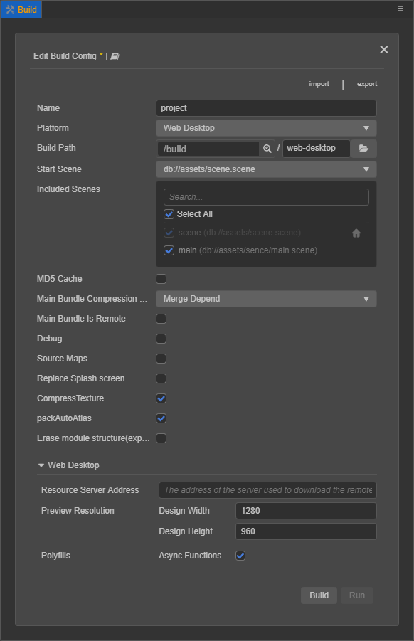

若已经构建过某一平台，则打开 **构建发布** 面板会进入 **构建任务** 页面。v3.0 各个平台的构建是以构建任务的形式进行，类似于下载任务：

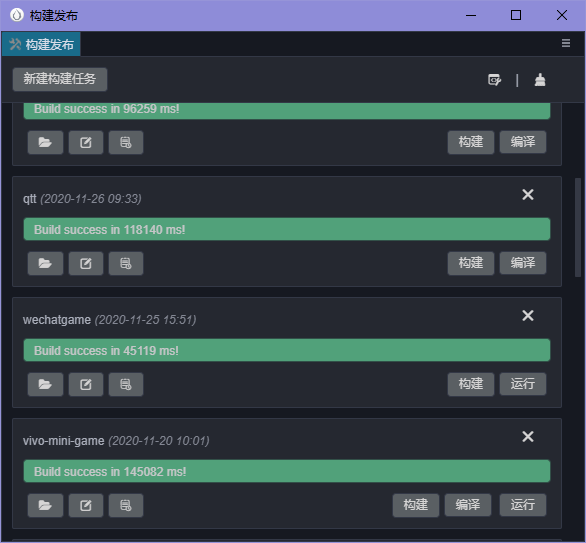

## 构建发布面板

在 **构建发布** 面板选择需要构建的平台，然后配置 [构建选项](build-options.md)。配置完成后，点击右下角的 **构建** 按钮即可跳转到 **构建任务** 页面执行构建流程。或者点击右上角的 **关闭（X）** 按钮也可以进入 **构建任务** 页面。

**构建发布** 面板上方有三个功能按钮：

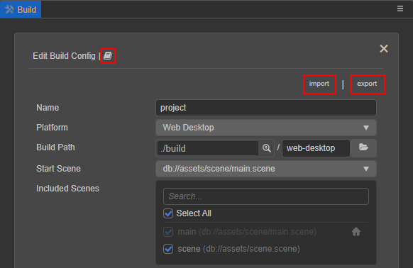

- 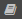：点击该按钮即可跳转到当前平台的官方手册文档。

- **Import**：点击该按钮即可导入保存了构建选项配置的 json 文件。

- **Export**：点击该按钮可将当前平台的构建选项配置导出为 json 文件，用于 [命令行构建](publish-in-command-line.md)，也可以在项目成员之间共享构建选项配置。导出的配置是按照平台区分的，并且带有版本号，请不要删除版本号，以免在跨版本导入配置时无法进行数据迁移。使用命令行构建时，将构建参数 `configPath` 的文件路径指定为导出的 json 配置文件路径即可。

> **注意**：
>
> 1. 构建没有场景的项目是没有意义的，所以如果当前打开的项目没有场景，则打开 **构建发布** 面板时会提示请先创建场景：
>
>     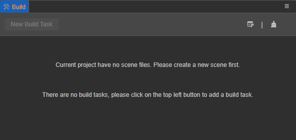
>
> 2. 在构建之前，请确保当前的场景已经保存，否则点击 **构建** 按钮时将会弹框提示，可以选择 **保存**、**忽略** 或者 **取消构建**。选择 **保存** 和 **忽略** 都会继续执行构建流程。
>
>     

## 构建任务页面

在 **构建任务** 页面可以查看当前平台的构建进度及构建结果。

- 正在构建中：进度条显示为 **蓝色**。
- 构建成功：进度条到达 100%，输出实际构建时间并显示为 **绿色**。
- 构建失败：进度条到达 100%，提示构建失败原因或者报错信息，并显示为 **红色**。

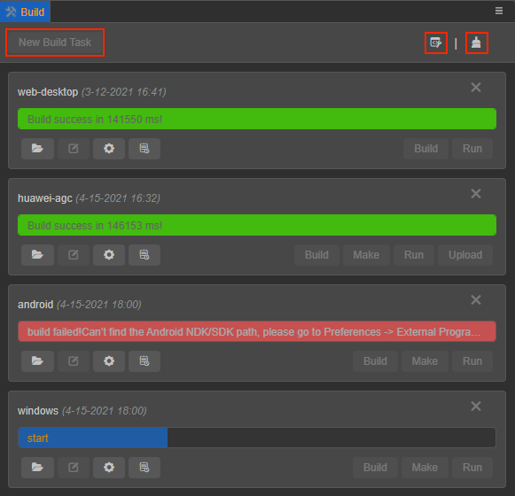

该页面上方有三个按钮，包括 **新建构建任务**、**打开构建调试工具** 和 **清空构建缓存**：

- **新建构建任务**：点击该按钮即可返回 **构建发布** 面板，选择新的平台进行构建。

- ：打开构建调试工具，点击该按钮即可打开构建调试工具，查看在构建过程中产生的全部日志信息包括调用栈。

- ：清空构建缓存。为了复用可被重复利用的构建结果，以便重新构建时加快构建速度、降低内存占用等，构建过程中的很多处理都添加了缓存管理机制，例如压缩纹理、自动图集生成、引擎编译、资源序列化 JSON 等。 正常情况下这部分缓存数据是不需要手动清理的，但如果是在特殊情况下需要避免缓存干扰，可以点击该按钮来清空缓存数据。

  项目相关的资源缓存会存储在项目目录下，引擎编译相关的缓存则存储在全局目录下，开发者可根据自己的需要选择清空项目缓存、全局缓存，或者全部清空。

  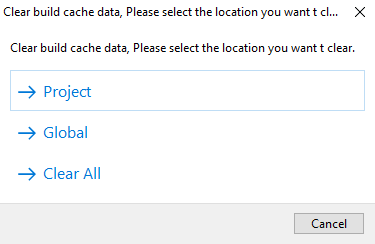

### 平台构建任务

各个平台的构建是以构建任务的形式进行，类似于下载任务。平台构建任务的名称取决于 **构建发布** 面板中的 **发布路径** 选项，具体可查看 [构建选项](build-options.md) 文档。

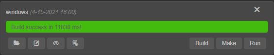

每个构建任务都配置了相应的功能按钮方便使用。

**构建任务右上方的移除（X）按钮** 用于移除当前构建任务，可选择 **仅移除构建记录** 或者 **删除源文件**。**删除源文件** 即删除对应平台构建后生成在 `build` 目录下的项目发布包。

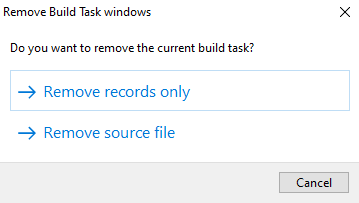

**构建任务左下方的按钮包括**：

- ：点击该按钮即可打开对应平台构建后生成的项目发布包（默认在 `build` 目录下）。

- ：点击该按钮即可返回 **构建发布** 面板，修改对应平台上一次构建时配置的构建选项，然后点击右下方的 **构建** 按钮重新构建。详情请参考下方 **修改构建选项** 部分的内容。

- ：点击该按钮即可返回 **构建发布** 面板，查看对应平台上次构建时配置的构建选项。

- 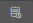：点击该按钮即可打开对应平台在构建过程中产生的日志文件或者日志文件所在目录，可通过 **偏好设置 -> 构建发布 -> 日志文件打开方式** 进行设置。更多内容请参考下方 **构建日志信息查看** 部分的内容。

**构建任务右下方的按钮**，主要用于各个平台在构建完成后根据平台要求执行生成、运行、上传等发布流程。**Build** 按钮则是用于重新构建。

各个平台完成构建后，与构建相关的构建选项配置信息都会保存在项目目录下的 `profiles/v2/packages/builder.json` 文件中，只要没有在 **构建任务** 页面删除对应平台的构建任务或者删除 `build` 目录下的项目发布包，就可以在重新打开编辑器后查看上次构建时的构建选项配置，以及继续运行预览等。

各个平台具体的发布流程，可参考：

- [发布到原生平台](native-options.md)
- [发布到小游戏平台](publish-mini-game.md)

### 修改构建选项

点击构建任务左下方的编辑按钮，即可返回 **构建发布** 面板修改上次构建时配置的构建选项，以便重新构建。因为只能修改当前平台上一次构建时的构建选项配置，所以页面中的 **发布平台** 项为置灰状态，不可修改。

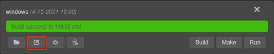

当前平台上一次构建时的构建选项配置可点击编辑按钮右侧的  按钮查看。

修改完成后点击 **构建** 按钮就会清空上次构建后生成的项目发布包并重新构建。或者点击 **构建发布** 面板右上方的 **X** 按钮返回 **构建任务** 页面，再点击平台构建任务右下方的 **构建** 按钮也可以重新构建。

> **注意**：
>
> 1. 原生平台为了避免误删除已定制的内容，在重新构建时仅更新项目资源，不会覆盖原有的原生工程内容。因此在返回 **构建发布** 面板修改之前配置的构建选项时，原生平台相关的构建选项为 **禁用** 状态。如果需要重新生成工程请新建构建任务。
> 2. 从 v3.3 开始，原生平台在重新构建时，构建选项 **游戏名称** 为置灰状态，不可修改。

如果修改配置后没有点击 **构建** 按钮重新构建，修改的配置也会被保存起来。若当前 **构建发布** 面板中的配置与上次构建后生成的 `build` 目录下的项目发布包中的配置不一致，**构建发布** 面板的上方会显示黄色的 * 号键。

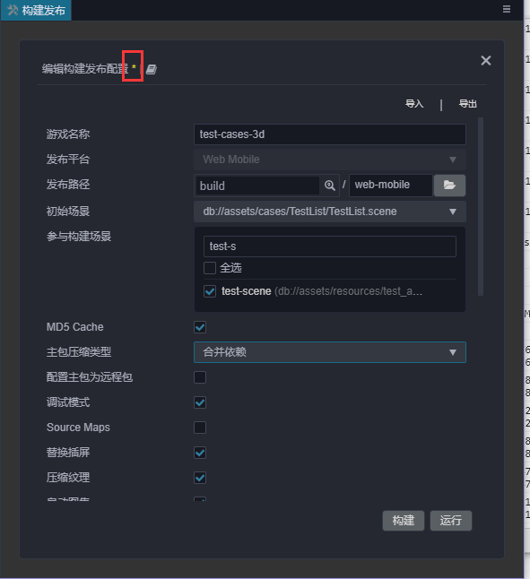

### 构建日志信息查看

由于构建过程会产生非常多的日志信息，默认情况下只有错误信息才会打印到编辑器的 **控制台** 面板中。

如果需要查看所有的日志信息有以下几种操作方式：

- **打开构建调试工具**

    通过点击主菜单中的 **开发者 -> 打开构建调试工具** 或者点击 **构建任务** 页面右上方的  按钮，即可查看在构建过程中打印出的全部日志信息包括调用栈。

- **打开构建日志记录文件**

    每次构建过程中产生的报错信息都会被记录存储在项目目录下的 `temp/builder/log` 文件夹中。点击构建任务左下方的  按钮即可查看。在反馈构建相关问题时，可直接附上该文件以便定位问题。
