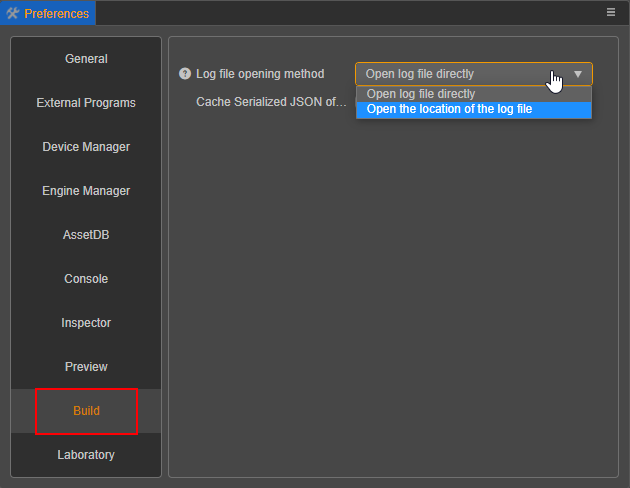

# 熟悉构建发布面板

点击主菜单中的 `项目` -> `构建发布` 或者使用快捷键 `Ctrl / Cmd + Shift + B` 即可打开构建发布面板，构建发布是以构建任务的形式进行，类似于下载任务。

## 新建构建任务

点击右上方的 **新建构建任务** 按钮，即可打开构建参数配置面板，在该区域内填写好相关的构建参数，点击构建即可。

在点击构建之前，请确保当前的场景数据没有未保存的内容。当前场景有内容尚未保存，点击构建后构建将会弹框提示，可以选择 **保存**、**忽略** 或者 **取消构建**。选择保存和忽略都会继续进行构建。

> 注：没有场景的项目构建是没有意义的，因而没有场景的项目是不允许添加构建任务的。

## 构建进度查看

点击构建后，可以在构建面板上看到当前的构建任务进行情况。如果构建成功，进度条会显示为绿色，并且会输出实际构建时间。第一次构建的时候，引擎编译会比较慢请耐心等待。如果构建失败，进度条则会显示为红色。

## 修改/查看构建参数

每个构建任务下方都有一个  编辑按钮，点击即可修改之前的构建选项配置，调整完成后点击 **构建** 按钮就会清空原目录重新构建（原生平台除外）。

如果修改完配置后没有点击构建，修改的配置也会被保存起来。当这个构建配置与实际文件构建包内的构建配置不对应时，界面会显示 * 表示修改过。同时会出现一个按钮可以查看当前构建任务上一次构建时的实际构建参数方便查看。

在编辑器内构建过的构建任务信息，将会保存在项目目录下的 `profiles/packages/builder.json` 文件中，只要没有在面板上删除对应构建任务或者删除对应的实体文件，就可以在重新打开编辑器后查看之前构建的参数配置、运行预览等操作。

同时，点击构建构建后，编辑器也将打印出当前构建的参数内容，可以作为命令行构建的参数配置参考。除此之外，编辑器也提供了更加快捷的构建选项导出功能。

具体详细的构建参数介绍可以参考 [构建参数介绍](./build-options.md)

## 导出 / 导入构建选项配置

### 导出

构建面板右上方的导出选项可将当前构建选项的配置导出为 json 文件，主要是为了方便 **命令行构建** 以及同个项目内共享构建选项配置。导出的构建参数是按照平台区分的，对于使用命令行构建的开发者，可以直接将这份 json 配置文件作为命令行构建参数的 `configPath` 来使用。

### 导入

导入选项可读取 json 配置文件到构建面板，方便开发者共享构建配置信息。

## 编译、运行构建结果

除了构建按钮之外，不同平台的构建任务可能还会有编译、运行等此类执行阶段，部分平台也会开发对应阶段的构建钩子。主要是和平台本身构建相关，不同平台的具体使用方式差异需要以平台相关文档为准。

## 构建 Log 信息查看

由于构建过程会产生非常多的 log 记录，默认情况下只有错误信息会打印到编辑器自带的控制台内。

如果需要查看到所有的日志信息有以下操作方式：

- **打开构建调试工具**

    通过点击菜单 `开发者 -> 打开构建调试工具` 或者点击构建面板顶上右侧的快捷按钮打开，即可查看在构建过程中打印出的全部 log 信息包括调用栈。

- **调整日志等级**

    点击菜单里的 `Cocos Creator -> 偏好设置 -> 构建发布` ，即可看到调整日志等级的界面。

    

- **打开构建日志记录文件**

    每次构建过程中产生的报错信息都会被记录起来，点击构建任务的  按钮即可查看，在向 [论坛](https://forum.cocos.org/c/58) 反馈构建相关问题时，可以直接贴上该 log 文件。

    这里的 log 文件会存储在项目目录下的 `temp/builder/log` 文件夹内。

## 清空构建缓存

为了加快构建速度等，构建过程中会存在许多的缓存机制，例如压缩纹理、自动图集生成、引擎编译、 资源序列化 JSON 等等，项目相关的资源缓存会存储在项目缓存目录下，引擎编译缓存将会存储在全局目录下。正常情况下这部分缓存数据是不需要手动清理的，但是如果在特殊情况下需要避免缓存干扰的话，可以点击顶上的清理缓存按钮清理数据。

