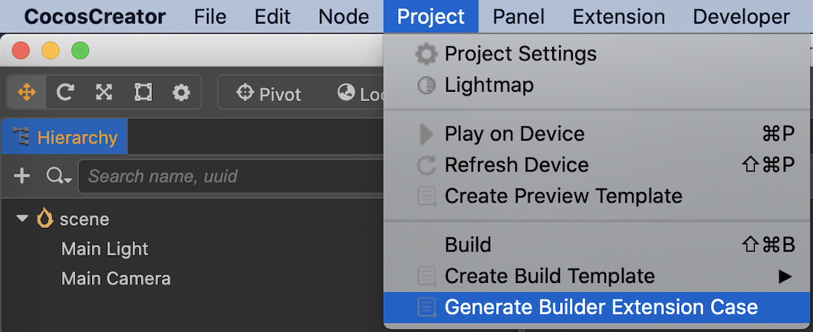
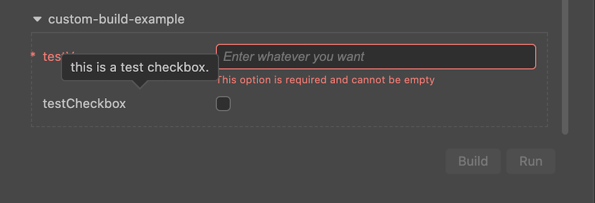
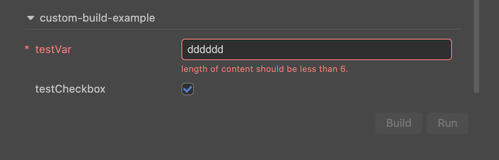
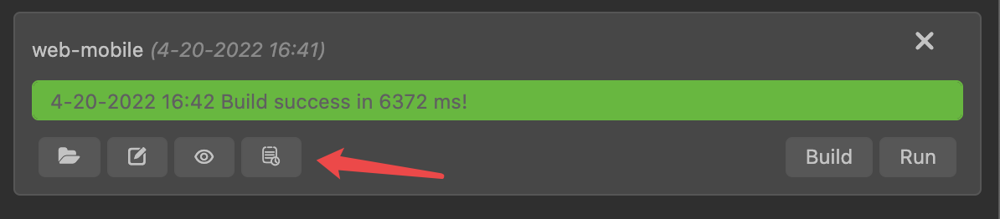
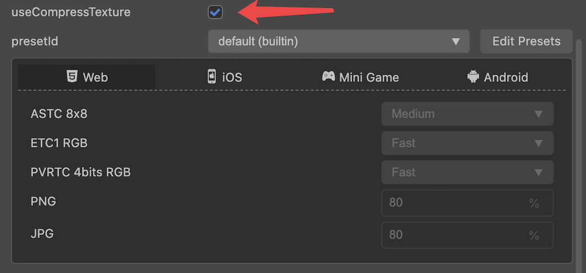
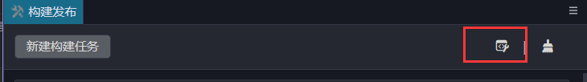

# 自定义构建流程

对构建流程进行自定义的前提是需要对构建发布的整体流程有所了解，不熟悉的开发者建议先阅读 [构建流程简介与常见问题指南](./build-guide.md)。

为了能更好的理解本篇文档内容，在继续阅读本文档之前，推荐大家先阅读 Cocos Creator [扩展编辑器](../extension/readme.md) 文档，了解扩展开发相关知识。

为方便书写，本文中我们约定将用于自定义构建流程的扩展简称为： **构建扩展**

## 构建扩展模板

Cocos Creator 提供了快捷方式生成 **构建扩展模板**：点击 **项目** -> **新建构建扩展包** 菜单即可生成 `cocos-build-template`，如下图所示：



> **注意**：生成此扩展模板时会选择其作用于 **项目** 还是 **全局**，建议选择 **项目**，除非真的需要将此扩展作用于所有项目。

下面我们将重现此扩展包的制作过程，并逐一讲解细节。

## 创建扩展

对扩展的创建和开发不太熟悉的开发者可参考文档 [入门示例](../extension/first.md)，创建一个名为 `custom-build-example` 的扩展。

> **注意**：为了方便与 `cocos-build-template` 对比学习，我们使用另一个不同的名字。

## 扩展包定义与自定义构建入口脚本

在 `package.json` 中添加 `contributions.builder` 字段，此字段指向一个 `JavaScript` 脚本的 **相对路径**，作为构建流程的入口脚本（以下简称**自定义构建脚本**），如下所示：

```json5
// package.json
{
    "contributions": {
        "builder": "./dist/builder.js"
    }
}
```

> **注意**：`./dist/builder.js` 是由 `./src/builder.ts` 编译后生成的脚本。

## 自定义构建脚本结构

`builder.ts` 完整结构示例如下：

```ts

import { BuildPlugin, IBuildTaskOption } from "../@types/packages/builder/@types";

export const load: BuildPlugin.load = function() {
    console.debug('custom-build-example load');
};

export const unload: BuildPlugin.load = function() {
    console.debug('custom-build-example unload');
};

export const assetHandlers: string = './asset-handlers';

export const configs:BuildPlugin.Configs = {
    'web-mobile': {
        options: {
            opt_1:{ ... },
            opt_2:{ ... },
            ...
            opt_n:{ ... }
        },
        verifyRuleMap: {
            rule1:{ ... },
            rule2:{ ... },
            ...
            rulen:{ ... }
        },
        hooks:'./hooks',
    },
    'android':{ ... },
    'ios':{ ... }
    '*':{ ... }
};
```

部分属性与接口描述如下：

`configs`：BuildPlugin.Configs - 构建面板相关的配置
- `web-mobile`：string - Cocos Creator 支持的平台名，与点击 **构建** 按钮后生成的文件夹一致。 如果平台标记为 `*`，则里面的配置对所有构建平台生效。
- `options`：{} -  构建面板选项，每一个选项都会在构建面板中新增一个显示项，详情请参考下文 [自定义构建面板选项](#%E8%87%AA%E5%AE%9A%E4%B9%89%E6%9E%84%E5%BB%BA%E9%9D%A2%E6%9D%BF%E9%80%89%E9%A1%B9) 。
- `verifyRuleMap`：{} - 自定义参数校验规则函数，请参考下文 [参数校验规则](#%E5%8F%82%E6%95%B0%E6%A0%A1%E9%AA%8C%E8%A7%84%E5%88%99)。
- `hooks`：string - 指定一个脚本，里面可以包含构建生命周期内的一系列钩子函数，详情请参考下文 [钩子函数](#%E9%92%A9%E5%AD%90%E5%87%BD%E6%95%B0) 。

## 自定义构建面板选项

为了方便测试，本文将以 web-mobile 为例来展示如何在构建面板上新增选项并显示。

新建 `src/builder.ts` 脚本文件，并在 `builder.ts` 中编写如下代码：

```ts
import { BuildPlugin, IBuildTaskOption } from "../@types/packages/builder/@types";

export const load: BuildPlugin.load = function() {
    console.debug('custom-build-example load');
};

export const unload: BuildPlugin.load = function() {
    console.debug('custom-build-example unload');
};

export const configs:BuildPlugin.Configs = {
    'web-mobile': {
        options: {
            testInput: {
                label: 'testVar',
                description: 'this is a test input.',
                default: '',
                render: {
                    ui: 'ui-input',
                    attributes: {
                        placeholder: 'Enter numbers',
                    },
                },
                verifyRules: ['required','ruleTest']
            },
            testCheckbox: {
                label: 'testCheckbox',
                description: 'this is a test checkbox.',
                default: false,
                render: {
                    ui: 'ui-checkbox',
                },
            },
        },
        verifyRuleMap: {
            ruleTest: {
                message: 'length of content should be less than 6.',
                func(val: any, option: IBuildTaskOption) {
                    if (val.length < 6) {
                        return true;
                    }
                    return false;
                }
            }
        }
    },
};
 ```

在上面的 `configs` 中我们定义了 2 个参数：

- `testInput`：string - 字符串变量，采用输入框方式修改
- `testCheckbox`：boolean - 布尔变量，采用复选框方式修改

构建选项配置的参数各字段含义如下：

- `label`：string - 必填，此参数在界面上显示的名称，支持 `i18n:key` 配置
- `description`：string 可选，简要描述信息，用于鼠标悬停在 label 上时显示提示，支持 `i18n:key` 配置
- `default`：any - 可选，参数的默认值
- `render`：{} - 必填，配置渲染组件相关信息
    - `ui`：string - 必填，UI 组件名，详情请参考文档 [UI 组件](../extension/ui.md)
    - `attributes`：{} - 可选，UI 组件所需的属性，详情请参考文档 [UI 组件](../extension/ui.md)

- `verifyRules`：[] - 可选，参数检验规则
- `verifyRuleMap`：[] - 可选，自定义参数检验规则函数，参考下文 [参数校验规则](#%E5%8F%82%E6%95%B0%E6%A0%A1%E9%AA%8C%E8%A7%84%E5%88%99)

执行 `npm run build` 编译此扩展并刷新后，打开构建面板，在 web-mobile 构建任务中可以看到末尾多出了 2 个构建参数，如下图所示：



### 特别注意事项

1. 不同进程中的环境变量会有所差异，自定义构建脚本会同时被 **渲染进程** 和 **主进程** 加载，所以请不要在自定义构建脚本中使用仅存在于单一进程中的编辑器接口。进程相关详情请参考下文 [调试构建扩展](#%E8%B0%83%E8%AF%95%E6%9E%84%E5%BB%BA%E6%89%A9%E5%B1%95) 部分的内容。

2. `configs` 的 `key` 有两种配置方式：

    - 针对 **单个平台** 的配置，`key` 值填写为 `平台名`，参考上面的代码示例。各平台对应的构建名可在编辑器主菜单的 **扩展 -> 扩展管理器 -> 内置** 中查看。

    - 针对 **所有平台** 的配置，`key` 值填写为 `*`，参考 [构建扩展模板](#%E6%9E%84%E5%BB%BA%E6%89%A9%E5%B1%95%E6%A8%A1%E6%9D%BF) 中的 `source/builder.ts` 文件。

    > **注意**：优先级 `平台名` > `*`， 若某平台有对应的 `平台名` 配置，则会优先使用对应的配置, `*` 中的所有配置对此平台无效。

## 参数校验规则

在 `testInput` 参数中，有如下配置：

```ts
verifyRules: ['required','ruleTest']
```

### 内置参数校验规则

上面的 `verifyRules` 定义的 `required`，是扩展系统的内置校验规则，它表示此选项为必填项，不能为空，在界面上会有 `*` 提示，未填写时也会有红字提示：


完整的内置参数校验规则如下：

- `required` - 参数为必填
- `array` - 参数内容必须满足数组格式
- `string` - 参数内容只能是字符串形式
- `number` - 参数只能是数字

`verifyRules` 数组中还定义了一个叫 `ruleTest` 的自定义校验规则。自定义构建脚本在进行匹配时，会优先从 `verifyRuleMap` 去寻找匹配，若不能匹配到任何一个自定义校验规则，才会从内置的参数校验规则中去寻找。

自定义规则属性含义如下：
- `message`：string - 当规则校验失败后，会在控制台窗口打印出此消息，支持 `i18n:key` 形式。
- `func`：function - 自定义校验规则函数
    - `val`：any - 当前值
    - `options`：IBuildTaskOption - 整个构建面板的选项信息，详情请前往 `d.ts` 查看定义

本例中的自定义检验规则函数，会对输入的字符串长度做检查，当字符串长度不小于 6 时，会打印 `message` 中定义的提示信息，如下图所示：



## 钩子函数

在项目构建过程中，引擎提供了处理一些特殊事件的钩子函数，如下图所示：


参考上图，所有的钩子函数都是在构建流程中按照顺序依次执行，不同的钩子函数接收到的数据会有所差异。钩子函数中可以直接使用引擎提供的 `API` 和 `Editor` 相关全局变量。

关于 `Editor` 详细的接口定义请点击编辑器主菜单的 **开发者 —> 导出 .d.ts** 获取和查看。关于构建进程的说明请参考下文 [构建进程](#%E6%9E%84%E5%BB%BA%E8%BF%9B%E7%A8%8Bhooks-%E8%84%9A%E6%9C%AC) 部分的内容。

要实现钩子函数，需要先在 `builder.ts` 中加入 `hooks` 字段，参考上文的 [自定义构建脚本结构](##%E8%87%AA%E5%AE%9A%E4%B9%89%E6%9E%84%E5%BB%BA%E8%84%9A%E6%9C%AC%E7%BB%93%E6%9E%84)，并创建一个 `src/hooks.ts` 脚本文件写入如下代码：

```ts
import { BuildHook } from "../@types/packages/builder/@types";

const PACKAGE_NAME = 'custom-build-example';

export const throwError: BuildHook.throwError = true;

export const load: BuildHook.load = async function() {
    console.log(PACKAGE_NAME,load);
};

export const onBeforeBuild: BuildHook.onBeforeBuild = async function(options) {
    // Todo some thing
    console.log(PACKAGE_NAME,'onBeforeBuild');
};

export const onBeforeCompressSettings: BuildHook.onBeforeCompressSettings = async function(options, result) {
    // Todo some thing
    console.log(PACKAGE_NAME,'onBeforeCompressSettings');
};

export const onAfterCompressSettings: BuildHook.onAfterCompressSettings = async function(options, result) {
    // Todo some thing
    console.log(PACKAGE_NAME, 'onAfterCompressSettings');
};

export const onAfterBuild: BuildHook.onAfterBuild = async function(options, result) {
    console.log(PACKAGE_NAME, 'onAfterBuild');
};

export const unload: BuildHook.unload = async function() {
    console.log(PACKAGE_NAME, 'unload');
};
```

目前支持的钩子函数列表：
- `onBeforeBuild` - 构建开始之前调用
- `onBeforeCompressSettings` - 开始压缩相关的 JSON 文件前调用
- `onAfterCompressSettings` - 压缩完设置文件后调用
- `onAfterBuild` - 构建完成之后调用

钩子接口定义如下所示：

```ts
type IBaseHooks = (options: IBuildTaskOptions, result?: IBuildResult) => void | Promise<void>;

export namespace BuildHook {
    export type throwError = boolean;
    export type title = string;
    export type onBeforeBuild = IBaseHooks;
    export type onBeforeCompressSettings = IBaseHooks;
    export type onAfterCompressSettings = IBaseHooks;
    export type onAfterBuild = IBaseHooks;
    export type load = () => Promise<void> | void;
    export type unload = () => Promise<void> | void;
}
```

> **注意**：
> 1. 传递到钩子函数中的 `options` 是实际构建流程中 `options` 对象的一个副本，仅作为信息获取的参考，直接修改它虽然能修改成功但并不会真正地影响构建流程。若要修改构建参数请在自定义构建脚本的 `options` 字段中修改。
> 2. 钩子函数允许为异步函数，构建流程在执行钩子函数时默认会 `await` 等待其执行完毕才会执行下一个流程。
> 3. 详细的接口定义可以参考扩展中 `@types/packages/builder` 目录下的内容。

编译、并刷新此扩展后，再次执行 web-mobile 构建任务，可在构建日志文件中看到相关打印信息。可通过下图所示按钮打开日志文件：



## 自定义纹理压缩处理

Cocos Creator 提供了自带的压缩工具用于处理压缩纹理资源，但因需要兼容不同的用户环境，通常压缩工具会选择兼容性更高的，而不是性能最高的。

因此 Cocos Creator 开放了资源处理器扩展机制：**允许用户自定义对应纹理资源的压缩处理函数，构建时会在相应的处理时机进行调用**。

具体操作步骤如下：

### 添加资源处理器脚本相对路径

在自定义构建脚本 `src/builder.ts` 中，添加如下所示代码：

```ts
export const assetHandlers = './asset-handlers';
```

### 编写脚本

创建 `src/asset-handlers.ts` 脚本文件并编写如下代码：

```ts
import { AssetHandlers } from '../@types/packages/builder/@types';

export const compressTextures: AssetHandlers.compressTextures = async (tasks) => {
    console.log('compressTextures');
};
```

### 运行测试

选择一张场景中使用到的图片，在其属性检查器中开启压缩选项，如下图所示：



编译、并刷新此扩展后，再次执行 web-mobile 构建任务，可在构建日志文件中看到相关打印信息。

> **注意**：测试时请先点击构建面板右上角的清理缓存按钮清理项目缓存，否则会因为纹理压缩的缓存机制导致不会再次执行压缩任务。

### 执行流程

在 `assetHandlers` 脚本模块里，我们开放了 `compressTextures` 函数，构建时便会在纹理压缩处理阶段调用该处理函数。

处理函数会接收当前剩余的未被处理的纹理压缩任务数组，处理完成后从原数组中移除。未被移除的纹理压缩任务视为未处理，会被放置到下一个相应的处理函数进行处理，直到所有的处理函数都处理完了，若还有未处理的纹理压缩任务，则放置回 Cocos Creator 原有的纹理压缩流程中进行处理。

当有多个扩展都注册了纹理压缩处理函数时，按照扩展启动顺序执行，如果前一个扩展处理了全部的纹理压缩任务，则后注册的扩展的处理函数将不会收到任务。

代码示例如下：

```ts
type ITextureCompressType =
    | 'jpg'
    | 'png'
    | 'webp'
    | 'pvrtc_4bits_rgb'
    | 'astc_12x12'; // 详细格式请参见接口定义
interface ICompressTasks {
    src: string; // 源文件地址
    dest: string; // 生成的目标文件地址（后缀默认为 PNG，其他类型需要自行更改）
    quality: number | IPVRQuality | IASTCQuality | IETCQuality; // 压缩质量 0 - 100 或者其他的压缩等级
    format: ITextureCompressType; // 压缩类型
}
export async function compressTextures(tasks: ICompressTasks[]) {
        for (let i = 0; i < Array.from(tasks).length; i++) {
        const task = Array.from(tasks)[i];
        if (task.format !== 'jpg') {
            // 跳过处理的纹理压缩任务会传递给下一个处理函数，直至最后进入 Creator 原有的构建时纹理压缩流程
            continue;
        }
        task.dest = task.dest.replace('.png', '.jpg');
        await pngToJPG(task.src, task.dest, task.quality);
        // 处理完的纹理压缩任务，将其从 tasks 里移除，这样构建时便不会再次处理
        tasks.splice(i, 1);
    }
}
```

## 调试构建扩展

构建扩展参与到自定义构建流程时，相关代码会运行在以下三种进程：

- **主进程**：执行自定义构建脚本（`package.json` 中 `builder` 字段指定的脚本）及其依赖资源
- **渲染进程**：执行自定义构建脚本中注册到 **构建发布** 面板上的部分字段
- **构建进程**：执行自定义构建脚本中 `hooks` 字段定义的脚本

### 主进程（入口脚本）

主进程主要执行用于参与构建流程的自定义构建脚本，以及扩展自身的入口脚本（`main` 字段中指定的脚本）。

当修改了运行在主进程中的代码时，必须要重启扩展，然后再刷新需要更新的进程（这一点会在之后优化，尽量通过一次重启便解决代码更新问题，但刷新依旧是最彻底的重载方法）。主进程目前没有比较合适的调试方法，可以使用命令行打开编辑器查看主进程代码日志来辅助调试：

```bash

// Mac
/Applications/CocosCreator/Creator/3.0.0/CocosCreator.app/Contents/MacOS/CocosCreator --project projectPath

// Windows
...\CocosCreator.exe --project projectPath
```

### 渲染进程（构建发布面板）

自定义构建脚本中，有部分字段是注册到 **构建发布** 面板上的，例如 `options` 的显示配置、`panel` 字段，以及 `panel` 脚本本身，这部分内容会在渲染进程载入执行。渲染进程其实就是窗口自己的执行进程，打开调试工具，可以调试 **构建发布** 面板上的 DOM 元素、样式、脚本等。

如果是修改了注册到 **构建发布** 面板上的代码时，只需要刷新面板即可，无需重启扩展。

- **打开构建发布面板渲染进程的调试工具**

  点击 **构建发布** 面板，然后按下快捷键 **Ctrl + Shift + i**（Windows）或者 **Cmd + Option + i**（Mac），即可打开 **构建发布** 面板的调试工具。

- **重新载入（刷新）面板方式**

  点击 **构建发布** 面板或者 **构建发布** 面板的调试工具后，按下 **Ctrl/Cmd + R** 即可。

### 构建进程（`hooks` 脚本）

构建流程的实际执行环境是单独的一个 `worker` 进程，确保即使发生异常崩溃也不会影响到其他窗口的正常使用。在自定义构建脚本的 `hooks` 字段中定义的脚本也是在这个单独的 `worker` 进程中载入执行的。

如果仅修改 `hooks` 字段定义的脚本，刷新构建进程即可，无需重启扩展。刷新方式同上文的 **构建发布** 面板一致，打开构建调试工具后，按下快捷键 **Ctrl/Cmd + R** 即可。

### 打开构建进程的调试工具

下三种方式均可打开调试工具：

1. 在 **构建发布** 面板点击构建任务窗口右上方的 **打开构建调试工具** 按钮。

    

2. 点击编辑器主菜单中的 **开发者 -> 打开构建调试工具** 即可。

3. 在任意控制台或者扩展的代码中，执行以下代码：

    ```ts
    Editor.Message.send('builder', 'open-devtools');
    ```

    可以在这个消息方法的基础上，根据自己的需要进行加工处理。（例如：可以在自己编写的构建扩展代码中捕获错误，一旦有异常就自动打开调试工具）。

完整示例代码请参考本文 [构建扩展模板](#%E6%9E%84%E5%BB%BA%E6%89%A9%E5%B1%95%E6%A8%A1%E6%9D%BF) 中生成的扩展项目。
