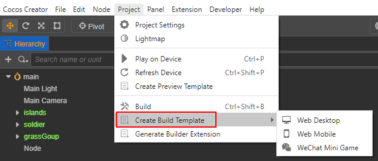
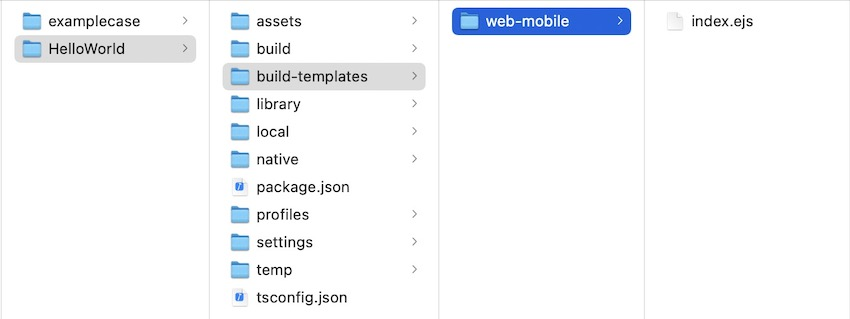

# 自定义构建模版

Cocos Creator 支持对每个项目分别定制构建模板，只需要在项目路径下添加一个 `build-templates` 目录，里面按照 **平台插件名称** 划分子目录。在构建结束后，`build-templates` 目录下所有的文件都会自动按照对应的目录结构 **复制** 到构建生成的工程中。具体的 **平台插件名称** 请参考最下方的 **自定义构建模板平台支持表**。

结构类似：

```bash
project-folder
 |--assets
 |--build
 |--build-templates
     |--web-mobile
         // 需要添加的文件，如 index.html
         |--index.html
```

这样如果当前构建的平台是 **Web Mobile** 的话，那么 `build-templates/web-mobile/index.html` 就会在构建后被拷贝到 `build/web-mobile（以平台插件名称为准）/index.html`。

除此之外，目前构建模板支持的文件类型还包括 **ejs 类型** 和 **json 类型**。各平台的支持情况，详情请参考下文的 **平台支持表**。

## ejs 类型

随着 Creator 版本的升级，可能会对构建模板做一些修改和更新，就会导致不同版本构建出来的包内容不完全一样，开发者需要手动同步更新项目中定制的构建模板。在勾选 MD5 Cache 选项之后，以 Web 平台的 index.html 为例，里面引用的 css 文件地址会带有 MD5 Hash 后缀可能会和原先的模板里的不匹配而无法使用。<br>
因此为了优化这个问题，Creator 在主菜单的 **项目** 中新增了 **创建项目构建模板** 选项，用于生成对应平台支持的构建模板。



开发者只需要在生成的构建模板的 `.ejs` 中进行定制，构建时会自动将编辑器构建模板的更新同步到定制的构建模板中，经常改动的内容都会同步到该模板引用的子模板（`.ejs`）中，这样定制构建模板便可以不用频繁手动更新。

以创建 Web Mobile 构建模板为例，生成的构建模板目录结构如下：



> **注意**：构建时，拷贝定制构建模板这一步骤是最后执行的，也就是说，假如该目录下同时存在 `index.ejs` 与 `index.html`，那么最终打包出来的是 `index.html` 文件而不是 `index.ejs` 文件。

## json 类型的融合处理

许多小游戏平台都会有类似 `game.json` 之类的配置文件，若这些 json 文件在对应平台的定制构建模板中，构建时便不会直接将其拷贝并覆盖到对应的发布包目录下，而是会将编辑器最新构建模板的内容整合进来。

## 自定义构建模板平台支持表

各平台对构建模板的文件类型支持情况如下表所示：

| 平台 | 平台构建插件名 | 支持的文件类型 |
| :--- | :--- | :--- |
| 华为 AGC | huawei-agc | 暂不支持 |
| 支付宝小游戏 | alipay-mini-game | `game.json` |
| 字节跳动小游戏 | bytedance-mini-game | `game.ejs`、`game.json`、`project.config.json` |
| OPPO 小游戏 | oppo-mini-game | `manifest.json` |
| 华为快游戏 | huawei-quick-game | 暂不支持 |
| Cocos Play | cocos-play |  `game.config.json` |
| vivo 小游戏 | vivo-mini-game | `project.config.json` |
| 小米快游戏 | xiaomi-quick-game | `manifest.json` |
| 百度小游戏 | baidu-mini-game | `game.json`、`project.swan.json` |
| 微信小游戏 | wechatgame | `game.ejs`、`game.json`、`project.config.json` |
| Web Desktop | web-desktop | `index.ejs` |
| Web Mobile | web-mobile | `index.ejs` |
| 原生平台 | native | 暂不支持 |

## application.js 的定制

`application.js` 是构建生成的全平台都一样的启动脚本，如需定制可以按照上文描述的方式在指定目录放置 `application.js` 来定制。或者点击主菜单的 **项目 -> 创建项目构建模板 -> 创建 application.ejs** 生成对应的 ejs 文件，在其中修改。

在 `build-templates/common` 文件夹中放置的 `application.ejs` 将会影响到所有构建平台。放置在 `build-templates/{platform}` 目录下则只对指定平台生效。构建在默认情况下优先使用平台构建路径下的文件。 使用 ejs 的方式，可以避免勾选 MD5 Cache 选项后，一些文件路径的更改导致定制的 `application.js` 不可用。不过需要注意的是，由于启动脚本和引擎接口是强相关的，不能完全保证在大版本的升级迭代中完全保持不变，如果发生修改我们会在更新日志中提及，请在升级版本后关注对应的版本的更新日志。
