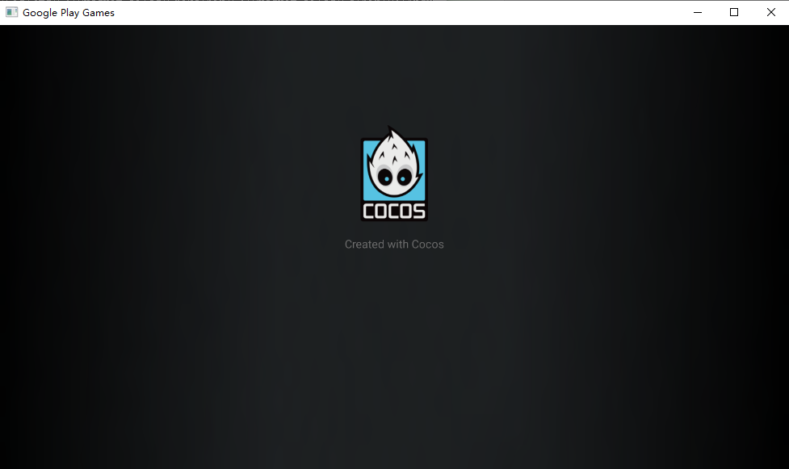
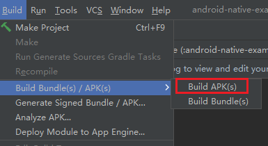
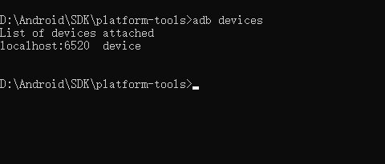
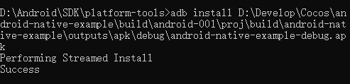
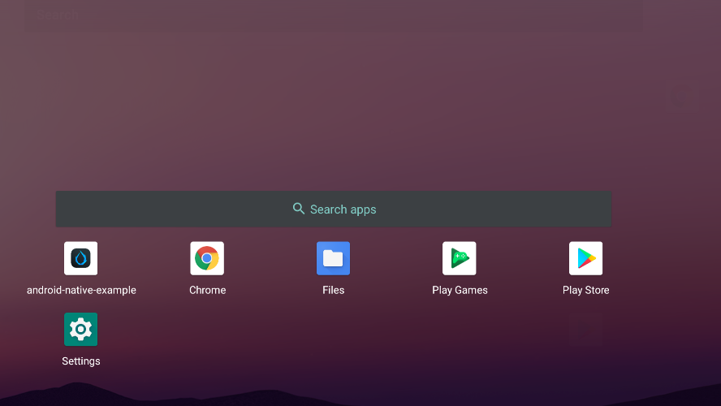

# 运行和启动



本节我们将介绍如何通过 HPE 模拟器对已有的 APK 进行开发和测试。

## 准备工作

首先您需要准备一个由 Cocos Creator 发布的 Android Studio 工程，如果对此不熟悉，建议您参考 [安卓构建示例](../android/build-example.md)

## 启动模拟器

首先您需要在操作系统的工具栏内找到模拟器的图标并选择 **Launch Emulator** 来启动模拟器：


启动后：


## 安装应用

我们稍微回顾下如何通过 Android Studio 来构建 APK，点击下面的菜单即可：



构建成功后可以在项目目录内找到对应的 APK 文件。

### 启动 ADB

接下来需要将 APK 安装到模拟器上，找到 adb 命令并输入：

> adb 一般在安卓的 SDK/plat-form 目录内。您可以考虑将该目录加入环境变量中，以便在任何地方可以使用。

```bash
adb devices 
```

用于检查模拟器是否正确连接。



如显示 `localhost:6520 offline` 或不显示设备，可重启模拟器或者在命令行内输入： `adb connect localhost:6520`。

### 安装应用

找到之前 apk 的目录，并在命令行内输入：

```bash
adb install C:/yourpath/yourgame.apk
```



## 启动应用

找到已经安装的程序在屏幕中通过鼠标上滑即可：


